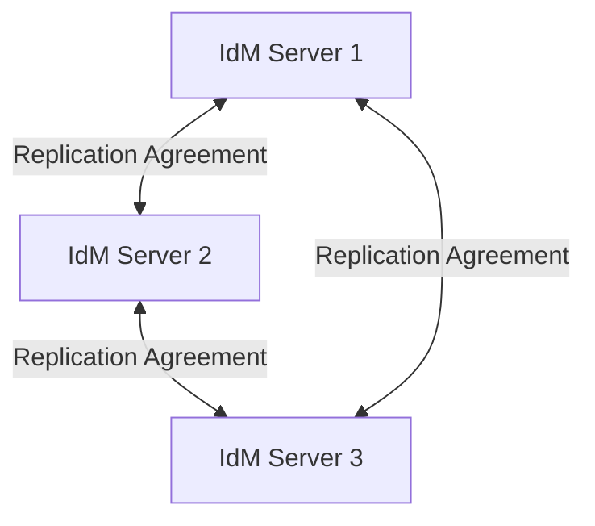
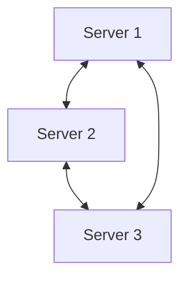
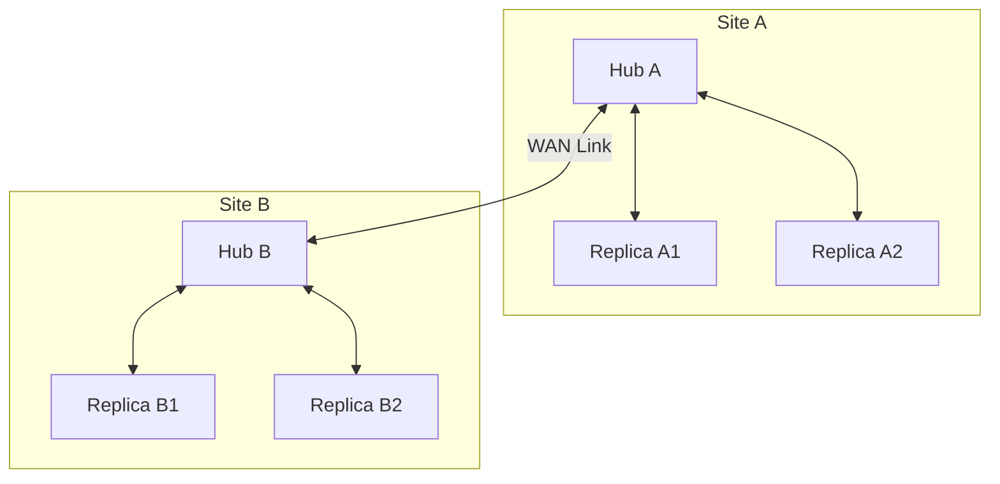

# How to Configure IdM Replication Topology on RHEL

Author: [nawazdhandala](https://www.github.com/nawazdhandala)

Tags: RHEL, IdM, Replication, FreeIPA, Linux

Description: A guide to designing and managing IdM replication topology on RHEL, covering multi-master replication, topology segments, and best practices for high availability.

---

IdM uses multi-master replication, which means every replica holds a full read-write copy of the directory. Changes made on any server get replicated to all others. Getting the topology right is essential for both performance and fault tolerance. A poorly designed replication topology can lead to slow convergence, replication conflicts, or split-brain scenarios.

## Replication Topology Concepts



In IdM, replication happens through topology segments. Each segment is a bidirectional replication agreement between two servers. IdM replicates two suffixes independently: the domain suffix (user/group data) and the CA suffix (certificate data).

## Planning Your Topology

Red Hat recommends these guidelines:

- Each server should connect to at least 2 other servers (for redundancy)
- No server should connect to more than 4 other servers (to limit replication overhead)
- Keep the maximum number of hops between any two servers to 3 or fewer
- For geographically distributed sites, use a hub-and-spoke model within each site and connect sites with dedicated links

## Step 1 - Install a New Replica

Start by installing a new IdM replica to add to the topology.

```bash
# On the new RHEL system, install required packages
sudo dnf install ipa-server ipa-server-dns ipa-server-ca -y

# Install the replica (connects to an existing server automatically)
sudo ipa-replica-install \
  --setup-ca \
  --setup-dns \
  --forwarder=8.8.8.8
```

By default, the replica installer creates a replication agreement to the server you specified (or the one discovered via DNS).

## Step 2 - View the Current Topology

After adding replicas, inspect the topology to understand the current layout.

```bash
# List all topology segments for the domain suffix
ipa topologysegment-find domain

# List all topology segments for the CA suffix
ipa topologysegment-find ca

# Show details of a specific segment
ipa topologysegment-show domain server1.example.com-to-server2.example.com
```

You can also use the web UI to visualize the topology. Navigate to IPA Server, then Topology, then Topology Graph.

## Step 3 - Add Replication Segments

If your topology needs additional connections for redundancy, create new segments manually.

```bash
# Create a new replication segment between two servers for domain data
ipa topologysegment-add domain \
  --leftnode=server1.example.com \
  --rightnode=server3.example.com \
  "server1-to-server3"

# Create a matching CA replication segment
ipa topologysegment-add ca \
  --leftnode=server1.example.com \
  --rightnode=server3.example.com \
  "server1-to-server3-ca"
```

## Step 4 - Remove Replication Segments

When decommissioning a server or simplifying the topology, remove unneeded segments.

```bash
# Remove a domain replication segment
ipa topologysegment-del domain "server1-to-server3"

# Remove a CA replication segment
ipa topologysegment-del ca "server1-to-server3-ca"
```

Before removing a segment, make sure the target server will still have at least one other replication path. Otherwise, it becomes isolated.

```bash
# Check if removing a segment would disconnect a server
ipa topologysuffix-verify domain
```

## Step 5 - Check Replication Health

Monitor replication to catch problems early.

```bash
# Check replication status between this server and its peers
ipa-replica-manage list

# Show detailed replication status
ipa-replica-manage list -v

# Verify the topology has no connectivity issues
ipa topologysuffix-verify domain
ipa topologysuffix-verify ca
```

For more detailed diagnostics, use the Directory Server tools:

```bash
# Check replication agreement status directly
sudo dsconf -D "cn=Directory Manager" ldap://localhost \
  repl-agmt list --suffix "dc=example,dc=com"

# Check replication lag
sudo dsconf -D "cn=Directory Manager" ldap://localhost \
  repl-agmt status --suffix "dc=example,dc=com" \
  "server1.example.com-to-server2.example.com"
```

## Step 6 - Handle Replication Conflicts

When two admins modify the same entry on different servers simultaneously, a replication conflict can occur.

```bash
# Search for replication conflict entries
ldapsearch -x -H ldap://localhost \
  -D "cn=Directory Manager" -W \
  -b "dc=example,dc=com" \
  "(nsds5ReplConflict=*)"
```

To resolve conflicts, you typically need to decide which version of the entry to keep and delete the conflict entry:

```bash
# Delete a conflict entry (replace the DN with the actual conflict DN)
ldapdelete -x -H ldap://localhost \
  -D "cn=Directory Manager" -W \
  "nsuniqueid=abcdef12-3456+uid=jsmith,cn=users,cn=accounts,dc=example,dc=com"
```

## Topology Patterns

### Three-Server Full Mesh

Good for small deployments. Every server replicates directly with every other server.



### Multi-Site Hub and Spoke

For geographically distributed deployments, use a hub in each site and connect the hubs.



## Server Roles

Check which servers hold special roles (CA renewal master, CRL generator, DNSSec key master):

```bash
# List all server roles
ipa server-role-find --status=enabled

# Check which server is the CA renewal master
ipa config-show | grep "CA renewal"

# Check which server generates CRLs
ipa config-show | grep "CRL"
```

## Removing a Server from the Topology

When decommissioning a server, follow this order:

```bash
# 1. Move any special roles off the server first
ipa config-mod --ca-renewal-master-server=server2.example.com

# 2. Remove the server from the topology
ipa server-del server1.example.com

# 3. On the server being removed, uninstall IdM
sudo ipa-server-install --uninstall
```

## Best Practices

- Always maintain at least 2 CA replicas for redundancy
- Test replication after any topology change by creating a user on one server and verifying it appears on others
- Monitor replication lag, especially over WAN links
- Keep your topology as simple as possible while maintaining redundancy
- Document your topology and update the documentation when changes are made

A well-designed replication topology is the foundation of a reliable IdM deployment. Take the time to plan it properly, and you will avoid painful troubleshooting sessions later.
