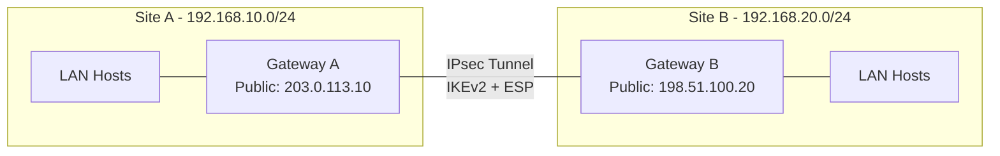

# How to Configure an IPsec VPN Using Libreswan on RHEL 9

Author: [nawazdhandala](https://www.github.com/nawazdhandala)

Tags: RHEL, IPsec, Libreswan, VPN, Linux

Description: A complete guide to setting up an IPsec VPN using Libreswan on RHEL 9, covering site-to-site tunnels with pre-shared keys and certificate-based authentication.

---

Libreswan is the default IPsec implementation on RHEL 9. If you need to connect to enterprise VPN gateways, Cisco ASA, or other IPsec-speaking equipment, Libreswan is the tool. It's also what Red Hat recommends for IPsec deployments, and it's included in the base repositories.

## When to Use IPsec vs WireGuard

IPsec with Libreswan makes sense when:
- You need to interoperate with non-Linux VPN gateways
- Corporate policy mandates IPsec
- You need IKEv2 compliance
- FIPS mode is required

## Prerequisites

- Two RHEL 9 systems (or one RHEL 9 and one remote gateway)
- Root or sudo access
- Network connectivity between the two endpoints
- Non-overlapping LAN subnets on each side

## Installing Libreswan

Libreswan is usually installed by default on RHEL 9.

```bash
# Install Libreswan if it's not already present
sudo dnf install -y libreswan

# Verify installation
ipsec --version
```

## Initializing the NSS Database

Libreswan uses NSS (Network Security Services) for its certificate store.

```bash
# Initialize the NSS database
sudo ipsec initnss

# This creates the database in /var/lib/ipsec/nss/
```

## Architecture: Site-to-Site IPsec Tunnel



## Setting Up a PSK (Pre-Shared Key) Tunnel

This is the simplest configuration. Both sides share a secret key.

### On Gateway A:

```bash
# Create the connection configuration
sudo tee /etc/ipsec.d/site-to-site.conf > /dev/null << 'EOF'
conn site-to-site
    # Use IKEv2
    ikev2=insist

    # Left side (this gateway)
    left=203.0.113.10
    leftsubnet=192.168.10.0/24
    leftid=@gateway-a

    # Right side (remote gateway)
    right=198.51.100.20
    rightsubnet=192.168.20.0/24
    rightid=@gateway-b

    # Authentication method
    authby=secret

    # Start automatically
    auto=start

    # Encryption settings
    ike=aes256-sha256-modp2048
    esp=aes256-sha256
EOF
```

### Set the Pre-Shared Key:

```bash
# Add the PSK to the secrets file
sudo tee -a /etc/ipsec.d/site-to-site.secrets > /dev/null << 'EOF'
@gateway-a @gateway-b : PSK "YourStrongPreSharedKeyHere"
EOF

# Lock down the secrets file
sudo chmod 600 /etc/ipsec.d/site-to-site.secrets
```

### On Gateway B:

```bash
# Mirror configuration (left and right are swapped)
sudo tee /etc/ipsec.d/site-to-site.conf > /dev/null << 'EOF'
conn site-to-site
    ikev2=insist

    # Left side (this gateway)
    left=198.51.100.20
    leftsubnet=192.168.20.0/24
    leftid=@gateway-b

    # Right side (remote gateway)
    right=203.0.113.10
    rightsubnet=192.168.10.0/24
    rightid=@gateway-a

    authby=secret
    auto=start
    ike=aes256-sha256-modp2048
    esp=aes256-sha256
EOF

# Same PSK (order of IDs doesn't matter)
sudo tee -a /etc/ipsec.d/site-to-site.secrets > /dev/null << 'EOF'
@gateway-b @gateway-a : PSK "YourStrongPreSharedKeyHere"
EOF

sudo chmod 600 /etc/ipsec.d/site-to-site.secrets
```

## Enabling IP Forwarding

Both gateways need to forward traffic.

```bash
# Enable forwarding
sudo sysctl -w net.ipv4.ip_forward=1
echo "net.ipv4.ip_forward = 1" | sudo tee /etc/sysctl.d/99-ipsec.conf
```

## Configuring the Firewall

```bash
# Allow IPsec traffic through the firewall
sudo firewall-cmd --permanent --add-service=ipsec

# Allow the ESP protocol and IKE port
sudo firewall-cmd --permanent --add-port=500/udp
sudo firewall-cmd --permanent --add-port=4500/udp

# Reload
sudo firewall-cmd --reload
```

## Starting the IPsec Service

```bash
# Start Libreswan
sudo systemctl start ipsec
sudo systemctl enable ipsec

# Check status
sudo systemctl status ipsec

# Verify the tunnel is established
sudo ipsec status
```

## Verifying the Tunnel

```bash
# Show detailed tunnel status
sudo ipsec whack --status

# Check for established Security Associations
sudo ipsec whack --trafficstatus

# Ping across the tunnel
ping -c 4 192.168.20.1
```

## Certificate-Based Authentication

For production environments, certificates are more secure than PSKs.

```bash
# Generate a key pair and certificate request
sudo ipsec certutil -R -k rsa -g 4096 \
    -s "CN=gateway-a.example.com,O=MyCompany" \
    -d sql:/var/lib/ipsec/nss \
    -o /tmp/gateway-a.csr

# Import a signed certificate
sudo ipsec certutil -A -n "gateway-a" \
    -d sql:/var/lib/ipsec/nss \
    -i /tmp/gateway-a.crt \
    -t "u,u,u"

# Import the CA certificate
sudo ipsec certutil -A -n "MyCA" \
    -d sql:/var/lib/ipsec/nss \
    -i /tmp/ca.crt \
    -t "CT,,"
```

Update the connection config for certificate auth:

```bash
sudo tee /etc/ipsec.d/site-to-site-cert.conf > /dev/null << 'EOF'
conn site-to-site-cert
    ikev2=insist
    left=203.0.113.10
    leftsubnet=192.168.10.0/24
    leftcert=gateway-a
    leftid=@gateway-a.example.com

    right=198.51.100.20
    rightsubnet=192.168.20.0/24
    rightid=@gateway-b.example.com

    authby=rsasig
    auto=start
    ike=aes256-sha256-modp2048
    esp=aes256-sha256
EOF
```

## Troubleshooting

**Tunnel won't establish:**

```bash
# Check Libreswan logs
journalctl -u ipsec --since "5 minutes ago"

# Run pluto with debug logging
sudo ipsec pluto --stderrlog

# Verify configuration syntax
sudo ipsec verify
```

**Phase 1 (IKE) fails:**

```bash
# Check that IKE proposals match on both sides
sudo ipsec whack --status | grep "IKE"

# Verify PSK matches
sudo ipsec showhostkey --list

# Check time synchronization (important for cert auth)
timedatectl
```

**Phase 2 (ESP) fails:**

```bash
# Check ESP proposals
sudo ipsec whack --status | grep "ESP"

# Verify subnet configuration matches
grep subnet /etc/ipsec.d/site-to-site.conf
```

**Packets not flowing through the tunnel:**

```bash
# Check for policy routing
ip xfrm state
ip xfrm policy

# Verify firewall isn't blocking
sudo tcpdump -i ens192 esp -c 10
```

## Monitoring the Tunnel

```bash
# Show traffic statistics
sudo ipsec whack --trafficstatus

# Monitor in real time
watch -n 5 'sudo ipsec whack --trafficstatus'
```

## Wrapping Up

Libreswan on RHEL 9 is the standard tool for IPsec VPNs, especially when you need to interoperate with enterprise equipment. The configuration can be more involved than WireGuard, but the protocol is well-understood and supported everywhere. Start with PSK for testing, move to certificates for production, and always verify with `ipsec status` and traffic tests after bringing the tunnel up.
