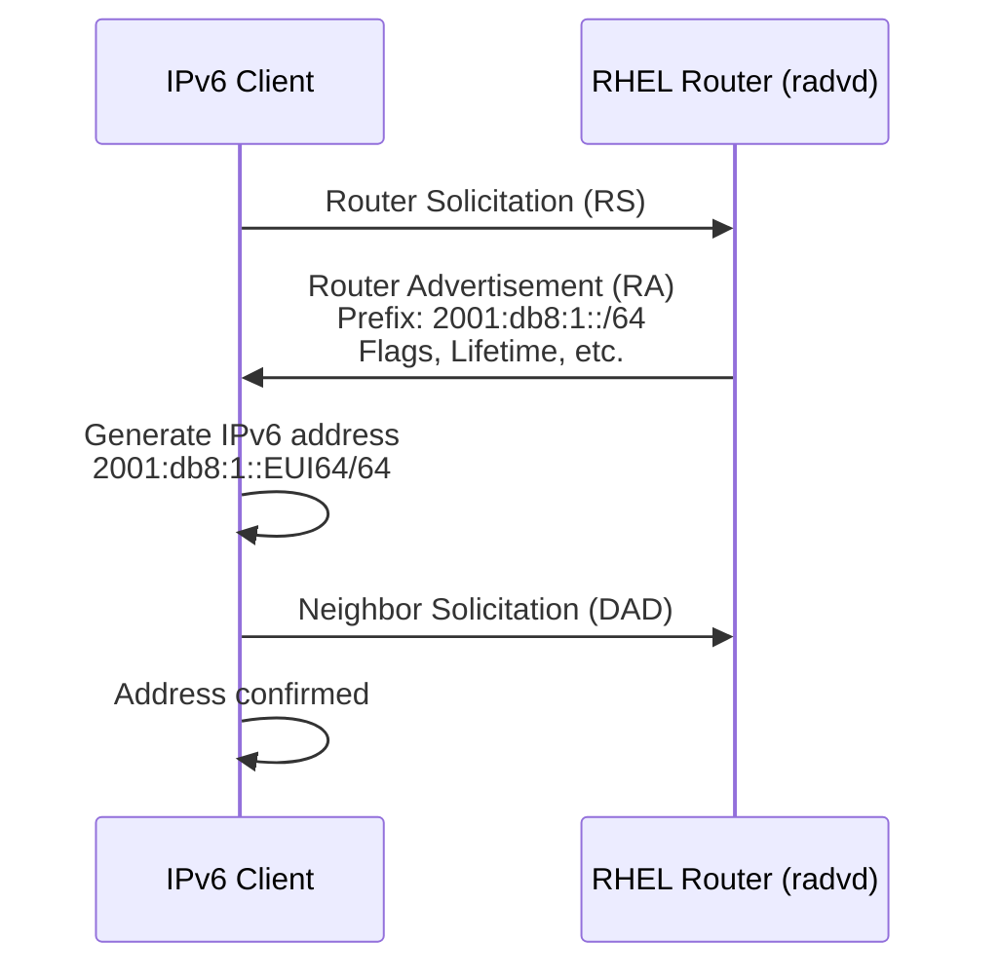

# How to Configure IPv6 Router Advertisements on RHEL

Author: [nawazdhandala](https://www.github.com/nawazdhandala)

Tags: RHEL, IPv6, Router Advertisements, Linux

Description: Learn how to configure your RHEL system as an IPv6 router that sends Router Advertisements using radvd, enabling clients on the network to auto-configure their IPv6 addresses via SLAAC.

---

Router Advertisements (RAs) are the backbone of IPv6 autoconfiguration. When a host comes online, it sends a Router Solicitation, and your router responds with an RA that tells it what prefix to use, which gateway to talk to, and various other parameters. If you're running RHEL as a gateway or router, you'll need radvd to handle this.

## How Router Advertisements Work

In IPv6, there's no DHCP server needed for basic address assignment (though DHCPv6 can complement it). Instead, routers periodically broadcast RAs, and hosts use SLAAC (Stateless Address Autoconfiguration) to build their own addresses from the announced prefix combined with their interface identifier.



## Prerequisites

- RHEL system with two or more network interfaces (acting as a router)
- Root or sudo access
- IPv6 prefix allocated for your network
- IPv6 forwarding enabled

## Installing radvd

The router advertisement daemon is available in the standard RHEL repositories.

```bash
# Install radvd
sudo dnf install -y radvd
```

## Enabling IPv6 Forwarding

A system must have IPv6 forwarding enabled to act as a router. Without this, radvd won't work properly.

```bash
# Enable IPv6 forwarding immediately
sudo sysctl -w net.ipv6.conf.all.forwarding=1

# Make it persistent across reboots
echo "net.ipv6.conf.all.forwarding = 1" | sudo tee /etc/sysctl.d/99-ipv6-forward.conf

# Verify
sysctl net.ipv6.conf.all.forwarding
```

Important note: enabling forwarding on an interface changes its behavior. It will no longer accept RAs on that interface by default. This is correct behavior for a router.

## Configuring radvd

The configuration file is `/etc/radvd.conf`. Here's a practical configuration for a LAN-facing interface.

```bash
# Create the radvd configuration
sudo tee /etc/radvd.conf > /dev/null << 'EOF'
interface ens224
{
    # Send Router Advertisements
    AdvSendAdvert on;

    # Maximum interval between RAs in seconds
    MaxRtrAdvInterval 600;

    # Minimum interval between RAs in seconds
    MinRtrAdvInterval 200;

    # Advertise this router as a default gateway
    AdvDefaultLifetime 1800;

    # Prefix to advertise for SLAAC
    prefix 2001:db8:1::/64
    {
        # Clients can use this prefix for autoconfiguration
        AdvOnLink on;

        # Clients can use SLAAC with this prefix
        AdvAutonomous on;

        # How long the prefix is valid (seconds)
        AdvValidLifetime 86400;

        # How long the address is preferred (seconds)
        AdvPreferredLifetime 14400;
    };

    # Advertise DNS server via RA (RFC 8106)
    RDNSS 2001:db8:1::1 2001:4860:4860::8888
    {
        AdvRDNSSLifetime 3600;
    };

    # Advertise DNS search domain
    DNSSL example.local
    {
        AdvDNSSLLifetime 3600;
    };
};
EOF
```

## Understanding the Key Options

Here's what the important settings do:

- **AdvSendAdvert on** - Actually send RAs on this interface
- **MaxRtrAdvInterval** - Upper bound on time between unsolicited RAs
- **AdvOnLink on** - Tells clients the prefix is on-link (directly reachable)
- **AdvAutonomous on** - Lets clients generate their own addresses from the prefix
- **AdvValidLifetime** - How long an address formed from this prefix stays valid
- **AdvPreferredLifetime** - How long the address is preferred for new connections

## Starting and Enabling radvd

```bash
# Start radvd
sudo systemctl start radvd

# Enable it to start on boot
sudo systemctl enable radvd

# Check the status
sudo systemctl status radvd
```

## Verifying Router Advertisements

From the RHEL router itself, you can check that radvd is running and sending advertisements.

```bash
# Check radvd is listening
ss -ulnp | grep radvd

# Watch for RAs on the network
sudo tcpdump -i ens224 -n icmp6 -c 5

# Check radvd logs for errors
journalctl -u radvd --since "10 minutes ago"
```

From a client machine on the same network:

```bash
# Check if the client received an IPv6 address via SLAAC
ip -6 addr show dev ens192

# Look for the default route pointing to the router
ip -6 route show default

# Listen for Router Advertisements
sudo radvdump
```

## Advertising Multiple Prefixes

You can advertise more than one prefix on the same interface.

```bash
# Configuration with multiple prefixes
sudo tee /etc/radvd.conf > /dev/null << 'EOF'
interface ens224
{
    AdvSendAdvert on;
    MaxRtrAdvInterval 600;

    # Primary prefix
    prefix 2001:db8:1::/64
    {
        AdvOnLink on;
        AdvAutonomous on;
        AdvValidLifetime 86400;
        AdvPreferredLifetime 14400;
    };

    # Secondary prefix for a specific VLAN or service
    prefix 2001:db8:2::/64
    {
        AdvOnLink on;
        AdvAutonomous on;
        AdvValidLifetime 86400;
        AdvPreferredLifetime 14400;
    };
};
EOF
```

## Using Managed and Other Flags

If you want clients to also use DHCPv6 for additional configuration (like NTP servers or search domains), set the managed and other flags.

```bash
# In the interface block, add:
# AdvManagedFlag on;   # Tells clients to use DHCPv6 for addresses
# AdvOtherConfigFlag on;  # Tells clients to use DHCPv6 for other info
```

A common setup is `AdvManagedFlag off` with `AdvOtherConfigFlag on`, which means SLAAC for addresses but DHCPv6 for things like DNS and NTP.

## Configuring the Router's Own IPv6 Address

Don't forget to give the router interface itself a static address in the prefix.

```bash
# Set a static IPv6 address on the LAN-facing interface
sudo nmcli connection modify "ens224" ipv6.method manual
sudo nmcli connection modify "ens224" ipv6.addresses "2001:db8:1::1/64"
sudo nmcli connection up "ens224"
```

## Troubleshooting

**radvd fails to start:**

```bash
# Check for config syntax errors
radvd --configtest

# Check logs
journalctl -u radvd -n 20
```

**Clients not getting addresses:**

```bash
# Verify forwarding is enabled
sysctl net.ipv6.conf.all.forwarding

# Check the interface is up and has an address
ip -6 addr show dev ens224

# Make sure firewall allows ICMPv6
sudo firewall-cmd --list-all
```

**Firewall blocking RAs:**

```bash
# ICMPv6 must be allowed for RAs to work
sudo firewall-cmd --permanent --add-icmp-block-inversion
sudo firewall-cmd --reload
```

## Wrapping Up

Running radvd on RHEL gives you full control over IPv6 autoconfiguration on your network. The combination of SLAAC with RDNSS lets clients fully configure themselves without any DHCPv6 infrastructure. Just remember that IPv6 forwarding must be on, and your firewall must permit ICMPv6 traffic for the whole thing to work.
