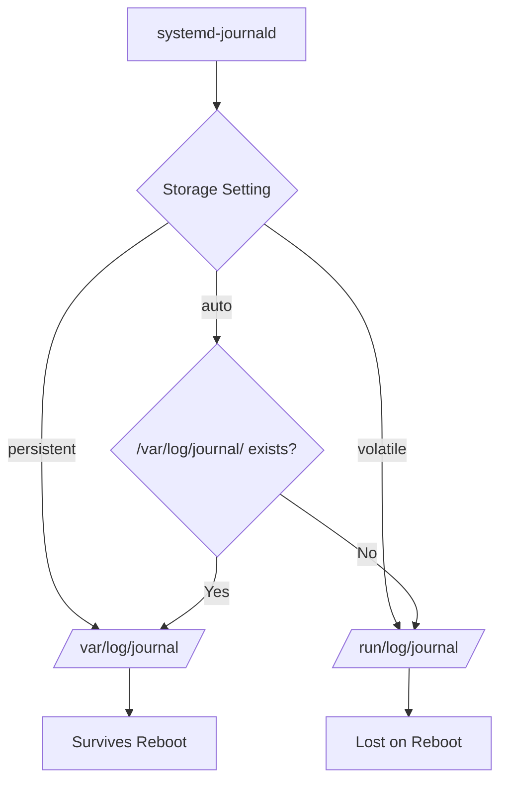

# How to Configure journald Persistent Storage and Log Rotation on RHEL

Author: [nawazdhandala](https://www.github.com/nawazdhandala)

Tags: RHEL, Journald, Systemd, Logging, Linux

Description: Learn how to configure systemd-journald for persistent log storage and set up log rotation policies to manage disk space on RHEL.

---

By default on RHEL, systemd-journald stores logs persistently in `/var/log/journal/`. However, understanding how to control storage behavior, set size limits, and configure rotation is important for keeping your system running smoothly. Without proper limits, journal logs can consume significant disk space over time.

## How journald Storage Works



journald has four storage modes:

- **persistent** - Stores logs in `/var/log/journal/`, creating the directory if needed
- **volatile** - Stores logs only in memory at `/run/log/journal/`
- **auto** - Stores persistently if `/var/log/journal/` exists, otherwise volatile
- **none** - Drops all logs

## Step 1: Enable Persistent Storage

On RHEL, persistent storage is the default. To verify or explicitly enable it:

```bash
# Check if the persistent journal directory exists
ls -la /var/log/journal/

# Check current journal disk usage
journalctl --disk-usage
```

Edit the journald configuration:

```bash
# Open the journald configuration file
sudo vi /etc/systemd/journald.conf
```

Set the storage directive:

```ini
[Journal]
# Enable persistent storage - logs survive reboots
Storage=persistent
```

If the directory does not exist, create it:

```bash
# Create the persistent journal directory
sudo mkdir -p /var/log/journal

# Set correct ownership and permissions
sudo systemd-tmpfiles --create --prefix /var/log/journal
```

## Step 2: Configure Log Size Limits

journald provides several options to control how much disk space logs can use.

Edit `/etc/systemd/journald.conf`:

```ini
[Journal]
Storage=persistent

# Maximum disk space the journal can use
# Default is 10% of the filesystem or 4G, whichever is smaller
SystemMaxUse=2G

# When journal exceeds this size, oldest entries are removed
# This is the threshold that triggers cleanup
SystemKeepFree=1G

# Maximum size of individual journal files
# Smaller files mean more granular rotation
SystemMaxFileSize=128M

# Maximum number of journal files to keep
# After this many files exist, the oldest are removed
SystemMaxFiles=50
```

Here is what each setting does:

| Setting | Description | Default |
|---------|-------------|---------|
| SystemMaxUse | Total max disk space for persistent logs | 10% of filesystem, max 4G |
| SystemKeepFree | Minimum free disk space to maintain | 15% of filesystem, max 4G |
| SystemMaxFileSize | Maximum size of a single journal file | 1/8 of SystemMaxUse |
| SystemMaxFiles | Maximum number of journal files | 100 |
| RuntimeMaxUse | Total max space for volatile logs | 10% of RAM, max 4G |
| RuntimeKeepFree | Min free RAM to maintain for volatile logs | 15% of RAM, max 4G |

## Step 3: Configure Time-Based Retention

You can limit how long journal entries are kept:

```ini
[Journal]
Storage=persistent
SystemMaxUse=2G
SystemMaxFileSize=128M

# Keep journal entries for a maximum of 30 days
MaxRetentionSec=30day

# Alternatively, use other time units:
# MaxRetentionSec=2week
# MaxRetentionSec=6month
# MaxRetentionSec=1year
```

## Step 4: Apply the Configuration

After editing the configuration file, restart journald:

```bash
# Restart journald to apply new settings
sudo systemctl restart systemd-journald

# Verify the service is running
sudo systemctl status systemd-journald
```

## Step 5: Verify the Configuration

```bash
# Check current disk usage
journalctl --disk-usage

# Show journal file details
journalctl --header | head -30

# List journal files
ls -lh /var/log/journal/$(cat /etc/machine-id)/
```

## Manual Log Cleanup

You can manually clean up journal logs without waiting for rotation:

```bash
# Remove journal entries older than 7 days
sudo journalctl --vacuum-time=7d

# Reduce journal to a maximum of 500MB
sudo journalctl --vacuum-size=500M

# Keep only the 5 most recent journal files
sudo journalctl --vacuum-files=5
```

These commands are useful for immediate cleanup before the automatic rotation kicks in.

## Rotating Journal Logs

journald handles rotation automatically based on your configured limits, but you can also trigger it manually:

```bash
# Rotate journal files - creates a new active journal file
sudo journalctl --rotate

# Rotate and then vacuum old entries
sudo journalctl --rotate
sudo journalctl --vacuum-time=7d
```

The `--rotate` command asks journald to close the current journal file and start a new one. This is similar to how logrotate works for traditional log files.

## Monitoring Journal Health

Create a simple script to monitor journal disk usage:

```bash
#!/bin/bash
# /usr/local/bin/journal-monitor.sh
# Monitor journal disk usage and alert if it exceeds a threshold

# Set threshold in megabytes
THRESHOLD_MB=1500

# Get current journal usage in megabytes
USAGE=$(journalctl --disk-usage 2>/dev/null | grep -oP '\d+\.\d+M' | head -1 | tr -d 'M')

# Handle gigabyte output
if journalctl --disk-usage 2>/dev/null | grep -q 'G'; then
    USAGE=$(journalctl --disk-usage 2>/dev/null | grep -oP '\d+\.\d+G' | head -1 | tr -d 'G')
    USAGE=$(echo "$USAGE * 1024" | bc | cut -d. -f1)
fi

if [ "${USAGE:-0}" -gt "$THRESHOLD_MB" ] 2>/dev/null; then
    echo "WARNING: Journal disk usage (${USAGE}MB) exceeds threshold (${THRESHOLD_MB}MB)"
    logger -p user.warning "Journal disk usage exceeds ${THRESHOLD_MB}MB threshold"
fi
```

```bash
# Make the script executable
sudo chmod +x /usr/local/bin/journal-monitor.sh

# Add to cron to run daily
echo "0 6 * * * root /usr/local/bin/journal-monitor.sh" | sudo tee /etc/cron.d/journal-monitor
```

## Separate Configuration for Runtime (Volatile) Logs

If you need different settings for volatile logs (useful for systems that also keep some logs in memory):

```ini
[Journal]
Storage=persistent

# Persistent storage limits
SystemMaxUse=2G
SystemMaxFileSize=128M

# Volatile (runtime) storage limits
RuntimeMaxUse=200M
RuntimeMaxFileSize=50M
RuntimeKeepFree=100M
```

## Summary

Configuring journald persistent storage and rotation on RHEL ensures your logs survive reboots while keeping disk usage under control. The key settings are `Storage=persistent` for reliable log keeping, `SystemMaxUse` and `SystemMaxFileSize` for disk limits, and `MaxRetentionSec` for time-based retention. Regular use of `journalctl --vacuum-time` and `journalctl --vacuum-size` helps with manual cleanup when needed.
