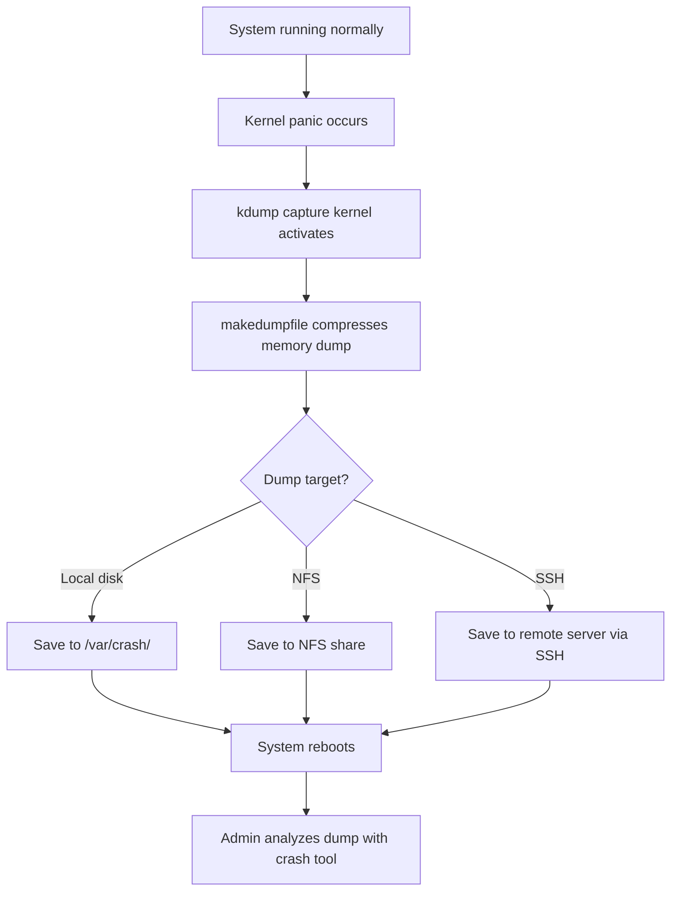

# How to Configure kdump for Kernel Crash Dump Analysis on RHEL 9

Author: [nawazdhandala](https://www.github.com/nawazdhandala)

Tags: RHEL, kdump, Crash Dump, Kernel, Linux

Description: A complete guide to setting up and configuring kdump on RHEL 9 for capturing kernel crash dumps, covering memory reservation, dump targets, crash analysis with the crash tool, and troubleshooting.

---

## What Is kdump?

When the Linux kernel crashes (a kernel panic), the system normally just freezes or reboots. Without a crash dump, you have no way to figure out what happened. kdump solves this by using a second kernel, pre-loaded into reserved memory, that activates when the primary kernel crashes. This "capture kernel" boots, collects the memory contents of the crashed kernel, saves them to disk or a remote location, and then reboots normally.

On RHEL 9, kdump is the supported mechanism for capturing kernel crash dumps, and setting it up on production systems is considered a best practice.

## How kdump Works



## Installing and Enabling kdump

```bash
# Install kdump and crash analysis tools
sudo dnf install kexec-tools crash -y

# Enable the kdump service
sudo systemctl enable kdump

# Check the current kdump status
systemctl status kdump
```

## Reserving Memory for the Crash Kernel

kdump needs memory reserved at boot time for the capture kernel. On RHEL 9, the default reservation is usually sufficient, but you can adjust it.

```bash
# Check current crashkernel reservation
cat /proc/cmdline | grep crashkernel

# The default on RHEL 9 is typically:
# crashkernel=1G-4G:192M,4G-64G:256M,64G-:512M
```

To change the reservation:

```bash
# Set a fixed reservation of 256 MB
sudo grubby --update-kernel=ALL --args="crashkernel=256M"

# Or use the auto scaling format
sudo grubby --update-kernel=ALL --args="crashkernel=1G-4G:192M,4G-64G:256M,64G-:512M"

# A reboot is required for the reservation to take effect
sudo systemctl reboot
```

After reboot, verify the reservation:

```bash
# Check that memory was reserved
dmesg | grep -i crash
cat /proc/iomem | grep -i crash
```

## Configuring the Dump Target

The kdump configuration file is at `/etc/kdump.conf`.

### Local Filesystem (Default)

```bash
# Edit the kdump configuration
sudo vi /etc/kdump.conf
```

Key settings for local storage:

```
# Save dumps to the local filesystem
path /var/crash

# Compression format (makedumpfile level)
core_collector makedumpfile -l --message-level 7 -d 31

# What to do after a dump is saved
default reboot
```

### Remote NFS Target

```bash
# Save crash dumps to an NFS share
# Add to /etc/kdump.conf:
nfs nfs-server.example.com:/exports/crash
path /var/crash
```

### Remote SSH Target

```bash
# Save crash dumps via SSH
# Add to /etc/kdump.conf:
ssh admin@remote-server.example.com
path /var/crash
sshkey /root/.ssh/kdump_id_rsa
```

Generate the SSH key for kdump:

```bash
# Generate a dedicated SSH key for kdump
sudo ssh-keygen -t rsa -f /root/.ssh/kdump_id_rsa -N ""

# Copy the key to the remote server
sudo ssh-copy-id -i /root/.ssh/kdump_id_rsa admin@remote-server.example.com
```

## Understanding core_collector Options

The `core_collector` line controls how the dump is captured and compressed.

```bash
# makedumpfile options explained
core_collector makedumpfile -l --message-level 7 -d 31
```

| Option | Meaning |
|--------|---------|
| -l | Use lzo compression (fast) |
| -c | Use zlib compression (smaller files) |
| -d 31 | Dump level - excludes zero pages, cache, user data |
| --message-level 7 | Verbosity of output during dump |

The dump level `-d` is a bitmask. Common values:

| Level | What is excluded |
|-------|-----------------|
| 1 | Zero-filled pages |
| 17 | Zero pages + free pages |
| 31 | Zero + free + user + cache pages (recommended) |

## Applying and Testing the Configuration

```bash
# Restart kdump to apply configuration changes
sudo systemctl restart kdump

# Verify kdump is running
sudo systemctl status kdump

# Check that the crash kernel is loaded
cat /sys/kernel/kexec_crash_loaded
# Should output: 1
```

### Testing kdump (Warning: Causes an Immediate Crash)

Only test on a non-production system or during a maintenance window.

```bash
# Trigger a manual kernel panic to test kdump
echo 1 | sudo tee /proc/sys/kernel/sysrq
echo c | sudo tee /proc/sysrq-trigger
```

The system will crash, kdump will capture the dump, and the system will reboot. After reboot, check for the dump:

```bash
# Find the crash dump
ls -la /var/crash/

# Each dump is in a timestamped directory
ls -la /var/crash/*/
```

## Analyzing Crash Dumps

The `crash` utility lets you examine crash dumps interactively.

```bash
# Install the debuginfo kernel package for analysis
sudo dnf install kernel-debuginfo -y

# Open a crash dump for analysis
sudo crash /usr/lib/debug/lib/modules/$(uname -r)/vmlinux /var/crash/*/vmcore
```

Common crash commands:

```bash
# Inside the crash shell:

# Show system information
sys

# Display the backtrace of the panicking task
bt

# Show all running processes at crash time
ps

# Display kernel message buffer (dmesg)
log

# Show memory usage
kmem -i

# Show open files for a process
files <pid>

# Exit the crash shell
quit
```

## Managing Crash Dumps

Crash dumps can be large. Set up automatic cleanup.

```bash
# Check the size of existing dumps
du -sh /var/crash/*/

# Remove old dumps manually
sudo rm -rf /var/crash/old-timestamp/

# Set up a cron job to clean dumps older than 30 days
echo "0 3 * * * root find /var/crash -type d -mtime +30 -exec rm -rf {} +" | sudo tee /etc/cron.d/clean-crash-dumps
```

## Configuring kdump for Specific Scenarios

### Filtering to Reduce Dump Size

For systems with large amounts of RAM, full dumps can be enormous. Use higher dump levels.

```bash
# Exclude as much as possible while keeping useful data
core_collector makedumpfile -l --message-level 7 -d 31
```

### Handling Systems with Encrypted Disks

If your dump target is on an encrypted volume, kdump needs access to the encryption key during the capture phase.

```bash
# For LUKS-encrypted targets, specify the device and mount
# Add to /etc/kdump.conf:
ext4 /dev/mapper/rhel-root
path /var/crash
```

## Troubleshooting kdump

```bash
# Check kdump service status and errors
systemctl status kdump -l

# View kdump-related log messages
journalctl -u kdump

# Verify the capture kernel can be loaded
kexec -l /boot/vmlinuz-$(uname -r) --initrd=/boot/initramfs-$(uname -r)kdump.img --command-line="$(cat /proc/cmdline) irqpoll nr_cpus=1 reset_devices"

# Check if enough memory is reserved
dmesg | grep -i "crash kernel"
```

Common issues:

| Problem | Solution |
|---------|----------|
| kdump fails to start | Check crashkernel reservation in /proc/cmdline |
| Dump file too large | Increase dump level (-d 31) |
| Network dump fails | Verify network connectivity and SSH keys |
| Not enough disk space | Clean old dumps or use a larger target |

## Wrapping Up

kdump is an essential safety net for production RHEL 9 systems. When a kernel panic hits, having a crash dump is the difference between guessing what went wrong and actually knowing. Set it up early, test it once to make sure it works, and then forget about it until you need it. The crash utility gives you powerful analysis capabilities, and combined with kernel debuginfo packages, you can usually pinpoint exactly what caused the panic.
