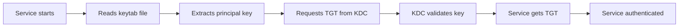

# How to Configure Kerberos Keytab Files on RHEL 9

Author: [nawazdhandala](https://www.github.com/nawazdhandala)

Tags: RHEL, Kerberos, Keytab, Authentication, Linux

Description: Learn how to create, manage, and use Kerberos keytab files on RHEL 9 for service authentication without interactive password prompts.

---

Keytab files store Kerberos principal keys and allow services (and automated scripts) to authenticate without needing someone to type a password. Getting keytabs right is important because a leaked keytab is equivalent to a leaked password.

## What a Keytab File Contains

A keytab file holds one or more entries, each consisting of a principal name and its encrypted key. When a service needs to authenticate to Kerberos, it reads the keytab instead of prompting for a password.



## Prerequisites

Install the Kerberos client packages:

```bash
# Install Kerberos workstation tools
sudo dnf install krb5-workstation krb5-libs -y
```

Ensure `/etc/krb5.conf` is configured to point to your KDC:

```bash
# Verify basic Kerberos configuration
cat /etc/krb5.conf
```

## Creating a Keytab with kadmin

If you have admin access to the KDC, use `kadmin` to create a keytab:

```bash
# Connect to the KDC admin interface
sudo kadmin -p admin/admin@EXAMPLE.COM

# Inside kadmin, create a service principal
addprinc -randkey HTTP/webserver.example.com@EXAMPLE.COM

# Export the key to a keytab file
ktadd -k /etc/krb5.keytab HTTP/webserver.example.com@EXAMPLE.COM

# Exit kadmin
quit
```

If you only have local admin access, use `kadmin.local` on the KDC itself:

```bash
# Run directly on the KDC server
sudo kadmin.local -q "addprinc -randkey HTTP/webserver.example.com@EXAMPLE.COM"
sudo kadmin.local -q "ktadd -k /tmp/http.keytab HTTP/webserver.example.com@EXAMPLE.COM"
```

## Managing Keytab Files with ktutil

The `ktutil` tool lets you merge, list, and manipulate keytab files:

```bash
# List entries in a keytab
klist -k /etc/krb5.keytab

# List with encryption types shown
klist -ke /etc/krb5.keytab
```

To merge two keytab files:

```bash
# Start ktutil
ktutil

# Read entries from the first keytab
read_kt /etc/krb5.keytab

# Read entries from the second keytab
read_kt /tmp/http.keytab

# Write all entries to a new combined keytab
write_kt /etc/combined.keytab

# Exit ktutil
quit
```

## Setting Proper Permissions

Keytab files must be protected. Anyone who can read a keytab can impersonate the service principal.

```bash
# Set ownership to root and the service user
sudo chown root:apache /etc/http.keytab

# Only root and the group can read it
sudo chmod 640 /etc/http.keytab

# Verify permissions
ls -la /etc/http.keytab
```

## Testing a Keytab

Verify that a keytab works by obtaining a ticket:

```bash
# Authenticate using the keytab (no password needed)
kinit -kt /etc/http.keytab HTTP/webserver.example.com@EXAMPLE.COM

# Verify the ticket was obtained
klist
```

## Rotating Keytab Keys

Periodically rotate keys for security:

```bash
# Connect to kadmin
sudo kadmin -p admin/admin@EXAMPLE.COM

# Change the key (generates a new random key)
change_password -randkey HTTP/webserver.example.com@EXAMPLE.COM

# Export the new key to the keytab
ktadd -k /etc/http.keytab HTTP/webserver.example.com@EXAMPLE.COM

quit
```

After rotation, restart any services that use the keytab so they pick up the new key.

## Using Keytabs in Scripts

For automated tasks that need Kerberos tickets:

```bash
#!/bin/bash
# Script that uses a keytab for automated Kerberos authentication

KEYTAB="/etc/cron.keytab"
PRINCIPAL="cronuser@EXAMPLE.COM"

# Obtain a ticket using the keytab
kinit -kt "$KEYTAB" "$PRINCIPAL"

# Verify we got a ticket
if klist -s; then
    echo "Authenticated successfully"
    # Run your Kerberos-authenticated commands here
    # For example, access a kerberized NFS share
    ls /mnt/kerberized-share/
else
    echo "Authentication failed"
    exit 1
fi

# Destroy the ticket when done
kdestroy
```

## Summary

Keytab files are the standard way to enable passwordless Kerberos authentication for services and automated processes on RHEL 9. Keep them properly secured with restrictive file permissions, rotate keys periodically, and always test after making changes.

