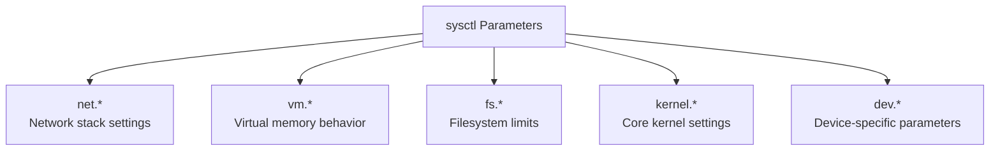

# How to Configure Kernel Parameters with sysctl on RHEL

Author: [nawazdhandala](https://www.github.com/nawazdhandala)

Tags: RHEL, Sysctl, Kernel, Tuning, Linux

Description: A hands-on guide to viewing, modifying, and managing kernel parameters using sysctl on RHEL, covering runtime changes, common tunable parameters, and practical use cases.

---

## What Is sysctl?

The sysctl interface lets you read and modify kernel parameters at runtime without rebooting. These parameters control everything from network stack behavior to memory management, file system limits, and process scheduling. On RHEL, the parameters live under the `/proc/sys/` virtual filesystem, and sysctl provides a clean way to interact with them.

If you have ever needed to bump the max number of open files, adjust swappiness, or enable IP forwarding on the fly, sysctl is the tool you reached for.

## Viewing Current Kernel Parameters

To list every tunable parameter on the system, use `sysctl -a`.

```bash
# List all kernel parameters and their current values
sudo sysctl -a
```

That will dump thousands of lines, so pipe it through grep when you are looking for something specific.

```bash
# Find all parameters related to IPv4
sudo sysctl -a | grep net.ipv4

# Check a single specific parameter
sysctl vm.swappiness
```

You can also read parameters directly from the proc filesystem.

```bash
# Read the current value of ip_forward
cat /proc/sys/net/ipv4/ip_forward
```

## Changing Parameters at Runtime

To change a parameter immediately, use `sysctl -w`.

```bash
# Enable IP forwarding
sudo sysctl -w net.ipv4.ip_forward=1

# Reduce swappiness to favor keeping data in RAM
sudo sysctl -w vm.swappiness=10

# Increase the maximum number of file handles
sudo sysctl -w fs.file-max=2097152
```

These changes take effect instantly but will be lost after a reboot. For persistent changes, see the next section.

## Understanding the Parameter Namespace

Kernel parameters are organized into logical groups. Here are the major categories you will work with.



| Namespace | Purpose | Example |
|-----------|---------|---------|
| net.ipv4 | IPv4 networking | net.ipv4.tcp_syncookies |
| net.ipv6 | IPv6 networking | net.ipv6.conf.all.disable_ipv6 |
| net.core | Core network settings | net.core.somaxconn |
| vm | Virtual memory | vm.swappiness |
| fs | Filesystem | fs.file-max |
| kernel | Kernel behavior | kernel.pid_max |

## Making Changes Persistent

To keep a parameter change across reboots, add it to a configuration file under `/etc/sysctl.d/`.

```bash
# Create a custom configuration file
sudo tee /etc/sysctl.d/99-custom.conf <<EOF
# Enable IP forwarding for routing
net.ipv4.ip_forward = 1

# Reduce swappiness
vm.swappiness = 10

# Increase max file handles
fs.file-max = 2097152
EOF

# Apply all settings from the file immediately
sudo sysctl -p /etc/sysctl.d/99-custom.conf
```

The naming convention matters. Files are processed in lexicographic order, so `99-custom.conf` loads after distribution defaults. The main configuration file `/etc/sysctl.conf` still works but the drop-in directory approach is preferred on RHEL.

## Common Tuning Scenarios

### Network Performance

```bash
# Increase the connection backlog for busy web servers
sudo sysctl -w net.core.somaxconn=65535

# Increase the TCP backlog queue
sudo sysctl -w net.ipv4.tcp_max_syn_backlog=65535

# Enable TCP window scaling for better throughput
sudo sysctl -w net.ipv4.tcp_window_scaling=1

# Widen the range of local ports available for outbound connections
sudo sysctl -w net.ipv4.ip_local_port_range="1024 65535"
```

### Memory Management

```bash
# Control how aggressively the kernel swaps
sudo sysctl -w vm.swappiness=10

# Set the percentage of dirty memory before background writeback starts
sudo sysctl -w vm.dirty_background_ratio=5

# Set the max percentage of dirty memory before forced writeback
sudo sysctl -w vm.dirty_ratio=15
```

### Security Hardening

```bash
# Ignore ICMP broadcast requests (smurf attack protection)
sudo sysctl -w net.ipv4.icmp_echo_ignore_broadcasts=1

# Enable TCP SYN cookies (SYN flood protection)
sudo sysctl -w net.ipv4.tcp_syncookies=1

# Disable source routing
sudo sysctl -w net.ipv4.conf.all.accept_source_route=0

# Enable reverse path filtering
sudo sysctl -w net.ipv4.conf.all.rp_filter=1
```

## Verifying and Troubleshooting

After making changes, always verify they took effect.

```bash
# Verify a specific value
sysctl net.ipv4.ip_forward

# Check which config files loaded and in what order
sudo sysctl --system
```

The `--system` flag reloads all sysctl configuration files from `/run/sysctl.d/`, `/etc/sysctl.d/`, `/usr/local/lib/sysctl.d/`, `/usr/lib/sysctl.d/`, and `/etc/sysctl.conf`. It also shows the load order, which is helpful when debugging conflicting settings.

If a parameter does not seem to stick, check for conflicting entries in other files.

```bash
# Search all sysctl config files for a specific parameter
grep -r "swappiness" /etc/sysctl.d/ /usr/lib/sysctl.d/ /etc/sysctl.conf
```

## A Word About SELinux

On RHEL, SELinux is enforcing by default and generally does not interfere with sysctl changes. However, if you are writing scripts that modify `/proc/sys/` directly rather than using the sysctl command, you might run into permission issues. Stick with the sysctl command and configuration files to avoid surprises.

## Wrapping Up

sysctl is one of those tools that every sysadmin should have in their back pocket. It lets you fine-tune kernel behavior without recompiling anything or waiting for a maintenance window reboot. Start with the defaults, measure your workload, change one parameter at a time, and always document what you changed and why. The `/etc/sysctl.d/` drop-in approach keeps your customizations organized and makes it clear what deviates from the stock RHEL configuration.
