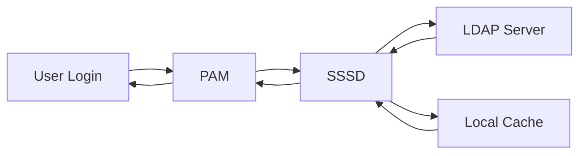

# How to Configure LDAP Authentication with SSSD on RHEL 9

Author: [nawazdhandala](https://www.github.com/nawazdhandala)

Tags: RHEL, LDAP, SSSD, Authentication, Linux

Description: Learn how to set up LDAP-based user authentication using SSSD on RHEL 9, including configuration, testing, and troubleshooting.

---

Managing user authentication centrally is essential for any organization with more than a handful of servers. SSSD (System Security Services Daemon) on RHEL 9 provides a reliable way to connect your Linux systems to an LDAP directory for authentication and identity lookups.

## What SSSD Does

SSSD sits between your system and the LDAP server, caching credentials and handling lookups. This means users can still log in even if the LDAP server is temporarily unavailable.



## Installing Required Packages

Start by installing SSSD and the LDAP client tools:

```bash
# Install SSSD with LDAP backend support
sudo dnf install sssd sssd-ldap openldap-clients -y
```

## Configuring SSSD

Create or edit the SSSD configuration file:

```bash
# Back up any existing configuration
sudo cp /etc/sssd/sssd.conf /etc/sssd/sssd.conf.bak 2>/dev/null

# Create the SSSD configuration
sudo tee /etc/sssd/sssd.conf > /dev/null << 'EOF'
[sssd]
# Define which services SSSD should manage
services = nss, pam
# List the domains (LDAP directories) to connect to
domains = example.com

[domain/example.com]
# Use LDAP as the identity and authentication provider
id_provider = ldap
auth_provider = ldap

# LDAP server URI - use ldaps for TLS encryption
ldap_uri = ldaps://ldap.example.com

# Base DN where user and group searches start
ldap_search_base = dc=example,dc=com

# TLS certificate for verifying the LDAP server
ldap_tls_cacert = /etc/pki/tls/certs/ca-bundle.crt

# Require TLS certificate verification
ldap_tls_reqcert = demand

# Enable ID mapping so LDAP users get consistent UIDs
ldap_id_use_start_tls = false

# Cache credentials for offline login
cache_credentials = true

# How long cached entries remain valid (in seconds)
entry_cache_timeout = 600
EOF
```

Set the correct permissions:

```bash
# SSSD requires strict permissions on its config file
sudo chmod 600 /etc/sssd/sssd.conf
sudo chown root:root /etc/sssd/sssd.conf
```

## Configuring NSS and PAM

Enable SSSD as a source for user and group information:

```bash
# Use authselect to configure PAM and NSS
sudo authselect select sssd with-mkhomedir --force
```

This command does two things: it tells NSS to look up users and groups through SSSD, and it configures PAM to use SSSD for authentication. The `with-mkhomedir` option automatically creates home directories for LDAP users on first login.

## Starting SSSD

```bash
# Enable and start the SSSD service
sudo systemctl enable --now sssd

# Check that it started without errors
sudo systemctl status sssd
```

## Testing the Configuration

Verify that LDAP users can be resolved:

```bash
# Look up a specific LDAP user
id ldapuser1

# List all users from LDAP
getent passwd ldapuser1

# Test group resolution
getent group ldapgroup1
```

Try logging in as an LDAP user:

```bash
# Test SSH login locally
ssh ldapuser1@localhost
```

## Troubleshooting

If things are not working, increase the SSSD debug level:

```bash
# Add debug level to the domain section in sssd.conf
sudo sed -i '/^\[domain\/example.com\]/a debug_level = 9' /etc/sssd/sssd.conf

# Clear the cache and restart SSSD
sudo sss_cache -E
sudo systemctl restart sssd

# Check the logs
sudo tail -f /var/log/sssd/sssd_example.com.log
```

Common issues include:

- **Certificate errors**: Make sure `ldap_tls_cacert` points to a valid CA certificate that signed the LDAP server certificate.
- **Connection timeouts**: Verify network connectivity and firewall rules (LDAPS uses port 636).
- **Permission denied on sssd.conf**: The file must be owned by root with 600 permissions.

## Verifying TLS Connection

```bash
# Test the LDAP TLS connection directly
ldapsearch -x -H ldaps://ldap.example.com -b "dc=example,dc=com" -D "cn=admin,dc=example,dc=com" -W "(uid=ldapuser1)"
```

## Summary

SSSD provides a robust, caching-aware bridge between RHEL 9 and your LDAP directory. With credential caching, users can authenticate even during brief network outages, and the integration with PAM and NSS means LDAP users work seamlessly with standard Linux tools and services.

