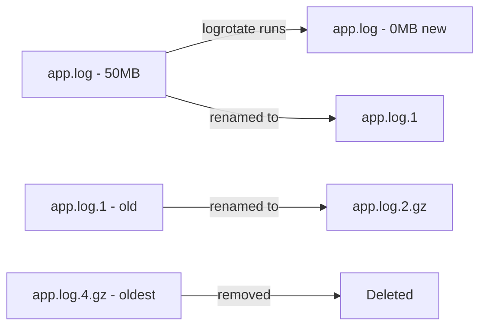

# How to Configure Log Rotation with logrotate on RHEL

Author: [nawazdhandala](https://www.github.com/nawazdhandala)

Tags: RHEL, Logrotate, Logging, System Administration, Linux

Description: Learn how to configure logrotate on RHEL to automatically manage log file sizes through rotation, compression, and cleanup policies.

---

Log files grow continuously and will eventually fill your disk if left unchecked. logrotate is the standard tool on RHEL for managing this problem. It rotates, compresses, and removes old log files on a schedule, keeping your system running smoothly without manual intervention.

## How logrotate Works



logrotate is triggered by a systemd timer (or cron) that runs daily. It reads configuration files that specify rules for each log file or group of log files.

## Default Configuration

The main configuration file is `/etc/logrotate.conf`:

```bash
# View the default configuration
cat /etc/logrotate.conf
```

The typical defaults on RHEL:

```bash
# Rotate log files weekly
weekly

# Keep 4 weeks of old log files
rotate 4

# Create new empty log files after rotation
create

# Use date as suffix for rotated files
dateext

# Compress rotated files
compress

# Include per-application configs from this directory
include /etc/logrotate.d
```

Individual applications place their configurations in `/etc/logrotate.d/`:

```bash
# List all logrotate configuration files
ls /etc/logrotate.d/
```

## Writing Custom logrotate Configurations

### Basic Configuration

```bash
# Create a configuration for a custom application
sudo vi /etc/logrotate.d/myapp
```

```bash
/var/log/myapp/*.log {
    # Rotate daily
    daily

    # Keep 14 rotated copies
    rotate 14

    # Compress old log files to save space
    compress

    # Do not compress the most recently rotated file
    # (allows the app time to close its file handle)
    delaycompress

    # Do not error if the log file is missing
    missingok

    # Do not rotate if the log file is empty
    notifempty

    # Set permissions on the new log file
    create 0640 appuser appgroup

    # Add date to the rotated file name
    dateext

    # Use this date format (e.g., myapp.log-20260304)
    dateformat -%Y%m%d
}
```

### Configuration with Post-Rotation Commands

Some applications need to be notified after log rotation so they reopen their log files:

```bash
/var/log/nginx/*.log {
    daily
    rotate 30
    compress
    delaycompress
    missingok
    notifempty
    create 0640 nginx nginx

    # Run this script after all logs in this block are rotated
    sharedscripts

    # Commands to run after rotation
    postrotate
        # Send USR1 signal to nginx to reopen log files
        /usr/bin/kill -USR1 $(cat /var/run/nginx.pid 2>/dev/null) 2>/dev/null || true
    endscript
}
```

### Size-Based Rotation

Instead of time-based rotation, rotate when a file reaches a certain size:

```bash
/var/log/myapp/app.log {
    # Rotate when file exceeds 100MB
    size 100M

    # Keep 10 old copies
    rotate 10

    compress
    delaycompress
    missingok
    notifempty
    create 0640 appuser appgroup

    postrotate
        # Restart the app to pick up the new log file
        systemctl reload myapp > /dev/null 2>&1 || true
    endscript
}
```

### Copy and Truncate

For applications that hold their log file handle open and cannot reopen files:

```bash
/var/log/stubborn-app/app.log {
    daily
    rotate 7
    compress

    # Copy the log file, then truncate the original
    # This avoids the need for the app to reopen the file
    copytruncate

    missingok
    notifempty
}
```

Note: `copytruncate` can lose a few lines of log data written between the copy and truncate operations.

## Common Directives Reference

| Directive | Description |
|-----------|-------------|
| daily/weekly/monthly/yearly | How often to rotate |
| rotate N | Number of old files to keep |
| compress | Compress rotated files with gzip |
| delaycompress | Wait one rotation before compressing |
| missingok | Do not error if log file is missing |
| notifempty | Skip rotation if log file is empty |
| create mode owner group | Create new file with these permissions |
| copytruncate | Copy the file then truncate (no reopen needed) |
| sharedscripts | Run postrotate once for all matched files |
| size N | Rotate when file exceeds N bytes/K/M/G |
| dateext | Use date in the rotated file name |
| maxage N | Remove rotated files older than N days |
| olddir /path | Move rotated files to this directory |
| prerotate/endscript | Run commands before rotation |
| postrotate/endscript | Run commands after rotation |

## Testing Your Configuration

Always test before waiting for the timer to run:

```bash
# Dry run - shows what would happen without making changes
sudo logrotate -d /etc/logrotate.d/myapp

# Force rotation to test (actually rotates files)
sudo logrotate -f /etc/logrotate.d/myapp

# Verbose output for troubleshooting
sudo logrotate -v /etc/logrotate.d/myapp
```

## The logrotate Timer

On RHEL, logrotate runs via a systemd timer:

```bash
# Check the timer status
sudo systemctl status logrotate.timer

# See when it last ran and when it will run next
sudo systemctl list-timers logrotate.timer

# View the timer configuration
sudo systemctl cat logrotate.timer
```

The state file tracks what has been rotated:

```bash
# View the logrotate state file
sudo cat /var/lib/logrotate/logrotate.status
```

## Advanced: Multiple Log Files with Different Rules

```bash
# Different rules for different log types in the same application
/var/log/myapp/access.log {
    daily
    rotate 90
    compress
    delaycompress
    missingok
    notifempty
    create 0640 appuser appgroup
    sharedscripts
    postrotate
        systemctl reload myapp > /dev/null 2>&1 || true
    endscript
}

/var/log/myapp/error.log {
    # Keep error logs longer
    daily
    rotate 180
    compress
    delaycompress
    missingok
    notifempty
    create 0640 appuser appgroup

    # Move old logs to a separate directory
    olddir /var/log/myapp/archive

    sharedscripts
    postrotate
        systemctl reload myapp > /dev/null 2>&1 || true
    endscript
}
```

Create the archive directory:

```bash
sudo mkdir -p /var/log/myapp/archive
sudo chown appuser:appgroup /var/log/myapp/archive
```

## Troubleshooting

```bash
# Check for syntax errors in all configs
sudo logrotate -d /etc/logrotate.conf

# Force rotation and see verbose output
sudo logrotate -fv /etc/logrotate.conf 2>&1 | tail -50

# Check if SELinux is blocking logrotate
sudo ausearch -m AVC -c logrotate -ts recent

# Check the systemd journal for logrotate errors
sudo journalctl -u logrotate --no-pager -n 20

# Reset the state file if logrotate thinks files were already rotated
sudo vi /var/lib/logrotate/logrotate.status
```

## Summary

logrotate on RHEL prevents log files from consuming all available disk space by automatically rotating, compressing, and removing old logs. Place your custom configurations in `/etc/logrotate.d/`, test them with `logrotate -d`, and let the systemd timer handle the rest. The key decisions are how often to rotate (daily, weekly), how many copies to keep, and whether to use `copytruncate` or `postrotate` scripts for applications that need to reopen their log files.
