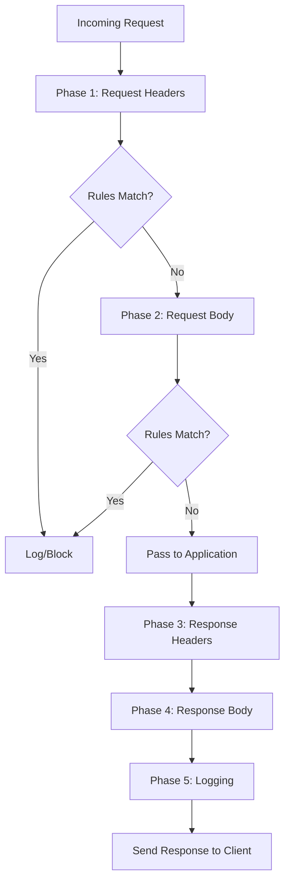

# How to Configure ModSecurity Web Application Firewall with Apache on RHEL 9

Author: [nawazdhandala](https://www.github.com/nawazdhandala)

Tags: RHEL, Apache, ModSecurity, WAF, Security, Linux

Description: How to install and configure ModSecurity as a web application firewall with Apache httpd on RHEL 9 to protect against common web attacks.

---

## What Is ModSecurity?

ModSecurity is an open-source web application firewall (WAF) that sits inside Apache and inspects HTTP traffic in real time. It can block SQL injection, cross-site scripting (XSS), path traversal, and many other attacks. Combined with the OWASP Core Rule Set (CRS), it provides solid baseline protection without writing custom rules from scratch.

## Prerequisites

- RHEL 9 with Apache httpd installed
- EPEL repository enabled
- Root or sudo access

## Step 1 - Enable EPEL and Install ModSecurity

ModSecurity is available through the EPEL repository:

```bash
# Enable EPEL repository
sudo dnf install -y epel-release

# Install ModSecurity and the Apache connector
sudo dnf install -y mod_security mod_security_crs
```

This installs both the ModSecurity engine and the OWASP Core Rule Set.

## Step 2 - Verify the Module Is Loaded

```bash
# Check if ModSecurity is loaded
httpd -M | grep security
```

You should see `security2_module`. The module is configured via `/etc/httpd/conf.d/mod_security.conf`.

## Step 3 - Understand the Configuration Files

| Path | Purpose |
|------|---------|
| `/etc/httpd/conf.d/mod_security.conf` | Main ModSecurity config |
| `/etc/httpd/modsecurity.d/` | Rule configuration directory |
| `/etc/httpd/modsecurity.d/activated_rules/` | Symlinks to active CRS rules |
| `/var/log/httpd/modsec_audit.log` | Audit log for blocked requests |

## Step 4 - Start in Detection Mode

Before blocking anything, run ModSecurity in detection-only mode to see what it would block:

```bash
# Edit the main ModSecurity configuration
sudo vi /etc/httpd/conf.d/mod_security.conf
```

Find the `SecRuleEngine` directive and set it to `DetectionOnly`:

```apache
# Run in detection mode first to avoid false positives
SecRuleEngine DetectionOnly
```

This logs potential violations without actually blocking them.

## Step 5 - Review the Audit Log

Reload Apache and watch the audit log:

```bash
# Reload Apache with ModSecurity in detection mode
sudo systemctl reload httpd

# Monitor the audit log
sudo tail -f /var/log/httpd/modsec_audit.log
```

Browse your site normally and generate some test traffic. Review the log entries to identify false positives.

## Step 6 - Switch to Enforcement Mode

Once you are confident there are no problematic false positives, enable blocking:

```apache
# Enable full protection
SecRuleEngine On
```

Reload Apache:

```bash
sudo systemctl reload httpd
```

## Step 7 - Test the WAF

Try a basic SQL injection test:

```bash
# This should be blocked by ModSecurity
curl -I "http://your-server/?id=1%20OR%201=1"
```

You should get a 403 Forbidden response. Check the audit log for the matching rule:

```bash
# Find the rule that triggered
sudo grep "SQL" /var/log/httpd/modsec_audit.log | tail -5
```

## Step 8 - Handle False Positives

False positives are inevitable. When a legitimate request gets blocked, you have a few options.

### Disable a Specific Rule

```apache
# Disable a specific rule by ID
SecRuleRemoveById 941100
```

### Disable a Rule for a Specific URL

```apache
# Disable a rule only for a specific path
<Location /api/upload>
    SecRuleRemoveById 941100
</Location>
```

### Whitelist a Parameter

```apache
# Allow a specific parameter to bypass a rule
SecRuleUpdateTargetById 941100 "!ARGS:content"
```

## Step 9 - Configure Audit Logging

The default audit log can get large. Tune what gets logged:

```apache
# Only log relevant transactions
SecAuditEngine RelevantOnly

# Define what is relevant (log 4xx and 5xx responses)
SecAuditLogRelevantStatus "^(?:5|4(?!04))"

# Log parts: headers, request body, response headers
SecAuditLogParts ABCFHZ

# Set the audit log path
SecAuditLog /var/log/httpd/modsec_audit.log
```

## Step 10 - Custom Rules

You can write custom rules for your specific application:

```apache
# Block requests with a specific bad user agent
SecRule REQUEST_HEADERS:User-Agent "BadBot" \
    "id:10001,phase:1,deny,status:403,msg:'Blocked bad user agent'"

# Block access to sensitive files
SecRule REQUEST_URI "\.(?:env|git|svn)" \
    "id:10002,phase:1,deny,status:403,msg:'Blocked sensitive file access'"
```

## ModSecurity Request Processing



## Step 11 - Keeping Rules Updated

The OWASP CRS receives regular updates. Keep it current:

```bash
# Update the CRS rules
sudo dnf update mod_security_crs
```

After updating, restart Apache and monitor the audit log for new false positives.

## Performance Considerations

ModSecurity adds processing overhead to every request. To minimize the impact:

- Only inspect request bodies when needed (`SecRequestBodyAccess On` only where necessary)
- Limit the request body size that gets inspected
- Use `SecRuleEngine Off` for static asset locations

```apache
# Skip ModSecurity for static assets
<LocationMatch "\.(css|js|png|jpg|gif|ico|woff2)$">
    SecRuleEngine Off
</LocationMatch>
```

## Wrap-Up

ModSecurity with the OWASP CRS gives you a strong baseline defense against common web attacks. Always start in detection mode, review the logs carefully, and tune out false positives before switching to enforcement. Keep the rules updated and write custom rules for your application-specific needs. It is not a replacement for secure coding, but it is a valuable additional layer.
