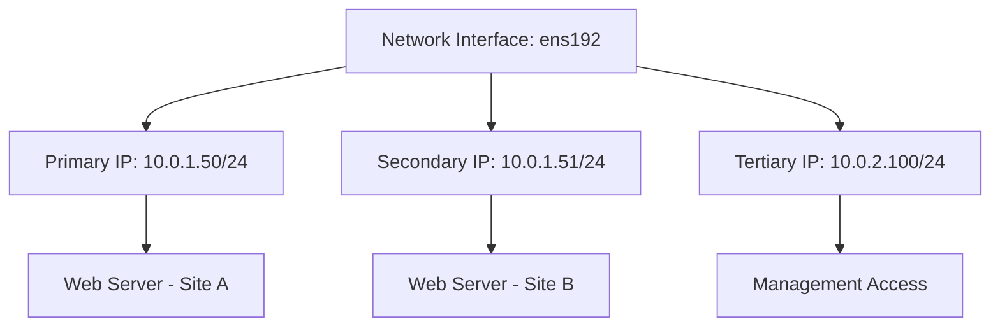

# How to Configure Multiple IP Addresses on a Single Interface Using nmcli on RHEL

Author: [nawazdhandala](https://www.github.com/nawazdhandala)

Tags: RHEL, nmcli, Multiple IPs, Networking, Linux

Description: Learn how to assign multiple IP addresses to a single network interface on RHEL using nmcli, with practical use cases and configuration examples.

---

There are plenty of legitimate reasons to put multiple IP addresses on one network interface. Maybe you are hosting several SSL websites that each need their own IP. Maybe you are migrating services between IPs and need both active during the transition. Or maybe you are setting up a cluster with a floating VIP alongside the node's real address. Whatever the reason, RHEL makes it straightforward with nmcli.

## How Multiple IPs Work on Linux

Linux supports multiple IP addresses on a single interface natively. Older approaches used "alias interfaces" (like eth0:0, eth0:1), but that method is deprecated. Modern NetworkManager handles multiple addresses as a list property on the connection profile, and the kernel assigns them all to the same interface.



## Adding Multiple IPs When Creating a Connection

You can specify multiple addresses when you first create a connection profile:

```bash
# Create a connection with two IP addresses
nmcli connection add \
  con-name "multi-ip" \
  ifname ens192 \
  type ethernet \
  ipv4.method manual \
  ipv4.addresses "10.0.1.50/24,10.0.1.51/24" \
  ipv4.gateway 10.0.1.1 \
  ipv4.dns "10.0.1.2"
```

Note that multiple addresses are comma-separated in the same `ipv4.addresses` parameter.

## Adding IPs to an Existing Connection

More commonly, you will want to add an IP to a connection that already exists. Use the `+` prefix to append:

```bash
# Add a second IP address to an existing connection
nmcli connection modify ens192 +ipv4.addresses 10.0.1.51/24

# Add a third IP address
nmcli connection modify ens192 +ipv4.addresses 10.0.1.52/24

# Apply the changes
nmcli connection up ens192
```

The `+` prefix is important. Without it, you would replace the existing addresses instead of adding to them.

## Removing an IP Address

Use the `-` prefix to remove a specific address:

```bash
# Remove a specific IP address from the connection
nmcli connection modify ens192 -ipv4.addresses 10.0.1.52/24

# Apply the changes
nmcli connection up ens192
```

## Replacing All IP Addresses

If you want to completely replace the address list:

```bash
# Replace all addresses with a new set
nmcli connection modify ens192 ipv4.addresses "10.0.1.60/24,10.0.1.61/24"

# Apply the changes
nmcli connection up ens192
```

## Mixing Subnets

You can assign addresses from different subnets to the same interface. This is common when a server needs to be reachable on multiple networks without additional physical interfaces:

```bash
# Add addresses from different subnets
nmcli connection modify ens192 ipv4.addresses "10.0.1.50/24,172.16.0.50/24"

# Apply changes
nmcli connection up ens192
```

When using multiple subnets, be mindful of your routing. You may need to add static routes to ensure traffic for each subnet uses the correct gateway:

```bash
# Add a route for the second subnet
nmcli connection modify ens192 +ipv4.routes "172.16.0.0/24 172.16.0.1"
```

## Adding IPv6 Addresses

The same approach works for IPv6:

```bash
# Add multiple IPv6 addresses
nmcli connection modify ens192 \
  ipv6.method manual \
  ipv6.addresses "2001:db8::50/64,2001:db8::51/64"

# Or append to existing IPv6 addresses
nmcli connection modify ens192 +ipv6.addresses "2001:db8::52/64"

# Apply changes
nmcli connection up ens192
```

## Verifying the Configuration

After adding multiple IPs, verify they are all active:

```bash
# Show all IP addresses on the interface
ip addr show ens192

# Check the connection profile settings
nmcli connection show ens192 | grep ipv4.addresses

# Verify connectivity from each address
ping -I 10.0.1.50 8.8.8.8 -c 2
ping -I 10.0.1.51 8.8.8.8 -c 2
```

The `ip addr show` output will list all addresses:

```bash
2: ens192: <BROADCAST,MULTICAST,UP,LOWER_UP> mtu 1500
    inet 10.0.1.50/24 brd 10.0.1.255 scope global noprefixroute ens192
    inet 10.0.1.51/24 brd 10.0.1.255 scope global secondary noprefixroute ens192
    inet 10.0.1.52/24 brd 10.0.1.255 scope global secondary noprefixroute ens192
```

Notice the "secondary" label on the additional addresses.

## Understanding the Keyfile Format

When you have multiple IPs, the keyfile stores them as numbered entries:

```ini
[ipv4]
method=manual
address1=10.0.1.50/24,10.0.1.1
address2=10.0.1.51/24
address3=10.0.1.52/24
dns=10.0.1.2;
```

The first address entry includes the gateway. Subsequent entries do not need to repeat it.

## Practical Use Cases

### Web Server with Multiple SSL Sites

Before SNI became universal, each SSL certificate needed its own IP address:

```bash
# Add IPs for each virtual host
nmcli connection modify ens192 ipv4.addresses \
  "10.0.1.50/24,10.0.1.51/24,10.0.1.52/24,10.0.1.53/24"
nmcli connection modify ens192 ipv4.gateway 10.0.1.1
nmcli connection up ens192
```

### Service Migration

When moving a service from one IP to another, you can temporarily run both:

```bash
# Add the new IP alongside the old one
nmcli connection modify ens192 +ipv4.addresses 10.0.1.100/24
nmcli connection up ens192

# After DNS propagation and testing, remove the old IP
nmcli connection modify ens192 -ipv4.addresses 10.0.1.50/24
nmcli connection up ens192
```

### High Availability Floating IPs

For HA setups, the cluster software usually manages the floating IP, but you can test the concept manually:

```bash
# Temporarily add a floating IP for testing
nmcli connection modify ens192 +ipv4.addresses 10.0.1.200/24
nmcli connection up ens192

# Remove it after testing
nmcli connection modify ens192 -ipv4.addresses 10.0.1.200/24
nmcli connection up ens192
```

In production, tools like Pacemaker or keepalived handle the VIP management automatically.

## Temporary vs. Persistent IPs

If you need an IP temporarily and do not want it to survive a reboot, you can add it with the `ip` command directly:

```bash
# Add a temporary IP address (does not persist across reboots)
ip addr add 10.0.1.99/24 dev ens192

# Remove the temporary IP
ip addr del 10.0.1.99/24 dev ens192
```

Be aware that NetworkManager may remove addresses it did not configure, depending on its settings. To prevent this, you can set the `may-fail` property or manage the address through NetworkManager instead.

## Performance Considerations

Having multiple IPs on an interface has negligible performance impact for a reasonable number of addresses (dozens). If you find yourself adding hundreds of IPs to a single interface, you should probably rethink your architecture, perhaps using a load balancer or reverse proxy instead.

## Wrapping Up

Adding multiple IP addresses to a single interface on RHEL is a straightforward operation with nmcli. The `+` and `-` prefixes for appending and removing addresses make it easy to manage the address list without disrupting existing configurations. Just remember to reactivate the connection after making changes, and verify with `ip addr show` that all addresses are properly assigned.
