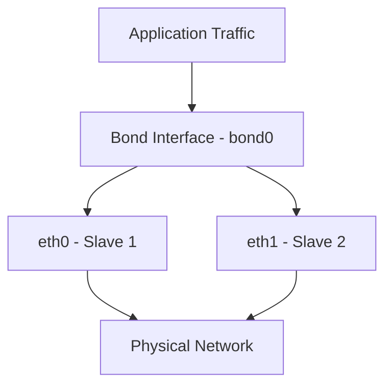

# How to Configure Network Bonding on RHEL 9 Using nmcli

Author: [nawazdhandala](https://www.github.com/nawazdhandala)

Tags: RHEL, Network Bonding, nmcli, High Availability, Linux

Description: A hands-on guide to setting up network bonding on RHEL 9 with nmcli, covering bond creation, slave interfaces, and verification steps for production environments.

---

Network bonding combines two or more physical network interfaces into a single logical interface. This gives you either redundancy, increased throughput, or both, depending on the bonding mode you pick. On RHEL 9, the recommended way to manage this is through nmcli, the NetworkManager command-line tool.

I have been running bonded interfaces on production servers for years, and the process on RHEL 9 is straightforward once you understand the moving parts. Let me walk you through it.

## Prerequisites

Before you start, make sure you have:

- RHEL 9 installed with at least two physical network interfaces
- Root or sudo access
- NetworkManager running (it should be by default)

Check that NetworkManager is active:

```bash
# Verify NetworkManager is running
systemctl status NetworkManager
```

List your available network interfaces:

```bash
# Show all network devices and their current state
nmcli device status
```

You should see your interfaces listed as `ethernet` type with a state of `disconnected` or `connected`.

## How Network Bonding Works

Here is a simplified view of how bonding stacks up:



The kernel bonding driver intercepts traffic destined for the bond interface and distributes it across the slave interfaces based on the bonding mode.

## Step 1: Create the Bond Interface

Create a bond connection with active-backup mode (mode 1), which is the safest starting point for most environments:

```bash
# Create the bond interface with active-backup mode
nmcli connection add type bond con-name bond0 ifname bond0 bond.options "mode=active-backup,miimon=100"
```

The `miimon=100` parameter sets the link monitoring interval to 100 milliseconds. This means the bonding driver checks the link status of each slave every 100ms and can failover quickly if a link drops.

## Step 2: Add Slave Interfaces

Now attach your physical interfaces to the bond. Replace `eth0` and `eth1` with your actual interface names:

```bash
# Add the first slave interface to the bond
nmcli connection add type ethernet con-name bond0-slave1 ifname eth0 master bond0

# Add the second slave interface to the bond
nmcli connection add type ethernet con-name bond0-slave2 ifname eth1 master bond0
```

## Step 3: Configure IP Addressing

Assign a static IP to the bond interface. Adjust the address, gateway, and DNS to match your network:

```bash
# Set a static IP address on the bond
nmcli connection modify bond0 ipv4.addresses 192.168.1.100/24
nmcli connection modify bond0 ipv4.gateway 192.168.1.1
nmcli connection modify bond0 ipv4.dns "8.8.8.8 8.8.4.4"
nmcli connection modify bond0 ipv4.method manual
```

If you prefer DHCP, skip the above and just set:

```bash
# Use DHCP instead of a static address
nmcli connection modify bond0 ipv4.method auto
```

## Step 4: Bring Up the Bond

Activate the bond and its slaves:

```bash
# Activate the bond connection
nmcli connection up bond0
```

NetworkManager will automatically bring up the slave connections when the bond activates.

## Step 5: Verify the Configuration

Check that everything is working:

```bash
# View the bond connection details
nmcli connection show bond0

# Check the bonding kernel module status
cat /proc/net/bonding/bond0
```

The output from `/proc/net/bonding/bond0` shows you which slave is currently active, the MII status of each interface, and the bonding mode.

You can also verify with:

```bash
# Quick overview of all connections
nmcli connection show

# Check IP assignment on the bond
ip addr show bond0
```

## Step 6: Test Connectivity

Run a quick ping test to confirm traffic flows:

```bash
# Test basic connectivity
ping -c 4 192.168.1.1
```

## Making the Bond Persistent

The connections you created with nmcli are already persistent. NetworkManager stores them as files under `/etc/NetworkManager/system-connections/`. They will survive reboots.

Verify the files exist:

```bash
# List the connection files
ls -la /etc/NetworkManager/system-connections/
```

## Modifying Bond Options After Creation

If you need to change bond parameters later, use `nmcli connection modify`:

```bash
# Change the MII monitoring interval to 200ms
nmcli connection modify bond0 bond.options "mode=active-backup,miimon=200"

# Restart the bond to apply changes
nmcli connection down bond0 && nmcli connection up bond0
```

## Removing a Bond

If you need to tear down the bond:

```bash
# Deactivate and delete the slave connections
nmcli connection delete bond0-slave1
nmcli connection delete bond0-slave2

# Delete the bond itself
nmcli connection delete bond0
```

## Common Pitfalls

**Firewall rules**: If you had firewall rules tied to individual interfaces (eth0, eth1), you need to update them to reference bond0 instead.

**Conflicting connections**: If your physical interfaces already have active connections, deactivate and delete those first before adding them as bond slaves.

```bash
# Remove existing connection on an interface before bonding
nmcli connection delete "Wired connection 1"
```

**SELinux**: Bonding itself does not typically trigger SELinux issues, but if you are running services that bind to specific interfaces, double-check that they reference the bond interface.

## Summary

Setting up network bonding on RHEL 9 with nmcli boils down to: create the bond, add slaves, assign an IP, and bring it up. The active-backup mode is a solid default for redundancy, and you can explore other modes (balance-rr, 802.3ad, etc.) depending on your needs. The key thing is to test failover before putting the server into production, which I cover in a separate post.
