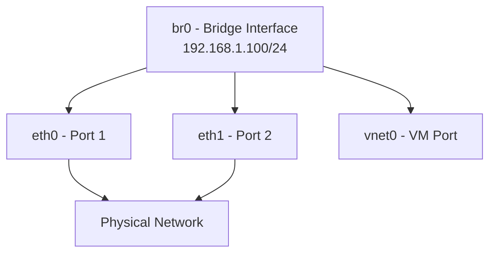

# How to Configure a Network Bridge with nmcli on RHEL 9

Author: [nawazdhandala](https://www.github.com/nawazdhandala)

Tags: RHEL, Network Bridge, nmcli, Linux

Description: A focused guide on creating and managing network bridges using nmcli on RHEL 9, covering bridge options, STP settings, and common configurations.

---

Network bridges connect two or more network segments at Layer 2, making them appear as one. On RHEL 9, bridges are commonly used for KVM virtualization, container networking, and connecting VLANs or physical segments. nmcli is the cleanest way to manage bridge configuration, and all settings persist across reboots.

## Creating a Basic Bridge

```bash
# Create a bridge interface
nmcli connection add type bridge con-name br0 ifname br0

# Add a physical interface as a bridge port
nmcli connection add type ethernet con-name br0-port1 ifname eth0 master br0

# Configure IP on the bridge
nmcli connection modify br0 ipv4.addresses 192.168.1.100/24
nmcli connection modify br0 ipv4.gateway 192.168.1.1
nmcli connection modify br0 ipv4.dns "192.168.1.1"
nmcli connection modify br0 ipv4.method manual

# Activate the bridge
nmcli connection up br0
```

## Bridge Architecture



## Bridge Options

nmcli exposes several bridge parameters:

### STP (Spanning Tree Protocol)

STP prevents loops when a bridge has multiple paths to the same network:

```bash
# Enable STP (default is on)
nmcli connection modify br0 bridge.stp yes

# Disable STP (use only if you know there are no loops)
nmcli connection modify br0 bridge.stp no
```

For simple server bridges with one physical port and virtual interfaces, STP is unnecessary and adds a 30-second delay when ports come up:

```bash
# Disable STP to avoid the forwarding delay
nmcli connection modify br0 bridge.stp no
nmcli connection down br0 && nmcli connection up br0
```

### Forward Delay

If STP is enabled, forward delay controls how long a port waits before forwarding traffic:

```bash
# Set forward delay to 4 seconds (minimum with STP)
nmcli connection modify br0 bridge.forward-delay 4

# Set to 0 if STP is disabled
nmcli connection modify br0 bridge.forward-delay 0
```

### Ageing Time

How long the bridge keeps MAC addresses in its forwarding table:

```bash
# Set ageing time to 300 seconds (default)
nmcli connection modify br0 bridge.ageing-time 300
```

### Hello Time

How often the bridge sends STP hello packets (only relevant with STP enabled):

```bash
# Set hello time to 2 seconds (default)
nmcli connection modify br0 bridge.hello-time 2
```

### Max Age

Maximum age of STP information before the bridge recalculates:

```bash
# Set max age to 20 seconds (default)
nmcli connection modify br0 bridge.max-age 20
```

## Bridge with Multiple Physical Ports

You can bridge multiple physical interfaces together:

```bash
# Create bridge with two physical ports
nmcli connection add type bridge con-name br0 ifname br0
nmcli connection add type ethernet con-name br0-port1 ifname eth0 master br0
nmcli connection add type ethernet con-name br0-port2 ifname eth1 master br0

# Configure IP
nmcli connection modify br0 ipv4.addresses 192.168.1.100/24
nmcli connection modify br0 ipv4.method manual

# Activate
nmcli connection up br0
```

Be careful with multi-port bridges, as they can create loops if STP is disabled and the ports connect to the same switch.

## Bridge with DHCP

```bash
# Create a bridge that gets its IP via DHCP
nmcli connection add type bridge con-name br0 ifname br0
nmcli connection modify br0 ipv4.method auto
nmcli connection add type ethernet con-name br0-port1 ifname eth0 master br0
nmcli connection up br0
```

## Viewing Bridge Status

```bash
# Show bridge link information
bridge link show

# Show MAC address table (forwarding database)
bridge fdb show br br0

# Show STP state
bridge link show dev eth0

# Show full bridge details via nmcli
nmcli connection show br0 | grep bridge
```

## Bridge Port Options

Individual ports have their own settings:

```bash
# Set port priority (lower = preferred for STP root port selection)
nmcli connection modify br0-port1 bridge-port.priority 32

# Set port path cost
nmcli connection modify br0-port1 bridge-port.path-cost 100

# Enable hairpin mode (allows traffic to go back out the same port)
nmcli connection modify br0-port1 bridge-port.hairpin-mode yes
```

Hairpin mode is important for some virtualization setups where VMs need to communicate with each other through the bridge.

## Bridge Without an IP Address

Sometimes you need a bridge that just forwards traffic without the host participating:

```bash
# Create a bridge with no IP
nmcli connection add type bridge con-name br0 ifname br0
nmcli connection modify br0 ipv4.method disabled
nmcli connection modify br0 ipv6.method disabled
nmcli connection add type ethernet con-name br0-port1 ifname eth0 master br0
nmcli connection up br0
```

## Removing a Bridge

```bash
# Deactivate the bridge
nmcli connection down br0

# Delete port connections first
nmcli connection delete br0-port1

# Delete the bridge
nmcli connection delete br0
```

## Checking Bridge Configuration Files

NetworkManager stores bridge configurations in:

```bash
# List all connection profiles
ls -la /etc/NetworkManager/system-connections/

# View a specific bridge profile
cat /etc/NetworkManager/system-connections/br0.nmconnection
```

## Common Mistakes

**Forgetting to move the IP**: If you move a physical NIC into a bridge but leave the IP on the physical NIC, traffic routing breaks. Always put the IP on the bridge interface.

**Leaving STP enabled for simple setups**: On a server with one physical NIC and VMs, STP just adds 30 seconds of delay when ports come up. Disable it.

**Not deleting old connections**: If eth0 already has a connection profile, it might interfere with the bridge port profile. Delete old connections before adding the interface as a bridge port.

## Summary

nmcli makes bridge management on RHEL 9 straightforward. The key steps are: create the bridge, add ports, configure the IP on the bridge (not the physical NIC), and tune STP settings based on your topology. For simple single-NIC server bridges, disable STP to avoid forwarding delays. For multi-port bridges or complex topologies, leave STP enabled to prevent loops. All configurations are persistent and survive reboots.
