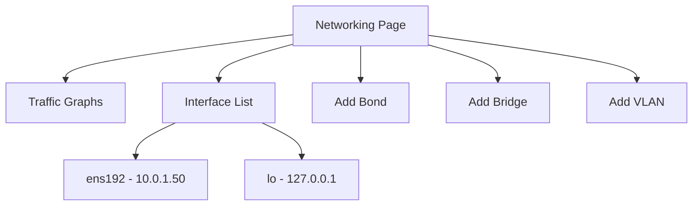
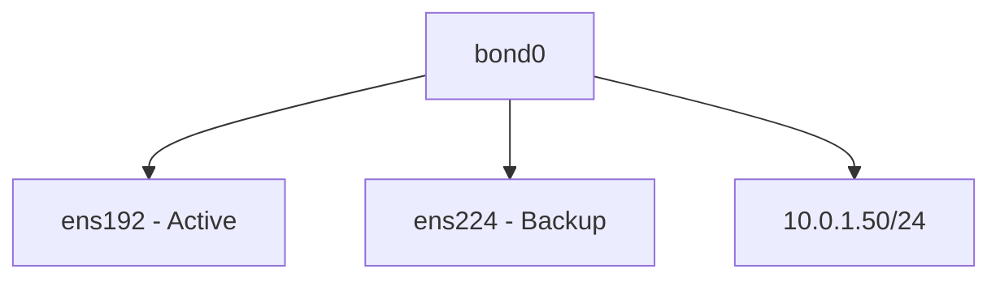

# How to Configure Network Interfaces Using the Cockpit Web Console on RHEL

Author: [nawazdhandala](https://www.github.com/nawazdhandala)

Tags: RHEL, Cockpit, Networking, Linux

Description: A practical guide to configuring network interfaces, bonds, VLANs, and bridges using the Cockpit web console on RHEL.

---

Network configuration on RHEL lives under NetworkManager, and while nmcli is a perfectly good tool, it has a learning curve. Cockpit's networking page gives you a visual overview of every interface, its IP addresses, and traffic stats. More importantly, it lets you make changes without memorizing nmcli syntax.

## The Networking Page

Click "Networking" in Cockpit's sidebar. The page shows:

- A traffic graph for each active interface
- A list of all interfaces with their IPs, status, and type
- Buttons to add bonds, bridges, VLANs, and teams



## Viewing Interface Details

Click on any interface name to see its full configuration:

- IPv4 and IPv6 settings (DHCP or static)
- MAC address
- MTU size
- DNS servers
- Search domains
- Connection status

The CLI equivalent:

```bash
# Show all interfaces and their addresses
ip addr show

# Show a specific connection's details
nmcli connection show ens192

# Show DNS configuration
cat /etc/resolv.conf
```

## Configuring a Static IP Address

To switch an interface from DHCP to a static address, click on the interface, then click on the IPv4 settings section. Change "Automatic (DHCP)" to "Manual" and fill in:

- IP address (e.g., 10.0.1.50)
- Prefix length or subnet mask (e.g., 24)
- Default gateway (e.g., 10.0.1.1)
- DNS servers (e.g., 10.0.1.1, 8.8.8.8)

Click "Apply" and Cockpit will reconfigure the interface. If you're connected via that interface, you may lose your connection momentarily.

The nmcli equivalent:

```bash
# Set a static IP on an existing connection
sudo nmcli connection modify ens192 \
    ipv4.method manual \
    ipv4.addresses 10.0.1.50/24 \
    ipv4.gateway 10.0.1.1 \
    ipv4.dns "10.0.1.1 8.8.8.8"

# Bring the connection up with new settings
sudo nmcli connection up ens192
```

## Switching Back to DHCP

To revert to DHCP, click on the interface, change IPv4 from "Manual" back to "Automatic (DHCP)", and apply.

```bash
# Revert to DHCP
sudo nmcli connection modify ens192 \
    ipv4.method auto \
    ipv4.addresses "" \
    ipv4.gateway "" \
    ipv4.dns ""

sudo nmcli connection up ens192
```

## Adding DNS Servers

In the interface settings, you can add DNS servers in the IPv4 or IPv6 section. Cockpit writes these into the NetworkManager connection profile, and NetworkManager updates `/etc/resolv.conf` accordingly.

Verify DNS configuration after the change:

```bash
# Check which DNS servers are being used
nmcli device show ens192 | grep DNS

# Test DNS resolution
dig google.com +short
```

## Setting the MTU

The MTU (Maximum Transmission Unit) can be adjusted in the interface settings. The default is 1500. For jumbo frames on storage networks, you might want 9000.

```bash
# Set MTU via nmcli
sudo nmcli connection modify ens192 802-3-ethernet.mtu 9000
sudo nmcli connection up ens192

# Verify the change
ip link show ens192 | grep mtu
```

In Cockpit, just edit the MTU field and apply.

## Creating a Network Bond

Bonding combines multiple interfaces for redundancy or increased throughput. In Cockpit, click "Add bond" and configure:

- **Name** - the bond interface name (e.g., bond0)
- **Members** - the physical interfaces to include
- **Mode** - active-backup, balance-rr, 802.3ad (LACP), etc.
- **Primary** - the preferred interface for active-backup mode



The CLI equivalent for an active-backup bond:

```bash
# Create a bond connection
sudo nmcli connection add type bond \
    con-name bond0 \
    ifname bond0 \
    bond.options "mode=active-backup,miimon=100"

# Add member interfaces
sudo nmcli connection add type ethernet \
    con-name bond0-port1 \
    ifname ens192 \
    master bond0

sudo nmcli connection add type ethernet \
    con-name bond0-port2 \
    ifname ens224 \
    master bond0

# Configure IP on the bond
sudo nmcli connection modify bond0 \
    ipv4.method manual \
    ipv4.addresses 10.0.1.50/24 \
    ipv4.gateway 10.0.1.1

# Bring it up
sudo nmcli connection up bond0
```

Cockpit handles all of this through a single form.

## Creating a VLAN Interface

VLANs let you segment traffic on a single physical interface. Click "Add VLAN" in Cockpit and specify:

- **Parent interface** - the physical NIC
- **VLAN ID** - the tag number (e.g., 100)
- **Name** - auto-generated or custom

```bash
# Create a VLAN interface via nmcli
sudo nmcli connection add type vlan \
    con-name vlan100 \
    ifname ens192.100 \
    dev ens192 \
    id 100 \
    ipv4.method manual \
    ipv4.addresses 10.0.100.50/24

sudo nmcli connection up vlan100
```

## Creating a Network Bridge

Bridges are used primarily for virtual machine networking. A bridge allows VMs to share the host's physical network.

Click "Add bridge" in Cockpit and select:

- **Name** - the bridge name (e.g., br0)
- **Ports** - the physical interface to bridge
- **STP** - Spanning Tree Protocol toggle

```bash
# Create a bridge via nmcli
sudo nmcli connection add type bridge \
    con-name br0 \
    ifname br0

# Add a port to the bridge
sudo nmcli connection add type ethernet \
    con-name br0-port \
    ifname ens192 \
    master br0

# Set IP on the bridge
sudo nmcli connection modify br0 \
    ipv4.method manual \
    ipv4.addresses 10.0.1.50/24 \
    ipv4.gateway 10.0.1.1

sudo nmcli connection up br0
```

## Checking Connectivity

After making network changes, Cockpit shows the updated status immediately. The traffic graphs will reflect the new configuration. You can also verify from the terminal:

```bash
# Check all interfaces
ip addr show

# Verify routing
ip route show

# Test connectivity
ping -c 3 8.8.8.8

# Test DNS
ping -c 3 google.com
```

## Troubleshooting Network Issues

If a configuration change breaks connectivity:

```bash
# List all connections
nmcli connection show

# Check which connections are active
nmcli connection show --active

# Restart NetworkManager as a last resort
sudo systemctl restart NetworkManager

# Check NetworkManager logs for errors
journalctl -u NetworkManager -n 30 --no-pager
```

In Cockpit, the networking page shows the current state of all interfaces. If an interface is down, its status will be clearly indicated.

## Firewall Integration

Cockpit's networking page also includes a link to firewall settings. Firewall zones are assigned to interfaces, and you can see which zone each interface belongs to.

```bash
# Check which zone an interface is in
firewall-cmd --get-zone-of-interface=ens192

# List all zones and their interfaces
firewall-cmd --get-active-zones
```

## Wrapping Up

Cockpit makes network configuration visual and straightforward. For simple tasks like setting a static IP or adding a DNS server, it saves time. For more involved setups like bonds, VLANs, and bridges, the guided forms prevent the common mistakes that come from typing long nmcli commands. All changes are made through NetworkManager, so they're persistent and consistent with how RHEL manages networking natively.
