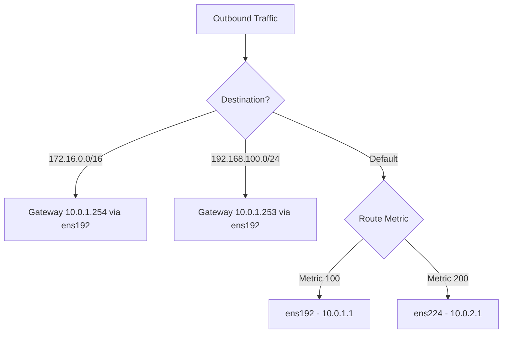

# How to Configure Network Routing Tables and Static Routes on RHEL

Author: [nawazdhandala](https://www.github.com/nawazdhandala)

Tags: RHEL, Routing, Static Routes, Networking, Linux

Description: Learn how to configure static routes, policy-based routing, and multiple routing tables on RHEL using NetworkManager and nmcli.

---

Most servers get by with a single default gateway, but real-world networks are rarely that simple. You might need traffic to a specific subnet to go through a different gateway, or you might have multiple uplinks with traffic that needs to be routed based on source address. RHEL handles all of this through NetworkManager, and once you understand how static routes and routing tables work, you can build surprisingly sophisticated routing setups.

## Understanding the Default Routing Table

Every RHEL system has a main routing table that gets populated automatically:

```bash
# View the current routing table
ip route show

# Show the default gateway
ip route show default
```

Typical output looks like:

```
default via 10.0.1.1 dev ens192 proto static metric 100
10.0.1.0/24 dev ens192 proto kernel scope link src 10.0.1.50 metric 100
```

The `default` route tells the kernel where to send packets that do not match any more specific route. The connected subnet route is added automatically when the interface is configured.

## Adding Static Routes with nmcli

### Basic Static Route

```bash
# Add a static route - traffic to 172.16.0.0/16 goes through 10.0.1.254
nmcli connection modify ens192 +ipv4.routes "172.16.0.0/16 10.0.1.254"

# Apply the changes
nmcli connection up ens192

# Verify the route was added
ip route show
```

### Multiple Static Routes

```bash
# Add multiple static routes
nmcli connection modify ens192 +ipv4.routes "172.16.0.0/16 10.0.1.254"
nmcli connection modify ens192 +ipv4.routes "192.168.100.0/24 10.0.1.253"
nmcli connection modify ens192 +ipv4.routes "10.10.0.0/16 10.0.1.252"

# Apply changes
nmcli connection up ens192
```

### Static Route with Metric

```bash
# Add a route with a specific metric (lower = higher priority)
nmcli connection modify ens192 +ipv4.routes "172.16.0.0/16 10.0.1.254 100"

# Apply
nmcli connection up ens192
```

### Removing a Static Route

```bash
# Remove a specific static route
nmcli connection modify ens192 -ipv4.routes "172.16.0.0/16 10.0.1.254"

# Apply
nmcli connection up ens192
```

## Setting the Default Gateway

```bash
# Set the default gateway
nmcli connection modify ens192 ipv4.gateway 10.0.1.1

# Apply
nmcli connection up ens192
```

### Route Metrics for Multiple Gateways

When you have multiple interfaces with default gateways, the route metric determines which one is preferred:

```bash
# Primary interface gets lower metric (higher priority)
nmcli connection modify ens192 ipv4.route-metric 100

# Secondary interface gets higher metric (lower priority)
nmcli connection modify ens224 ipv4.route-metric 200

# Apply both
nmcli connection up ens192
nmcli connection up ens224
```



## Policy-Based Routing

Policy-based routing (PBR) lets you make routing decisions based on criteria other than the destination address, like source address, incoming interface, or packet marks.

### Example: Source-Based Routing

A common scenario is having two network interfaces and wanting traffic that originates from each interface's IP to be routed out through that interface's gateway:

```bash
# Step 1: Create a custom routing table (add an entry to rt_tables)
echo "100 secondary" >> /etc/iproute2/rt_tables

# Step 2: Add routes and rules via nmcli
# Add the default route for the secondary table
nmcli connection modify ens224 +ipv4.routes "0.0.0.0/0 10.0.2.1 table=100"

# Add a routing rule: traffic from 10.0.2.50 uses table 100
nmcli connection modify ens224 +ipv4.routing-rules "priority 100 from 10.0.2.50/32 table 100"

# Apply
nmcli connection up ens224
```

### Verifying Policy Routes

```bash
# Show all routing rules
ip rule show

# Show routes in a specific table
ip route show table 100

# Show routes in all tables
ip route show table all
```

## IPv6 Static Routes

The same concepts apply to IPv6:

```bash
# Add an IPv6 static route
nmcli connection modify ens192 +ipv6.routes "2001:db8:2::/48 2001:db8:1::1"

# Apply
nmcli connection up ens192

# Verify
ip -6 route show
```

## Understanding the Keyfile Format for Routes

When you configure routes via nmcli, they are stored in the connection keyfile:

```ini
[ipv4]
method=manual
address1=10.0.1.50/24,10.0.1.1
route1=172.16.0.0/16,10.0.1.254
route2=192.168.100.0/24,10.0.1.253,100
dns=10.0.1.2;

[ipv4]
route1_options=table=100
routing-rule1=priority 100 from 10.0.2.50/32 table 100
```

You can edit these files directly, then reload:

```bash
# Reload after manual edits
nmcli connection reload
nmcli connection up ens192
```

## Preventing Default Route from DHCP

Sometimes you want DHCP for the IP address but do not want it to set the default route (common for management interfaces):

```bash
# Get IP from DHCP but do not use its gateway as default route
nmcli connection modify ens224 ipv4.never-default yes

# Apply
nmcli connection up ens224
```

## Troubleshooting Routing Issues

### Check the Routing Table

```bash
# Full routing table with all details
ip route show

# Routes for a specific destination
ip route get 172.16.0.100

# Show the route cache
ip route show cache
```

### Trace the Path

```bash
# Traceroute to see the path packets take
traceroute 172.16.0.100

# Or use tracepath (does not require root)
tracepath 172.16.0.100
```

### Check for Asymmetric Routing

Asymmetric routing happens when outgoing and incoming traffic take different paths. This can cause issues with stateful firewalls:

```bash
# Check reverse path filtering settings
cat /proc/sys/net/ipv4/conf/all/rp_filter
cat /proc/sys/net/ipv4/conf/ens192/rp_filter

# Temporarily disable rp_filter for testing (not recommended for production)
sysctl -w net.ipv4.conf.ens192.rp_filter=0
```

### Verify Routes Survive Reboot

```bash
# Check that routes are in the connection profile (persistent)
nmcli connection show ens192 | grep ipv4.routes

# Reboot and verify
reboot
# After reboot:
ip route show
```

## Practical Example: Multi-Homed Server

Here is a complete example for a server with two uplinks:

```bash
# Primary uplink - carries all default traffic
nmcli connection modify primary-uplink \
  ipv4.method manual \
  ipv4.addresses 203.0.113.50/24 \
  ipv4.gateway 203.0.113.1 \
  ipv4.route-metric 100

# Secondary uplink - used for specific subnets
nmcli connection modify secondary-uplink \
  ipv4.method manual \
  ipv4.addresses 198.51.100.50/24 \
  ipv4.never-default yes

# Route traffic for the 10.0.0.0/8 networks through the secondary uplink
nmcli connection modify secondary-uplink \
  +ipv4.routes "10.0.0.0/8 198.51.100.1"

# Apply both
nmcli connection up primary-uplink
nmcli connection up secondary-uplink
```

## Wrapping Up

Static routes and policy-based routing on RHEL are managed through NetworkManager connection profiles, which means they are persistent, well-organized, and easy to manage with nmcli. For most servers, a few static routes beyond the default gateway are all you need. For more complex setups with multiple uplinks or source-based routing, the combination of custom routing tables and routing rules gives you the flexibility to handle nearly any network topology. Just remember to verify your routes after applying changes, and be especially careful with remote servers where a routing mistake can cut off your SSH access.
