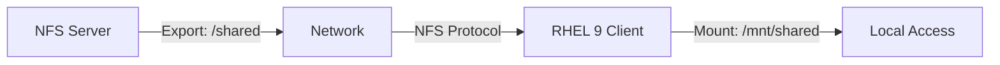

# How to Configure NFS Mounts Using the Cockpit Web Console on RHEL 9

Author: [nawazdhandala](https://www.github.com/nawazdhandala)

Tags: RHEL, Cockpit, NFS, Storage, Linux

Description: Learn how to configure NFS client mounts through the Cockpit web console on RHEL 9, including persistent mounts, mount options, and troubleshooting.

---

NFS is still one of the most common ways to share storage across Linux servers. Setting it up from the command line involves editing fstab, running mount commands, and getting the options right. Cockpit's storage page lets you add NFS mounts through a form that handles the fstab entry for you.

## Prerequisites

Make sure the NFS client utilities are installed on your RHEL 9 system:

```bash
# Install NFS client packages
sudo dnf install nfs-utils -y

# Start and enable the required services
sudo systemctl enable --now nfs-client.target
sudo systemctl enable --now rpcbind
```

You also need an NFS server with an exported share. We'll use `nfs-server.example.com:/shared` as the example throughout this guide.

## Adding an NFS Mount in Cockpit

Navigate to Storage in the Cockpit sidebar. Look for the "NFS mounts" section. Click "New NFS mount" and fill in:

- **Server address** - the NFS server hostname or IP (e.g., `nfs-server.example.com`)
- **Path on server** - the exported path (e.g., `/shared`)
- **Local mount point** - where to mount it locally (e.g., `/mnt/shared`)
- **Mount options** - additional mount options



Click "Add" and Cockpit mounts the share and adds an entry to `/etc/fstab` so it persists across reboots.

## The CLI Equivalent

Here's what Cockpit does behind the scenes:

```bash
# Create the mount point
sudo mkdir -p /mnt/shared

# Mount the NFS share
sudo mount -t nfs nfs-server.example.com:/shared /mnt/shared

# Add to fstab for persistence
echo 'nfs-server.example.com:/shared /mnt/shared nfs defaults 0 0' | sudo tee -a /etc/fstab
```

## Discovering Available Exports

Before adding a mount, you might want to see what the server is sharing:

```bash
# Show exports from an NFS server
showmount -e nfs-server.example.com
```

This lists all exports and which clients are allowed to access them. If the command hangs or fails, check that the NFS server's firewall allows the `nfs` service.

## Mount Options

Cockpit lets you specify mount options in the form. Common options include:

| Option | Purpose |
|--------|---------|
| `rw` | Read-write access (default) |
| `ro` | Read-only access |
| `soft` | Return error if server is unreachable |
| `hard` | Keep retrying if server is unreachable (default) |
| `intr` | Allow interruption of hung NFS operations |
| `noatime` | Don't update access times, improves performance |
| `vers=4` | Force NFS version 4 |
| `sec=krb5` | Use Kerberos authentication |
| `_netdev` | Mark as network device, mount after network is up |

A practical fstab entry with useful options:

```bash
# Performance-tuned NFS mount in fstab
nfs-server.example.com:/shared /mnt/shared nfs rw,hard,intr,noatime,vers=4,_netdev 0 0
```

## Checking NFS Mount Status

After adding the mount in Cockpit, verify it's working:

```bash
# Show all NFS mounts
mount -t nfs4

# Check the mount point is accessible
ls -la /mnt/shared

# Show NFS mount statistics
nfsstat -m

# Check NFS-specific details
nfsiostat
```

Cockpit's Storage page shows the mount with its current status and disk usage.

## Editing an Existing NFS Mount

In Cockpit, click on the NFS mount in the Storage page to modify its options or change the mount point. Cockpit updates the fstab entry accordingly.

From the CLI:

```bash
# Unmount first
sudo umount /mnt/shared

# Edit the fstab entry
sudo vi /etc/fstab

# Remount with new options
sudo mount /mnt/shared
```

## Removing an NFS Mount

In Cockpit, click on the mount and select the remove option. This unmounts the share and removes the fstab entry.

```bash
# Manual removal
sudo umount /mnt/shared
# Then remove the line from /etc/fstab
sudo vi /etc/fstab
```

## Using autofs for On-Demand Mounting

For environments with many NFS shares that aren't always needed, autofs mounts shares automatically when accessed and unmounts them after idle time.

Install and configure autofs:

```bash
# Install autofs
sudo dnf install autofs -y

# Configure the master map
sudo tee -a /etc/auto.master << 'EOF'
/mnt/auto /etc/auto.nfs --timeout=300
EOF

# Create the NFS map file
sudo tee /etc/auto.nfs << 'EOF'
shared -rw,hard,intr nfs-server.example.com:/shared
data -rw,hard,intr nfs-server.example.com:/data
backup -ro,hard,intr nfs-server.example.com:/backup
EOF

# Enable and start autofs
sudo systemctl enable --now autofs
```

Now accessing `/mnt/auto/shared` automatically mounts the NFS share. After 300 seconds of inactivity, it unmounts.

## Firewall Configuration for NFS

Make sure the NFS client can reach the server. On the client side, outbound connections typically aren't blocked. But if you're also running an NFS server:

```bash
# Allow NFS through the firewall (on the server)
sudo firewall-cmd --add-service=nfs --permanent
sudo firewall-cmd --add-service=rpc-bind --permanent
sudo firewall-cmd --add-service=mountd --permanent
sudo firewall-cmd --reload
```

## Troubleshooting NFS Mounts

**Mount hangs or times out**:

```bash
# Test basic connectivity to the NFS server
ping nfs-server.example.com

# Check if the NFS ports are reachable
nc -zv nfs-server.example.com 2049

# Check if rpcbind is running
systemctl status rpcbind
```

**Permission denied**:

```bash
# Check the server's export configuration
showmount -e nfs-server.example.com

# Verify your client IP is in the allowed list
# On the server, check /etc/exports
```

**Stale file handle errors**:

```bash
# Force unmount a stale NFS mount
sudo umount -f /mnt/shared

# If that doesn't work, use lazy unmount
sudo umount -l /mnt/shared

# Then remount
sudo mount /mnt/shared
```

**SELinux issues with NFS**:

```bash
# Check for NFS-related SELinux denials
sudo ausearch -m avc -ts recent | grep nfs

# Allow NFS home directories if needed
sudo setsebool -P use_nfs_home_dirs on

# Allow services to use NFS files
sudo setsebool -P httpd_use_nfs on
```

## NFS Performance Tuning

For better NFS performance, adjust the read and write buffer sizes:

```bash
# Mount with larger buffer sizes
sudo mount -t nfs -o rsize=1048576,wsize=1048576 nfs-server.example.com:/shared /mnt/shared

# In fstab format
nfs-server.example.com:/shared /mnt/shared nfs rw,hard,intr,rsize=1048576,wsize=1048576,_netdev 0 0
```

Check current NFS I/O statistics:

```bash
# Detailed NFS statistics
nfsstat -c

# I/O stats per mount
nfsiostat 2 5
```

## Wrapping Up

Cockpit makes NFS client configuration straightforward. Adding, modifying, and removing NFS mounts is a matter of filling in a form, and the fstab integration means your mounts survive reboots. For simple setups with a handful of mounts, the web interface is all you need. For environments with many shares, autofs is the better approach, and for performance tuning you'll want to specify the options explicitly.
