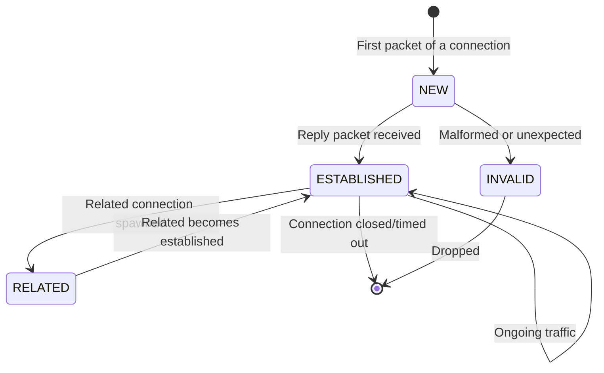

# How to Configure nftables Connection Tracking on RHEL

Author: [nawazdhandala](https://www.github.com/nawazdhandala)

Tags: RHEL, Nftables, Connection Tracking, Conntrack, Firewall, Linux

Description: Learn how to use nftables connection tracking (conntrack) on RHEL to build stateful firewall rules that intelligently handle established, related, and new connections.

---

Connection tracking, often called conntrack, is the mechanism that allows nftables to keep track of network connections and their states. This makes it possible to build stateful firewalls that can distinguish between new connections, established sessions, and related traffic. On RHEL, nftables provides powerful connection tracking capabilities out of the box.

## Prerequisites

- A RHEL system with root or sudo access
- The nftables service installed and running
- Basic understanding of TCP/IP networking

## How Connection Tracking Works

When a packet arrives, the conntrack subsystem in the kernel examines it and assigns it a connection state. The main states are:



- **NEW**: The first packet of a connection that conntrack has not seen before
- **ESTABLISHED**: A packet that belongs to an already-tracked connection (replies have been seen)
- **RELATED**: A new connection that is associated with an existing one (like FTP data channels or ICMP errors)
- **INVALID**: A packet that does not match any known connection and does not look like a valid new connection
- **UNTRACKED**: A packet that has been explicitly excluded from connection tracking

## Step 1: Check Current Connection Tracking State

```bash
# View the current conntrack table (active connections)
sudo conntrack -L

# Count the number of tracked connections
sudo conntrack -C

# Check the maximum number of connections the system can track
cat /proc/sys/net/netfilter/nf_conntrack_max

# View conntrack statistics
sudo conntrack -S
```

## Step 2: Create a Stateful Firewall with Connection Tracking

The most common use of connection tracking is building a stateful firewall that allows outbound connections while blocking unsolicited inbound traffic.

```bash
#!/usr/sbin/nft -f

# Clear any existing rules
flush ruleset

# Create the main filter table
table inet filter {
    chain input {
        type filter hook input priority filter; policy drop;

        # Allow traffic on the loopback interface (essential for local services)
        iifname "lo" accept

        # Allow established and related connections
        # This is the core of stateful firewalling
        ct state established,related accept

        # Drop invalid packets that do not match any known connection
        ct state invalid drop

        # Allow new SSH connections
        tcp dport 22 ct state new accept

        # Allow new HTTP and HTTPS connections
        tcp dport { 80, 443 } ct state new accept

        # Allow ICMP ping requests (new only)
        ip protocol icmp icmp type echo-request ct state new accept

        # Log dropped packets for troubleshooting (rate limited)
        limit rate 5/minute log prefix "nftables-drop: " level warn
    }

    chain forward {
        type filter hook forward priority filter; policy drop;

        # Allow forwarded traffic that is part of established connections
        ct state established,related accept

        # Drop invalid forwarded packets
        ct state invalid drop
    }

    chain output {
        type filter hook output priority filter; policy accept;

        # Allow all outbound traffic (you can restrict this if needed)
    }
}
```

## Step 3: Fine-Tune Connection Tracking Timeouts

Different protocols have different timeout values. You can adjust these to match your needs.

```bash
# View current timeout settings for TCP
sudo sysctl -a | grep nf_conntrack_tcp

# Set TCP established connection timeout (default is 432000 seconds / 5 days)
# Reduce to 1 hour for busy servers
sudo sysctl -w net.netfilter.nf_conntrack_tcp_timeout_established=3600

# Set timeout for TCP connections in FIN-WAIT state
sudo sysctl -w net.netfilter.nf_conntrack_tcp_timeout_fin_wait=30

# Set timeout for TCP TIME-WAIT connections
sudo sysctl -w net.netfilter.nf_conntrack_tcp_timeout_time_wait=30

# Set UDP timeout (default 30 seconds)
sudo sysctl -w net.netfilter.nf_conntrack_udp_timeout=30

# Set UDP stream timeout (default 120 seconds)
sudo sysctl -w net.netfilter.nf_conntrack_udp_timeout_stream=60

# Make changes persistent
cat <<'EOF' | sudo tee /etc/sysctl.d/99-conntrack-timeouts.conf
net.netfilter.nf_conntrack_tcp_timeout_established = 3600
net.netfilter.nf_conntrack_tcp_timeout_fin_wait = 30
net.netfilter.nf_conntrack_tcp_timeout_time_wait = 30
net.netfilter.nf_conntrack_udp_timeout = 30
net.netfilter.nf_conntrack_udp_timeout_stream = 60
EOF
```

## Step 4: Increase Connection Tracking Table Size

On busy servers, the default conntrack table size may not be enough.

```bash
# Check current maximum
cat /proc/sys/net/netfilter/nf_conntrack_max

# Increase the maximum number of tracked connections
sudo sysctl -w net.netfilter.nf_conntrack_max=262144

# Increase the hash table size (buckets) for better performance
# A good ratio is max_connections / 4
echo 65536 | sudo tee /proc/sys/net/netfilter/nf_conntrack_buckets

# Make persistent
cat <<'EOF' | sudo tee /etc/sysctl.d/99-conntrack-size.conf
net.netfilter.nf_conntrack_max = 262144
EOF
```

## Step 5: Use Connection Tracking Helpers

Some protocols like FTP and SIP use multiple connections. Conntrack helpers understand these protocols and create RELATED entries for the secondary connections.

```bash
# Load the FTP connection tracking helper
sudo modprobe nf_conntrack_ftp

# Make the module load at boot
echo "nf_conntrack_ftp" | sudo tee /etc/modules-load.d/nf_conntrack_ftp.conf

# Create nftables rules that use the FTP helper
sudo nft add table inet filter

# Create a ct helper object for FTP
sudo nft add ct helper inet filter ftp-standard { type "ftp" protocol tcp \; }

# Use the helper in a rule (assign it to FTP traffic)
sudo nft add rule inet filter input tcp dport 21 ct state new ct helper set "ftp-standard" accept

# Allow related connections (FTP data channel)
sudo nft add rule inet filter input ct state related accept
```

## Step 6: Bypass Connection Tracking for High-Throughput Traffic

For very high-throughput traffic that does not need stateful inspection, you can skip connection tracking using the raw table.

```bash
# Create a raw table to bypass conntrack
table inet raw {
    chain prerouting {
        type filter hook prerouting priority raw; policy accept;

        # Skip connection tracking for traffic between two specific subnets
        # This is useful for backend traffic that does not need inspection
        ip saddr 10.0.1.0/24 ip daddr 10.0.2.0/24 notrack

        # Skip conntrack for high-volume UDP traffic (e.g., DNS server)
        udp dport 53 notrack
    }

    chain output {
        type filter hook output priority raw; policy accept;

        # Skip conntrack for outgoing traffic to those subnets
        ip saddr 10.0.2.0/24 ip daddr 10.0.1.0/24 notrack

        # Skip conntrack for DNS replies
        udp sport 53 notrack
    }
}
```

When using notrack, you must add explicit rules in the filter table to handle untracked packets:

```bash
# In the input chain, accept untracked packets for services you allowed
sudo nft add rule inet filter input ct state untracked tcp dport 53 accept
sudo nft add rule inet filter input ct state untracked udp dport 53 accept
```

## Step 7: Monitor Connection Tracking

```bash
# Watch new connections in real time
sudo conntrack -E

# Filter events by protocol
sudo conntrack -E -p tcp

# Filter events for a specific port
sudo conntrack -E -p tcp --dport 80

# View connections to a specific destination
sudo conntrack -L -d 192.168.1.10

# Delete a specific tracked connection
sudo conntrack -D -p tcp --dport 80 --src 10.0.0.5

# Flush all tracked connections (careful - this drops all state)
sudo conntrack -F
```

## Step 8: Save the Configuration

```bash
# Export the complete ruleset
sudo nft list ruleset | sudo tee /etc/nftables.conf

# Restart nftables to verify the configuration loads correctly
sudo systemctl restart nftables

# Confirm rules are loaded
sudo nft list ruleset
```

## Troubleshooting

```bash
# Check if the conntrack table is full (causes dropped connections)
sudo dmesg | grep conntrack

# If you see "nf_conntrack: table full, dropping packet" messages,
# increase the table size as shown in Step 4

# Verify that conntrack modules are loaded
lsmod | grep nf_conntrack

# Check conntrack statistics for errors
sudo conntrack -S
# Look for "drop" and "early_drop" counters

# Debug a specific connection
sudo conntrack -L -p tcp --dport 443 -o extended
```

## Summary

Connection tracking is the foundation of stateful firewalling with nftables on RHEL. By understanding connection states and tuning the conntrack subsystem, you can build efficient and secure firewall rules. Key takeaways include always allowing established and related traffic first, dropping invalid packets, tuning timeouts and table sizes for your workload, and using notrack for high-throughput traffic that does not need stateful inspection.
