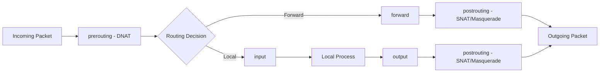

# How to Configure nftables for NAT and Masquerading on RHEL

Author: [nawazdhandala](https://www.github.com/nawazdhandala)

Tags: RHEL, Nftables, NAT, Masquerading, Linux

Description: Learn how to set up source NAT, destination NAT, masquerading, and port forwarding using nftables on RHEL.

---

If your RHEL box is acting as a gateway, router, or load balancer, you need NAT. nftables handles all flavors of network address translation natively, and the syntax is straightforward once you understand how the NAT chains hook into the netfilter pipeline. This guide covers SNAT, DNAT, masquerading, and port forwarding.

## NAT Basics in nftables

NAT in nftables uses chains of type `nat` that hook into `prerouting` (for DNAT) and `postrouting` (for SNAT/masquerade).



## Prerequisites

Enable IP forwarding. Without this, the kernel drops forwarded packets:

```bash
# Enable immediately
sysctl -w net.ipv4.ip_forward=1

# Make persistent
echo "net.ipv4.ip_forward = 1" > /etc/sysctl.d/99-forwarding.conf
sysctl -p /etc/sysctl.d/99-forwarding.conf
```

For IPv6 forwarding:

```bash
sysctl -w net.ipv6.conf.all.forwarding=1
echo "net.ipv6.conf.all.forwarding = 1" >> /etc/sysctl.d/99-forwarding.conf
```

Make sure nftables is installed and firewalld is not interfering:

```bash
dnf install nftables -y
systemctl stop firewalld
systemctl disable firewalld
systemctl enable --now nftables
```

## Setting Up Masquerading

Masquerading is the most common NAT scenario. Your internal network uses private IPs and you want to share a single public IP for outbound internet access.

Create the NAT table and chains:

```bash
cat > /etc/nftables/nat.nft << 'EOF'
flush ruleset

table inet nat_gateway {
    chain prerouting {
        type nat hook prerouting priority -100; policy accept;
    }

    chain postrouting {
        type nat hook postrouting priority 100; policy accept;

        # Masquerade traffic going out through the public interface
        oifname "eth0" masquerade
    }

    chain forward {
        type filter hook forward priority 0; policy drop;

        # Allow forwarding for established connections
        ct state established,related accept

        # Allow internal network to go outbound
        iifname "eth1" oifname "eth0" accept

        # Allow return traffic
        iifname "eth0" oifname "eth1" ct state established,related accept
    }

    chain input {
        type filter hook input priority 0; policy drop;

        ct state established,related accept
        iifname "lo" accept
        ip protocol icmp accept
        tcp dport 22 accept
    }
}
EOF
```

Apply the configuration:

```bash
nft -f /etc/nftables/nat.nft
```

In this setup, `eth0` is the public-facing interface and `eth1` connects to the internal network.

## Source NAT (SNAT)

If your public IP is static, SNAT is more efficient than masquerading because the kernel doesn't have to look up the outgoing interface's IP for every packet.

Replace the masquerade line with SNAT:

```bash
nft add rule inet nat_gateway postrouting oifname "eth0" snat to 203.0.113.10
```

## Destination NAT (DNAT) - Port Forwarding

DNAT redirects incoming traffic to a different destination. This is how you expose internal services through your gateway.

Forward incoming port 80 to an internal web server:

```bash
nft add rule inet nat_gateway prerouting iifname "eth0" tcp dport 80 dnat to 192.168.1.100:80
```

Forward incoming port 443 to the same server:

```bash
nft add rule inet nat_gateway prerouting iifname "eth0" tcp dport 443 dnat to 192.168.1.100:443
```

Don't forget to allow the forwarded traffic in your forward chain:

```bash
nft add rule inet nat_gateway forward iifname "eth0" oifname "eth1" ip daddr 192.168.1.100 tcp dport { 80, 443 } accept
```

## Port Redirection

Redirect traffic to a different port on the same machine. Useful for transparent proxying:

```bash
nft add rule inet nat_gateway prerouting tcp dport 80 redirect to :3128
```

This sends all port 80 traffic to port 3128, where your proxy might be listening.

## Complete NAT Gateway Configuration

Here's a full configuration for a gateway with masquerading and port forwarding:

```bash
cat > /etc/nftables/gateway.nft << 'EOF'
flush ruleset

table inet gateway {
    # Internal servers that need port forwarding
    set web_servers {
        type ipv4_addr
        elements = { 192.168.1.100, 192.168.1.101 }
    }

    chain prerouting {
        type nat hook prerouting priority -100; policy accept;

        # Port forward HTTP to internal web server
        iifname "eth0" tcp dport 80 dnat to 192.168.1.100:80

        # Port forward HTTPS to internal web server
        iifname "eth0" tcp dport 443 dnat to 192.168.1.100:443

        # Port forward SSH on 2222 to internal server
        iifname "eth0" tcp dport 2222 dnat to 192.168.1.50:22
    }

    chain postrouting {
        type nat hook postrouting priority 100; policy accept;

        # Masquerade outbound traffic
        oifname "eth0" masquerade
    }

    chain forward {
        type filter hook forward priority 0; policy drop;

        # Allow established connections
        ct state established,related accept

        # Allow internal to external
        iifname "eth1" oifname "eth0" accept

        # Allow port-forwarded traffic to web servers
        iifname "eth0" oifname "eth1" ip daddr @web_servers tcp dport { 80, 443 } accept

        # Allow port-forwarded SSH
        iifname "eth0" oifname "eth1" ip daddr 192.168.1.50 tcp dport 22 accept
    }

    chain input {
        type filter hook input priority 0; policy drop;

        ct state established,related accept
        ct state invalid drop
        iifname "lo" accept
        ip protocol icmp accept

        # Allow SSH to the gateway itself
        tcp dport 22 accept

        # Allow DHCP from internal network
        iifname "eth1" udp dport { 67, 68 } accept
    }

    chain output {
        type filter hook output priority 0; policy accept;
    }
}
EOF

nft -f /etc/nftables/gateway.nft
```

## Testing NAT

From an internal machine, test outbound connectivity:

```bash
curl -I https://example.com
```

From outside, test port forwarding:

```bash
curl -I http://your-public-ip
ssh -p 2222 user@your-public-ip
```

Check the NAT connection tracking table:

```bash
conntrack -L -n
```

## Monitoring NAT Connections

View active NAT connections:

```bash
conntrack -L --src-nat
conntrack -L --dst-nat
```

Count active connections:

```bash
conntrack -C
```

## Making It Persistent

Save and enable the service:

```bash
echo 'include "/etc/nftables/gateway.nft"' > /etc/sysconfig/nftables.conf
systemctl enable nftables
systemctl restart nftables
```

Verify after reboot:

```bash
nft list ruleset
sysctl net.ipv4.ip_forward
```

NAT with nftables is cleaner than the old iptables approach, and the ability to use sets for your internal servers makes management much simpler when you're handling multiple port forwards.
