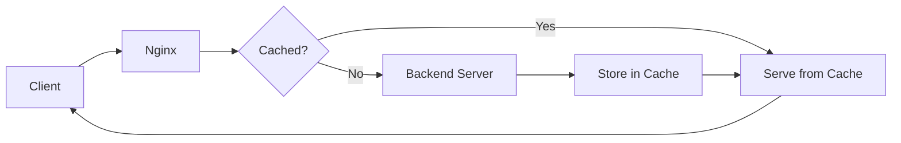

# How to Configure Nginx Caching for Static Content on RHEL 9

Author: [nawazdhandala](https://www.github.com/nawazdhandala)

Tags: RHEL, Nginx, Caching, Performance, Linux

Description: Learn how to set up Nginx caching for static files and proxy responses on RHEL 9 to reduce backend load and improve response times.

---

Caching is one of the most effective ways to improve web performance. Nginx can cache both static files and proxied responses, reducing load on backend servers and delivering content faster to users. This guide covers both browser caching and proxy caching on RHEL 9.

## Prerequisites

- A RHEL 9 system with Nginx installed and running
- Root or sudo access

## Caching Architecture



## Step 1: Browser Caching for Static Files

Tell browsers to cache static assets locally:

```nginx
server {
    listen 80;
    server_name example.com;
    root /var/www/html;

    # Cache images for 1 year
    location ~* \.(jpg|jpeg|png|gif|ico|svg|webp)$ {
        expires 1y;
        add_header Cache-Control "public, immutable";
        access_log off;
    }

    # Cache CSS and JavaScript for 1 month
    location ~* \.(css|js)$ {
        expires 30d;
        add_header Cache-Control "public";
        access_log off;
    }

    # Cache fonts for 1 year
    location ~* \.(woff|woff2|ttf|eot)$ {
        expires 1y;
        add_header Cache-Control "public, immutable";
        access_log off;
    }

    # Do not cache HTML (always get the latest version)
    location ~* \.html$ {
        expires -1;
        add_header Cache-Control "no-store, no-cache, must-revalidate";
    }
}
```

## Step 2: Enable Gzip Compression

Compress content before caching and serving:

```nginx
# /etc/nginx/conf.d/gzip.conf

gzip on;
gzip_vary on;
gzip_min_length 1024;
gzip_comp_level 5;
gzip_types
    text/plain
    text/css
    text/xml
    text/javascript
    application/javascript
    application/json
    application/xml
    image/svg+xml;

# Do not compress already small responses
gzip_min_length 256;

# Compress responses for proxied requests too
gzip_proxied any;
```

## Step 3: Set Up Proxy Cache

Cache responses from backend servers:

```nginx
# Define the cache zone in the http block (/etc/nginx/nginx.conf)
proxy_cache_path /var/cache/nginx/proxy
    levels=1:2
    keys_zone=backend_cache:10m
    max_size=1g
    inactive=60m
    use_temp_path=off;
```

Parameters explained:
- `levels=1:2` - Two-level directory hierarchy for cached files
- `keys_zone=backend_cache:10m` - 10MB of shared memory for cache keys
- `max_size=1g` - Maximum 1GB of cached data on disk
- `inactive=60m` - Remove cached items not accessed in 60 minutes

## Step 4: Use the Proxy Cache

```nginx
# /etc/nginx/conf.d/app.conf

server {
    listen 80;
    server_name app.example.com;

    location / {
        proxy_pass http://127.0.0.1:3000;

        # Enable proxy caching
        proxy_cache backend_cache;

        # Cache successful responses for 10 minutes
        proxy_cache_valid 200 10m;

        # Cache redirects for 5 minutes
        proxy_cache_valid 301 302 5m;

        # Cache 404 responses briefly to prevent hammering the backend
        proxy_cache_valid 404 1m;

        # Add a header showing cache status (HIT, MISS, BYPASS)
        add_header X-Cache-Status $upstream_cache_status;

        # Use the request URI as the cache key
        proxy_cache_key "$scheme$request_method$host$request_uri";

        # Serve stale content while revalidating in the background
        proxy_cache_use_stale error timeout updating http_500 http_502 http_503;
        proxy_cache_background_update on;

        # Lock prevents multiple simultaneous requests from hitting the backend
        proxy_cache_lock on;
        proxy_cache_lock_timeout 5s;
    }

    # Bypass cache for authenticated users
    location /api/ {
        proxy_pass http://127.0.0.1:3000;
        proxy_cache backend_cache;
        proxy_cache_valid 200 5m;

        # Do not cache if the request has an Authorization header
        proxy_cache_bypass $http_authorization;
        proxy_no_cache $http_authorization;
    }
}
```

## Step 5: Create the Cache Directory

```bash
# Create the cache directory
sudo mkdir -p /var/cache/nginx/proxy

# Set ownership to the Nginx user
sudo chown nginx:nginx /var/cache/nginx/proxy

# Set SELinux context
sudo semanage fcontext -a -t httpd_cache_t "/var/cache/nginx(/.*)?"
sudo restorecon -Rv /var/cache/nginx
```

## Step 6: Cache Purging

```nginx
# Allow cache purging from trusted IPs
location /purge/ {
    # Only allow from localhost
    allow 127.0.0.1;
    deny all;

    # Purge the cached item
    proxy_cache_purge backend_cache "$scheme$request_method$host$request_uri";
}
```

```bash
# Purge a specific cached URL
curl -X PURGE http://app.example.com/purge/path/to/page

# Manually clear all cached files
sudo rm -rf /var/cache/nginx/proxy/*
```

## Step 7: Monitor Cache Performance

```bash
# Test and reload
sudo nginx -t
sudo systemctl reload nginx

# Check cache status header
curl -I http://app.example.com/
# Look for: X-Cache-Status: HIT or MISS

# Monitor cache directory size
du -sh /var/cache/nginx/proxy/

# Check cache hit ratio in access logs
sudo awk '{print $NF}' /var/log/nginx/access.log | sort | uniq -c
```

## Troubleshooting

```bash
# If caching is not working, check these common issues:

# 1. Backend sends Cache-Control: no-cache headers
# Add this to ignore backend cache headers:
# proxy_ignore_headers Cache-Control;

# 2. SELinux blocking cache writes
sudo ausearch -m avc -ts recent | grep nginx

# 3. Cache directory permissions
ls -laZ /var/cache/nginx/proxy/

# 4. Check Nginx error log
sudo tail -f /var/log/nginx/error.log
```

## Summary

Nginx caching on RHEL 9 dramatically reduces backend load and improves response times. Use browser caching (expires headers) for static assets, and proxy caching for dynamic content that does not change frequently. The X-Cache-Status header helps you verify the cache is working, and the proxy_cache_use_stale directive ensures users still get content even when backends are temporarily unavailable.
