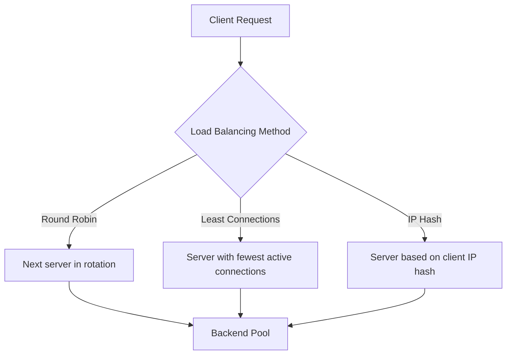

# How to Configure Nginx Load Balancing on RHEL

Author: [nawazdhandala](https://www.github.com/nawazdhandala)

Tags: RHEL, Nginx, Load Balancing, Linux

Description: How to set up Nginx as a load balancer on RHEL, covering round-robin, least connections, and IP hash methods.

---

## Why Nginx for Load Balancing?

When a single backend server cannot handle the traffic, you add more servers and distribute requests across them. Nginx makes a great load balancer because it handles thousands of connections with minimal overhead. It also serves as a single entry point, which simplifies TLS termination and health monitoring.

## Prerequisites

- RHEL with Nginx installed
- Two or more backend servers
- Root or sudo access
- SELinux boolean `httpd_can_network_connect` enabled

## Step 1 - Enable SELinux Network Connections

```bash
# Allow Nginx to connect to backend servers
sudo setsebool -P httpd_can_network_connect on
```

## Step 2 - Round-Robin Load Balancing

This is the default method. Requests are distributed evenly across backends:

```bash
# Create a load balancer configuration
sudo tee /etc/nginx/conf.d/loadbalancer.conf > /dev/null <<'EOF'
upstream backend {
    server 192.168.1.11:8080;
    server 192.168.1.12:8080;
    server 192.168.1.13:8080;
}

server {
    listen 80;
    server_name lb.example.com;

    location / {
        proxy_pass http://backend;
        proxy_set_header Host $host;
        proxy_set_header X-Real-IP $remote_addr;
        proxy_set_header X-Forwarded-For $proxy_add_x_forwarded_for;
    }
}
EOF
```

## Step 3 - Weighted Round-Robin

If your servers have different capacities, assign weights:

```nginx
upstream backend {
    # The powerful server gets twice the traffic
    server 192.168.1.11:8080 weight=3;
    server 192.168.1.12:8080 weight=2;
    server 192.168.1.13:8080 weight=1;
}
```

A server with `weight=3` receives three times the requests compared to a server with `weight=1`.

## Step 4 - Least Connections

Send new requests to the backend with the fewest active connections:

```nginx
upstream backend {
    least_conn;
    server 192.168.1.11:8080;
    server 192.168.1.12:8080;
    server 192.168.1.13:8080;
}
```

This is a good choice when request processing times vary. Faster backends naturally pick up more requests.

## Step 5 - IP Hash (Session Persistence)

Route clients to the same backend based on their IP address:

```nginx
upstream backend {
    ip_hash;
    server 192.168.1.11:8080;
    server 192.168.1.12:8080;
    server 192.168.1.13:8080;
}
```

This provides basic session persistence. The same client IP always goes to the same backend, which is useful for applications that store session data locally.

## Load Balancing Methods Comparison



## Step 6 - Health Checks

Nginx checks backend health passively by monitoring response failures:

```nginx
upstream backend {
    server 192.168.1.11:8080 max_fails=3 fail_timeout=30s;
    server 192.168.1.12:8080 max_fails=3 fail_timeout=30s;
    server 192.168.1.13:8080 max_fails=3 fail_timeout=30s;
}
```

After 3 failures within 30 seconds, Nginx stops sending requests to that server for 30 seconds. Then it tries again.

## Step 7 - Backup Servers

Designate a server that only receives traffic when all primary servers are down:

```nginx
upstream backend {
    server 192.168.1.11:8080;
    server 192.168.1.12:8080;
    server 192.168.1.13:8080 backup;
}
```

## Step 8 - Draining a Server

To gracefully remove a server from the pool (during maintenance), mark it as down:

```nginx
upstream backend {
    server 192.168.1.11:8080;
    server 192.168.1.12:8080 down;
    server 192.168.1.13:8080;
}
```

Reload Nginx and no new requests will go to that server.

## Step 9 - Add TLS Termination

Handle TLS at the load balancer so backends receive plain HTTP:

```nginx
server {
    listen 443 ssl;
    server_name lb.example.com;

    ssl_certificate /etc/pki/tls/certs/lb.crt;
    ssl_certificate_key /etc/pki/tls/private/lb.key;

    location / {
        proxy_pass http://backend;
        proxy_set_header Host $host;
        proxy_set_header X-Real-IP $remote_addr;
        proxy_set_header X-Forwarded-For $proxy_add_x_forwarded_for;
        proxy_set_header X-Forwarded-Proto $scheme;
    }
}
```

## Step 10 - Test and Apply

```bash
# Validate configuration
sudo nginx -t

# Reload Nginx
sudo systemctl reload nginx
```

Test that requests are distributed:

```bash
# Send multiple requests and check which backend responds
for i in $(seq 1 6); do
    curl -s http://lb.example.com/health
done
```

If your backends return a hostname or identifier, you should see different responses as Nginx rotates through them.

## Wrap-Up

Nginx load balancing on RHEL is straightforward. Round-robin works for most cases, least_conn is better when request times vary, and ip_hash handles basic session persistence. Set reasonable `max_fails` and `fail_timeout` values so Nginx automatically routes around failed backends. For maintenance windows, use the `down` directive to gracefully remove servers from rotation.
