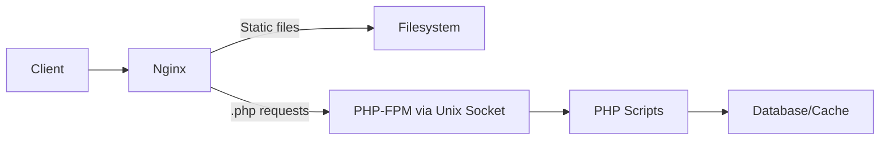

# How to Configure Nginx with PHP-FPM on RHEL

Author: [nawazdhandala](https://www.github.com/nawazdhandala)

Tags: RHEL, NGINX, PHP-FPM, Linux

Description: How to set up Nginx with PHP-FPM on RHEL to serve PHP applications efficiently.

---

## Why Nginx with PHP-FPM?

Nginx does not have a built-in PHP module like Apache's mod_php. Instead, it hands PHP requests to PHP-FPM (FastCGI Process Manager) over a Unix socket or TCP connection. This separation is actually an advantage. Nginx handles static files and connection management while PHP-FPM focuses purely on executing PHP code. Each can be tuned independently.

## Prerequisites

- RHEL with Nginx installed
- Root or sudo access

## Step 1 - Install PHP-FPM

```bash
# Install PHP and PHP-FPM with common extensions
sudo dnf install -y php-fpm php-mysqlnd php-mbstring php-xml php-json php-zip php-gd
```

Check the version:

```bash
php -v
```

## Step 2 - Configure PHP-FPM for Nginx

By default, PHP-FPM on RHEL is configured for Apache. You need to change the user and group:

```bash
# Edit the PHP-FPM pool configuration
sudo vi /etc/php-fpm.d/www.conf
```

Change these lines:

```ini
; Set the user and group to nginx
user = nginx
group = nginx

; Use a Unix socket
listen = /run/php-fpm/www.sock
listen.owner = nginx
listen.group = nginx
listen.mode = 0660
```

## Step 3 - Start PHP-FPM

```bash
# Enable and start PHP-FPM
sudo systemctl enable --now php-fpm
```

Verify the socket was created:

```bash
# Check that the socket exists and has correct ownership
ls -la /run/php-fpm/www.sock
```

## Step 4 - Configure Nginx to Use PHP-FPM

Create a server block that passes PHP files to FPM:

```bash
# Create the Nginx server block for a PHP site
sudo tee /etc/nginx/conf.d/php-site.conf > /dev/null <<'EOF'
server {
    listen 80;
    server_name php.example.com;
    root /var/www/phpsite;
    index index.php index.html;

    access_log /var/log/nginx/phpsite-access.log;
    error_log /var/log/nginx/phpsite-error.log;

    # Serve static files directly
    location / {
        try_files $uri $uri/ /index.php?$query_string;
    }

    # Pass PHP files to PHP-FPM
    location ~ \.php$ {
        fastcgi_pass unix:/run/php-fpm/www.sock;
        fastcgi_param SCRIPT_FILENAME $document_root$fastcgi_script_name;
        include fastcgi_params;
        fastcgi_index index.php;
    }

    # Block access to hidden files
    location ~ /\. {
        deny all;
        access_log off;
        log_not_found off;
    }
}
EOF
```

## Step 5 - Create the Document Root and Test File

```bash
# Create the site directory
sudo mkdir -p /var/www/phpsite

# Create a test PHP file
sudo tee /var/www/phpsite/index.php > /dev/null <<'EOF'
<?php phpinfo(); ?>
EOF

# Set ownership
sudo chown -R nginx:nginx /var/www/phpsite
```

## Step 6 - Fix SELinux

```bash
# Set SELinux context for the document root
sudo semanage fcontext -a -t httpd_sys_content_t "/var/www/phpsite(/.*)?"
sudo restorecon -Rv /var/www/phpsite/
```

If PHP needs to write files (uploads, cache):

```bash
# Allow writes to a specific directory
sudo mkdir -p /var/www/phpsite/uploads
sudo semanage fcontext -a -t httpd_sys_rw_content_t "/var/www/phpsite/uploads(/.*)?"
sudo restorecon -Rv /var/www/phpsite/uploads/
```

## Step 7 - Test and Reload

```bash
# Test Nginx configuration
sudo nginx -t

# Reload Nginx
sudo systemctl reload nginx
```

Browse to `http://php.example.com` and you should see the PHP info page. Remove it after testing:

```bash
# Remove the info page
sudo rm /var/www/phpsite/index.php
```

## Architecture



## Step 8 - Tune PHP-FPM Pool Settings

Edit `/etc/php-fpm.d/www.conf` for your workload:

For low traffic sites:

```ini
pm = dynamic
pm.max_children = 10
pm.start_servers = 2
pm.min_spare_servers = 2
pm.max_spare_servers = 5
pm.max_requests = 500
```

For high traffic sites:

```ini
pm = static
pm.max_children = 50
pm.max_requests = 1000
```

Calculate `pm.max_children` based on available memory:

```bash
# Check average PHP-FPM process memory usage
ps --no-headers -o rss -C php-fpm | awk '{sum += $1; count++} END {print "Avg:", sum/count/1024, "MB per process"}'
```

## Step 9 - Enable PHP-FPM Status Page

In `/etc/php-fpm.d/www.conf`:

```ini
pm.status_path = /fpm-status
ping.path = /fpm-ping
```

In Nginx:

```nginx
location = /fpm-status {
    fastcgi_pass unix:/run/php-fpm/www.sock;
    fastcgi_param SCRIPT_FILENAME $document_root$fastcgi_script_name;
    include fastcgi_params;
    allow 127.0.0.1;
    deny all;
}
```

Restart PHP-FPM and reload Nginx, then check:

```bash
curl http://localhost/fpm-status
```

## Step 10 - Using TCP Instead of Unix Socket

If PHP-FPM runs on a separate server:

In `/etc/php-fpm.d/www.conf`:

```ini
listen = 127.0.0.1:9000
```

In Nginx:

```nginx
location ~ \.php$ {
    fastcgi_pass 127.0.0.1:9000;
    fastcgi_param SCRIPT_FILENAME $document_root$fastcgi_script_name;
    include fastcgi_params;
}
```

Enable the SELinux boolean if using TCP:

```bash
sudo setsebool -P httpd_can_network_connect on
```

## Common Errors

**"File not found" or blank page**: Check that `SCRIPT_FILENAME` is set correctly. The `$document_root` variable must resolve to the actual path.

**502 Bad Gateway**: PHP-FPM is not running or the socket does not exist. Check `systemctl status php-fpm`.

**Permission denied on socket**: The socket owner must be the nginx user. Check the `listen.owner` setting in `www.conf`.

## Wrap-Up

Nginx with PHP-FPM is the recommended stack for PHP applications on RHEL. Unix sockets are faster than TCP for same-server setups. Size the FPM pool based on your available memory and traffic, and do not forget to set SELinux contexts on your document root. The separation between Nginx and PHP-FPM gives you flexibility to scale and tune each component independently.
