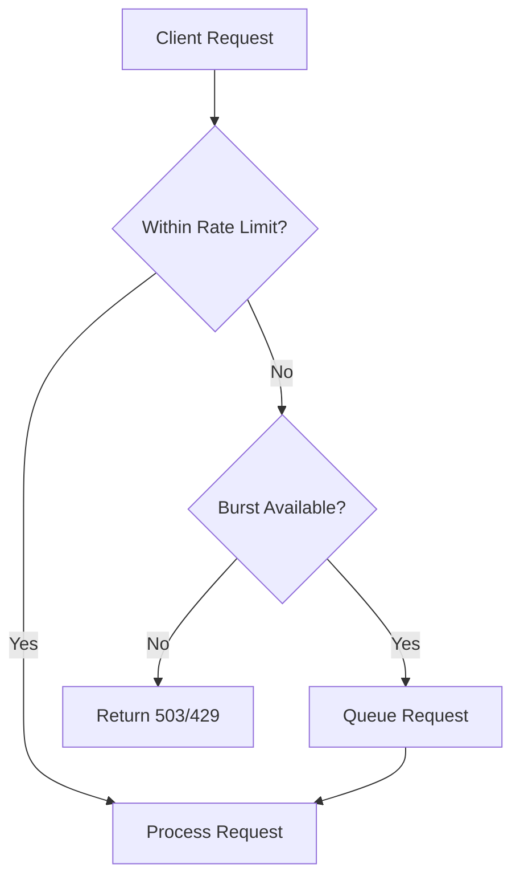

# How to Configure Nginx Rate Limiting on RHEL 9

Author: [nawazdhandala](https://www.github.com/nawazdhandala)

Tags: RHEL, Nginx, Rate Limiting, Security, Linux

Description: Learn how to protect your Nginx web server from abuse by implementing rate limiting on RHEL 9, including per-IP limits, burst handling, and zone configuration.

---

Rate limiting protects your web server from abuse, brute-force attacks, and excessive traffic from individual clients. Nginx provides built-in rate limiting through the limit_req module. This guide shows you how to configure it on RHEL 9.

## Prerequisites

- A RHEL 9 system with Nginx installed and running
- Root or sudo access

## How Rate Limiting Works



Nginx rate limiting uses the leaky bucket algorithm. Requests arrive and fill a bucket. The bucket drains at a fixed rate. If the bucket overflows, excess requests are rejected.

## Step 1: Define a Rate Limit Zone

Rate limit zones are defined in the `http` block:

```nginx
# /etc/nginx/nginx.conf (inside the http block)

# Define a rate limit zone
# $binary_remote_addr - use client IP as the key
# zone=api_limit:10m - name the zone and allocate 10MB of shared memory
# rate=10r/s - allow 10 requests per second
limit_req_zone $binary_remote_addr zone=api_limit:10m rate=10r/s;

# A more restrictive zone for login endpoints
limit_req_zone $binary_remote_addr zone=login_limit:10m rate=1r/s;

# A zone based on server name (per-site limits)
limit_req_zone $server_name zone=per_site:10m rate=100r/s;
```

Memory usage: 1MB stores about 16,000 IP addresses.

## Step 2: Apply Rate Limits to Locations

```nginx
# /etc/nginx/conf.d/example.conf

server {
    listen 80;
    server_name example.com;

    # Apply rate limiting to the entire site
    # burst=20 allows 20 requests to queue beyond the rate limit
    # nodelay processes queued requests immediately instead of spacing them
    location / {
        limit_req zone=api_limit burst=20 nodelay;
        proxy_pass http://127.0.0.1:3000;
    }

    # Stricter rate limit for login endpoint
    location /login {
        limit_req zone=login_limit burst=5 nodelay;
        proxy_pass http://127.0.0.1:3000;
    }

    # No rate limiting for static files
    location /static/ {
        alias /var/www/html/static/;
    }
}
```

## Step 3: Understanding Burst and Nodelay

```nginx
# Without burst - strictly enforce the rate
# Excess requests get an immediate 503
limit_req zone=api_limit;

# With burst=20 - queue up to 20 excess requests
# They are processed at the defined rate (10r/s)
# This means the 20 queued requests take 2 seconds to drain
limit_req zone=api_limit burst=20;

# With burst=20 nodelay - queue up to 20 but process them immediately
# After the burst is used, the client must wait for the bucket to refill
limit_req zone=api_limit burst=20 nodelay;

# With delay=8 - process first 8 excess requests immediately
# Remaining burst requests (up to 20) are delayed
limit_req zone=api_limit burst=20 delay=8;
```

## Step 4: Customize the Error Response

```nginx
server {
    listen 80;
    server_name example.com;

    # Return 429 (Too Many Requests) instead of the default 503
    limit_req_status 429;

    # Custom error page for rate-limited requests
    error_page 429 /rate-limited.html;
    location = /rate-limited.html {
        root /var/www/html;
        internal;
    }

    location / {
        limit_req zone=api_limit burst=20 nodelay;
        proxy_pass http://127.0.0.1:3000;
    }
}
```

## Step 5: Rate Limit by Different Keys

```nginx
# Rate limit by IP address (most common)
limit_req_zone $binary_remote_addr zone=per_ip:10m rate=10r/s;

# Rate limit by API key from a header
limit_req_zone $http_x_api_key zone=per_api_key:10m rate=100r/s;

# Rate limit by combination of IP and requested URI
limit_req_zone "$binary_remote_addr$request_uri" zone=per_ip_uri:10m rate=5r/s;
```

## Step 6: Whitelist Trusted IPs

Exempt certain IP addresses from rate limiting:

```nginx
# Create a map to identify trusted IPs
geo $limit_key {
    # Default: use the client IP for rate limiting
    default $binary_remote_addr;

    # Trusted IPs: use empty string (effectively bypasses rate limiting)
    10.0.0.0/8 "";
    192.168.1.0/24 "";
    203.0.113.50 "";
}

# Only apply rate limiting when the key is not empty
limit_req_zone $limit_key zone=api_limit:10m rate=10r/s;
```

## Step 7: Logging Rate-Limited Requests

```nginx
# Set the log level for rate limit events
# warn = log when requests are delayed
# error = log when requests are rejected (default)
limit_req_log_level warn;

# Custom log format that includes rate limit status
log_format rate_limit '$remote_addr - [$time_local] '
                      '"$request" $status '
                      'limit_req_status=$limit_req_status';

server {
    access_log /var/log/nginx/access.log rate_limit;
}
```

## Step 8: Test Rate Limiting

```bash
# Test configuration
sudo nginx -t

# Reload Nginx
sudo systemctl reload nginx

# Send rapid requests to trigger rate limiting
for i in $(seq 1 50); do
    curl -s -o /dev/null -w "%{http_code}\n" http://example.com/
done

# Use Apache Bench for more controlled testing
ab -n 100 -c 10 http://example.com/

# Watch the error log for rate limit messages
sudo tail -f /var/log/nginx/error.log | grep "limiting"
```

## Troubleshooting

```bash
# Check for rate limiting entries in the error log
sudo grep "limiting" /var/log/nginx/error.log

# If legitimate users are being rate limited, increase the burst value
# or increase the rate

# Verify the zone memory is sufficient
# If you see "limit_req_zone shared memory is exhausted" in logs,
# increase the zone size (e.g., from 10m to 20m)
```

## Summary

Nginx rate limiting on RHEL 9 protects your server from abuse by controlling the request rate per client. Define zones in the http block, apply them to specific locations, and use burst with nodelay for a good balance between protection and user experience. Whitelist trusted IPs and use 429 status codes for proper HTTP semantics.
