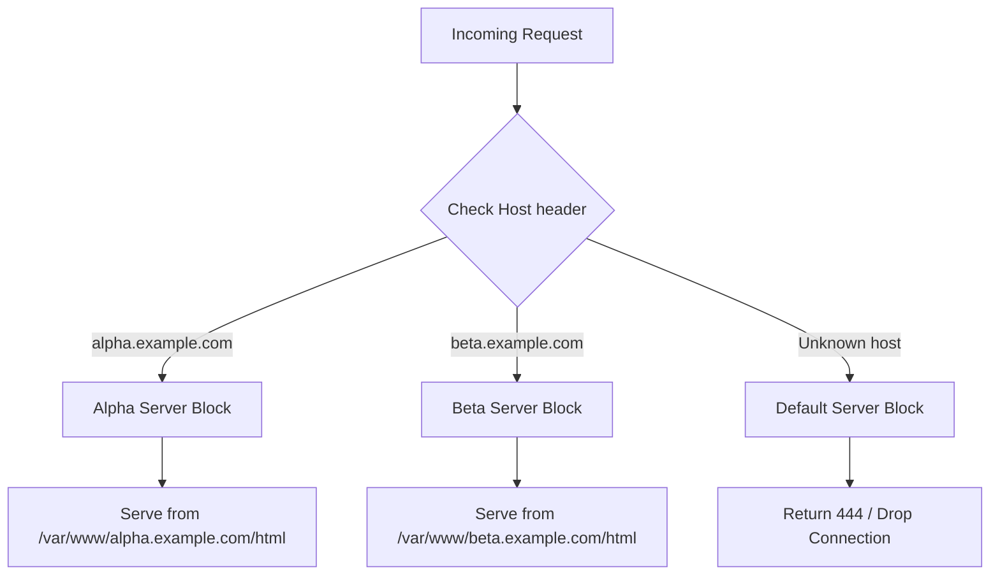

# How to Configure Nginx Server Blocks (Virtual Hosts) on RHEL 9

Author: [nawazdhandala](https://www.github.com/nawazdhandala)

Tags: RHEL, Nginx, Server Blocks, Virtual Hosts, Linux

Description: Learn how to host multiple websites on a single Nginx server using server blocks on RHEL 9.

---

## What Are Server Blocks?

Server blocks in Nginx are the equivalent of Apache virtual hosts. They let you serve multiple websites from one server. Each server block defines a hostname, document root, and site-specific settings. Nginx uses the `server_name` directive to match incoming requests to the correct block.

## Prerequisites

- RHEL 9 with Nginx installed
- DNS records pointing your domains to the server
- Root or sudo access

## Step 1 - Create Directory Structure

Set up separate document roots for each site:

```bash
# Create document roots for two sites
sudo mkdir -p /var/www/alpha.example.com/html
sudo mkdir -p /var/www/beta.example.com/html
```

Add test pages:

```bash
# Test page for alpha
sudo tee /var/www/alpha.example.com/html/index.html > /dev/null <<'EOF'
<html><body><h1>Alpha Site</h1></body></html>
EOF

# Test page for beta
sudo tee /var/www/beta.example.com/html/index.html > /dev/null <<'EOF'
<html><body><h1>Beta Site</h1></body></html>
EOF
```

## Step 2 - Set SELinux Contexts

```bash
# Label directories for web content
sudo semanage fcontext -a -t httpd_sys_content_t "/var/www/alpha.example.com(/.*)?"
sudo semanage fcontext -a -t httpd_sys_content_t "/var/www/beta.example.com(/.*)?"
sudo restorecon -Rv /var/www/
```

## Step 3 - Create Server Block for Alpha

```bash
# Create the server block for alpha.example.com
sudo tee /etc/nginx/conf.d/alpha.example.com.conf > /dev/null <<'EOF'
server {
    listen 80;
    server_name alpha.example.com www.alpha.example.com;
    root /var/www/alpha.example.com/html;
    index index.html;

    access_log /var/log/nginx/alpha-access.log;
    error_log /var/log/nginx/alpha-error.log;

    location / {
        try_files $uri $uri/ =404;
    }
}
EOF
```

## Step 4 - Create Server Block for Beta

```bash
# Create the server block for beta.example.com
sudo tee /etc/nginx/conf.d/beta.example.com.conf > /dev/null <<'EOF'
server {
    listen 80;
    server_name beta.example.com www.beta.example.com;
    root /var/www/beta.example.com/html;
    index index.html;

    access_log /var/log/nginx/beta-access.log;
    error_log /var/log/nginx/beta-error.log;

    location / {
        try_files $uri $uri/ =404;
    }
}
EOF
```

## Step 5 - Set Up a Default Server Block

When a request does not match any `server_name`, Nginx uses the default server. Control this explicitly:

```bash
# Create a default catch-all server block
sudo tee /etc/nginx/conf.d/00-default.conf > /dev/null <<'EOF'
server {
    listen 80 default_server;
    server_name _;

    # Return 444 (close connection) for unmatched hosts
    return 444;
}
EOF
```

The `server_name _` is a convention for catch-all blocks. Returning 444 drops the connection without sending a response, which is useful for blocking scanners.

## Step 6 - Disable the Default RHEL Page

The default page is configured in `/etc/nginx/nginx.conf`. Comment out or remove the default server block there to avoid conflicts:

```bash
# Check if there is a default server block in the main config
grep -n "server {" /etc/nginx/nginx.conf
```

If there is one, either remove it or ensure your `00-default.conf` has the `default_server` flag.

## How Server Block Matching Works



## Step 7 - Test and Reload

```bash
# Validate the configuration
sudo nginx -t

# Reload Nginx
sudo systemctl reload nginx
```

## Step 8 - Verify Each Site

If you do not have DNS set up, use /etc/hosts on your client machine:

```bash
# Add test DNS entries on your client
echo "192.168.1.100 alpha.example.com beta.example.com" | sudo tee -a /etc/hosts
```

Test each site:

```bash
# Test alpha
curl -s http://alpha.example.com

# Test beta
curl -s http://beta.example.com
```

## Server Block Best Practices

1. **One file per site** in `/etc/nginx/conf.d/` keeps things organized
2. **Separate log files** per site make troubleshooting easier
3. **Always set a default server block** to handle unknown hosts
4. **Use `try_files`** instead of `if` statements for serving static content
5. **Name config files** after the domain for easy identification

## Adding TLS Per Server Block

Each server block can have its own TLS certificate:

```nginx
server {
    listen 443 ssl;
    server_name alpha.example.com;

    ssl_certificate /etc/pki/tls/certs/alpha.crt;
    ssl_certificate_key /etc/pki/tls/private/alpha.key;

    root /var/www/alpha.example.com/html;

    location / {
        try_files $uri $uri/ =404;
    }
}
```

## Wrap-Up

Server blocks are how you host multiple domains on one Nginx instance. Keep each site in its own config file, set up separate logs, and always define a default server block. On RHEL 9, do not forget to set the SELinux context on any custom document roots. This pattern scales easily whether you have two sites or fifty.
