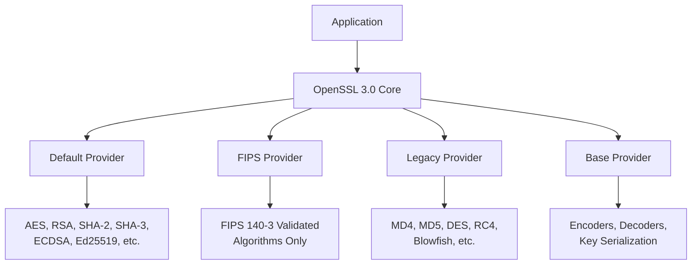

# How to Configure OpenSSL 3.0 Cryptographic Settings on RHEL

Author: [nawazdhandala](https://www.github.com/nawazdhandala)

Tags: RHEL, OpenSSL, Cryptography, Security, FIPS, Linux

Description: A practical guide to configuring OpenSSL 3.0 on RHEL, covering the provider architecture, FIPS module, system-wide crypto policies, deprecated algorithms, and common migration issues.

---

RHEL ships with OpenSSL 3.0, and if you are coming from RHEL 8 (which had OpenSSL 1.1.1), there are some significant changes to be aware of. The biggest one is the new provider architecture, which fundamentally changes how cryptographic algorithms are loaded and used. Then there is the FIPS module, system-wide crypto policies, and a bunch of deprecated algorithms that might break older applications.

I have spent a lot of time getting applications working correctly after the OpenSSL 3.0 transition, so let me share what I have learned.

## What Changed in OpenSSL 3.0

The headline change is the move from a monolithic library to a provider-based architecture. Instead of all algorithms being compiled into a single library, they are now organized into providers that can be loaded independently.



### Key Changes to Be Aware Of

1. **Provider architecture** - Algorithms live in providers, not the core library
2. **Deprecated algorithms** - MD2, MDC2, Whirlpool, and others are now in the legacy provider
3. **Engine API removed** - Replaced by the provider API
4. **FIPS module** - Separate, validated provider for FIPS compliance
5. **Configuration changes** - `openssl.cnf` has new sections for providers

## Checking Your OpenSSL Version

```bash
# Check the installed OpenSSL version
openssl version -a
```

On RHEL, you should see something like:

```bash
OpenSSL 3.0.7 1 Nov 2022 (Library: OpenSSL 3.0.7 1 Nov 2022)
```

## Understanding the openssl.cnf Configuration

The main configuration file is at `/etc/pki/tls/openssl.cnf`. On RHEL, it includes a provider configuration section.

```bash
# View the configuration file
cat /etc/pki/tls/openssl.cnf
```

The key sections related to providers:

```ini
[openssl_init]
providers = provider_sect

[provider_sect]
default = default_sect

[default_sect]
activate = 1
```

This loads and activates the default provider, which includes all the modern algorithms you typically need.

## Working with the Legacy Provider

Some older applications and protocols depend on algorithms that OpenSSL 3.0 considers deprecated. These are in the legacy provider and are not loaded by default.

Common algorithms in the legacy provider:
- MD4 (used by some older authentication protocols)
- RC4 (used by older TLS configurations)
- DES (single DES, not 3DES)
- Blowfish
- CAST
- SEED
- RC2

### Enabling the Legacy Provider

If you need legacy algorithm support:

```bash
# Edit the OpenSSL configuration
sudo vi /etc/pki/tls/openssl.cnf
```

Add the legacy provider to the provider section:

```ini
[provider_sect]
default = default_sect
legacy = legacy_sect

[default_sect]
activate = 1

[legacy_sect]
activate = 1
```

After making this change, test that the legacy algorithms are available:

```bash
# Test MD4 availability (legacy algorithm)
echo -n "test" | openssl dgst -md4

# List all available algorithms
openssl list -digest-algorithms
openssl list -cipher-algorithms
```

### Enabling Legacy Provider Per-Application

Instead of enabling legacy support system-wide, you can create an application-specific configuration:

```bash
# Create an app-specific OpenSSL config
sudo vi /etc/pki/tls/openssl-legacy.cnf
```

```ini
openssl_conf = openssl_init

[openssl_init]
providers = provider_sect

[provider_sect]
default = default_sect
legacy = legacy_sect

[default_sect]
activate = 1

[legacy_sect]
activate = 1
```

Then point the application at this config:

```bash
# Use the legacy config for a specific command
OPENSSL_CONF=/etc/pki/tls/openssl-legacy.cnf openssl dgst -md4 somefile
```

## Configuring the FIPS Provider

For environments that require FIPS 140-3 compliance, RHEL provides a validated FIPS provider.

### Enabling FIPS Mode System-Wide

```bash
# Enable FIPS mode (requires reboot)
sudo fips-mode-setup --enable

# Check FIPS status
fips-mode-setup --check
```

After reboot, verify FIPS is active:

```bash
# Verify FIPS mode is enabled
cat /proc/sys/crypto/fips_enabled
# Should output: 1

# Check that OpenSSL recognizes FIPS mode
openssl list -providers
```

In FIPS mode, only FIPS-approved algorithms are available. Non-approved algorithms (like MD5 for hashing, or RSA keys shorter than 2048 bits) will be rejected.

### What FIPS Mode Restricts

When FIPS mode is enabled, these are no longer available:

- MD5 (for message digests, still usable in HMAC)
- SHA-1 (for signatures, still usable in HMAC)
- DES, 3DES (for encryption in most contexts)
- RSA keys smaller than 2048 bits
- Various other non-approved algorithms

```bash
# Test: this will fail in FIPS mode
echo -n "test" | openssl dgst -md5
# Should show: Error setting digest

# This should work
echo -n "test" | openssl dgst -sha256
```

### Disabling FIPS Mode

If you enabled FIPS and need to go back:

```bash
# Disable FIPS mode
sudo fips-mode-setup --disable

# Reboot required
sudo systemctl reboot
```

## System-Wide Crypto Policies

RHEL uses `update-crypto-policies` to manage cryptographic settings across all applications (OpenSSL, GnuTLS, NSS, etc.) from a single place.

### Available Policies

```bash
# List available crypto policies
update-crypto-policies --show

# See all available policies and subpolicies
ls /usr/share/crypto-policies/policies/
```

The built-in policies:

| Policy | Description |
|---|---|
| DEFAULT | Balanced security, suitable for most deployments |
| FUTURE | More restrictive, prepares for future security requirements |
| FIPS | FIPS 140-3 compliant settings |
| LEGACY | Allows older algorithms for backward compatibility |

### Changing the System-Wide Policy

```bash
# Set the system-wide policy to FUTURE (more restrictive)
sudo update-crypto-policies --set FUTURE

# Or set to LEGACY if you need backward compatibility
sudo update-crypto-policies --set LEGACY

# Check the current policy
update-crypto-policies --show
```

Some applications need a restart to pick up the new policy. The safest approach is to reboot.

### Using Sub-Policies

You can layer sub-policies on top of a base policy:

```bash
# Use DEFAULT policy but also enable SHA-1 signatures
sudo update-crypto-policies --set DEFAULT:SHA1

# Use FUTURE policy with an exception for specific algorithm
sudo update-crypto-policies --set FUTURE:AD-SUPPORT
```

The `AD-SUPPORT` sub-policy is common in environments with Active Directory, which sometimes requires algorithms that stricter policies disable.

### Creating Custom Policies

If the built-in policies do not fit your needs:

```bash
# Create a custom policy module
sudo vi /etc/crypto-policies/policies/modules/MY-POLICY.pmod
```

```bash
# Allow TLS 1.2 and above
min_tls_version = TLS1.2

# Set minimum RSA key size
min_rsa_size = 3072

# Disable specific ciphers
cipher = -CAMELLIA-128-CBC -CAMELLIA-256-CBC
```

Apply it:

```bash
# Apply the custom sub-policy
sudo update-crypto-policies --set DEFAULT:MY-POLICY
```

## Troubleshooting Common OpenSSL 3.0 Issues

### "unsupported" or "algorithm not found" Errors

This usually means the application is trying to use an algorithm that is not in the loaded provider.

```bash
# Check which providers are loaded
openssl list -providers

# Check if a specific algorithm is available
openssl list -cipher-algorithms | grep -i rc4
```

Fix: Either enable the legacy provider or update the application to use modern algorithms.

### Applications Failing After RHEL 8 to 9 Upgrade

Applications compiled against OpenSSL 1.1.1 might use APIs that were removed in 3.0:

```bash
# Check what OpenSSL libraries an application links against
ldd /usr/local/bin/myapp | grep ssl

# Check for deprecated API usage
openssl version -a | grep "OPENSSL_API_COMPAT"
```

### Certificate and Key Format Issues

OpenSSL 3.0 is stricter about key formats and encoding:

```bash
# Check if a private key is in a supported format
openssl pkey -in /etc/ssl/private/mykey.pem -noout

# Convert an old format key to PKCS#8
openssl pkcs8 -topk8 -in oldkey.pem -out newkey.pem -nocrypt
```

### TLS Connection Failures

If clients cannot connect after tightening crypto policies:

```bash
# Test a TLS connection with verbose output
openssl s_client -connect server.example.com:443 -tls1_2

# Show the cipher being used
openssl s_client -connect server.example.com:443 2>/dev/null | grep "Cipher is"

# List supported ciphers under the current policy
openssl ciphers -v 'ALL' | head -20
```

## Verifying Crypto Policy Compliance

```bash
# Check what minimum TLS version is enforced
openssl ciphers -v 'ALL' | awk '{print $2}' | sort -u

# Test that a specific weak cipher is rejected
openssl s_client -connect localhost:443 -cipher RC4-SHA 2>&1
# Should fail if RC4 is disabled by policy
```

## Best Practices

1. **Start with the DEFAULT policy.** It provides good security for most environments. Only change if you have specific requirements.

2. **Do not enable the legacy provider globally unless necessary.** Use per-application configuration instead. Global legacy support weakens security for everything.

3. **Test FIPS mode in staging first.** Enabling FIPS can break applications that depend on non-approved algorithms. Test thoroughly before enabling in production.

4. **Keep crypto policies consistent.** All servers in a cluster should use the same policy. Use configuration management to enforce this.

5. **Monitor for deprecation warnings.** OpenSSL 3.0 logs warnings when deprecated functions are called. Watch your application logs for these.

## Summary

OpenSSL 3.0 on RHEL brings a significant architectural change with the provider system, and it tightens security by moving legacy algorithms out of the default configuration. For most deployments, the defaults work well. If you need FIPS compliance, the FIPS provider and `fips-mode-setup` make it straightforward. If you need backward compatibility with older systems, the legacy provider and LEGACY crypto policy have you covered. The key is understanding which levers to pull and being deliberate about weakening defaults only when you have a genuine need.
