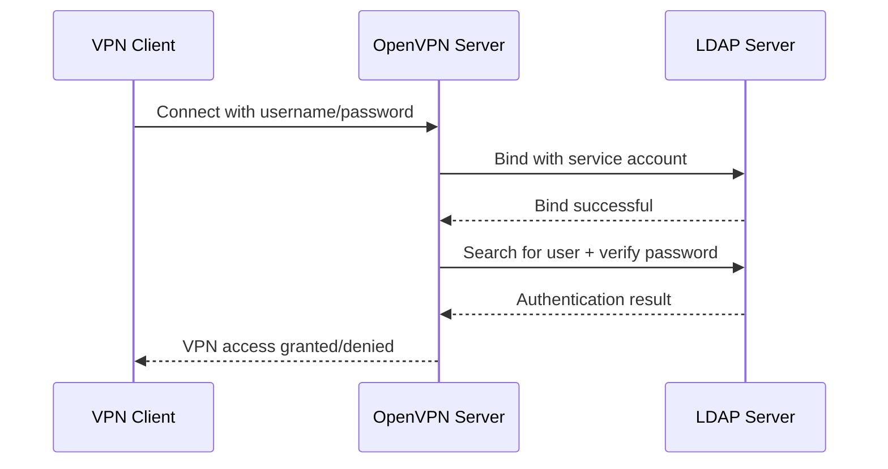

# How to Configure OpenVPN with LDAP Authentication on RHEL 9

Author: [nawazdhandala](https://www.github.com/nawazdhandala)

Tags: RHEL, OpenVPN, LDAP, Authentication, Linux

Description: Step-by-step instructions for integrating OpenVPN with LDAP directory services on RHEL 9, allowing VPN users to authenticate with their existing directory credentials.

---

Certificate-based authentication for OpenVPN works well, but managing individual certificates for every user gets tedious in larger organizations. LDAP authentication lets users connect to the VPN with their existing Active Directory or LDAP credentials, which means one less set of credentials to manage and immediate access revocation when someone leaves.

## How LDAP Authentication Works with OpenVPN



## Prerequisites

- OpenVPN installed and running on RHEL 9
- An LDAP server (Active Directory, FreeIPA, or OpenLDAP)
- LDAP service account with search permissions
- EPEL repository enabled

## Installing the LDAP Plugin

```bash
# Install the OpenVPN LDAP authentication plugin
sudo dnf install -y epel-release
sudo dnf install -y openvpn-auth-ldap
```

## Configuring the LDAP Plugin

The plugin has its own configuration file that tells it how to connect to your LDAP server.

```bash
# Create the LDAP auth configuration
sudo mkdir -p /etc/openvpn/server
sudo tee /etc/openvpn/server/auth-ldap.conf > /dev/null << 'EOF'
<LDAP>
    # LDAP server URL
    URL             ldaps://ldap.example.com:636

    # Timeout for LDAP operations (seconds)
    Timeout         15

    # Follow LDAP referrals
    FollowReferrals yes

    # TLS settings (for ldaps://)
    TLSEnable       yes
    TLSCACertFile   /etc/pki/tls/certs/ca-bundle.crt

    # Service account for searching
    BindDN          "CN=openvpn-svc,OU=Service Accounts,DC=example,DC=com"
    Password        "ServiceAccountPasswordHere"
</LDAP>

<Authorization>
    # Base DN to search for users
    BaseDN          "OU=Users,DC=example,DC=com"

    # LDAP search filter (Active Directory example)
    SearchFilter    "(&(sAMAccountName=%u)(memberOf=CN=VPN-Users,OU=Groups,DC=example,DC=com))"

    # Require group membership for access
    RequireGroup    true

    <Group>
        BaseDN      "OU=Groups,DC=example,DC=com"
        SearchFilter "(CN=VPN-Users)"
        MemberAttribute "member"
    </Group>
</Authorization>
EOF

# Secure the config file (it contains credentials)
sudo chmod 600 /etc/openvpn/server/auth-ldap.conf
```

## Modifying the OpenVPN Server Configuration

Add the LDAP plugin to your existing OpenVPN server config.

```bash
# Add these lines to /etc/openvpn/server/server.conf
sudo tee -a /etc/openvpn/server/server.conf > /dev/null << 'EOF'

# LDAP authentication plugin
plugin /usr/lib64/openvpn/plugin/lib/openvpn-auth-ldap.so /etc/openvpn/server/auth-ldap.conf

# Still require client certificates (belt and suspenders)
# Remove this line if you want username/password only
# verify-client-cert none

# Username as Common Name (when not using client certs)
# username-as-common-name
EOF
```

## Certificate-Free Authentication (Username/Password Only)

If you want to drop client certificates entirely and rely solely on LDAP:

```bash
# Add these to server.conf instead
sudo tee -a /etc/openvpn/server/server.conf > /dev/null << 'EOF'

# LDAP authentication
plugin /usr/lib64/openvpn/plugin/lib/openvpn-auth-ldap.so /etc/openvpn/server/auth-ldap.conf

# Don't require client certificates
verify-client-cert none

# Use the username as the client's Common Name
username-as-common-name
EOF
```

Note: Dropping certificates reduces security. The recommended approach is using both certificates AND LDAP authentication.

## Configuring for FreeIPA/Red Hat IdM

If your directory is FreeIPA instead of Active Directory, adjust the search filters:

```bash
sudo tee /etc/openvpn/server/auth-ldap.conf > /dev/null << 'EOF'
<LDAP>
    URL             ldaps://ipa.example.com:636
    Timeout         15
    TLSEnable       yes
    TLSCACertFile   /etc/ipa/ca.crt
    BindDN          "uid=openvpn-svc,cn=users,cn=accounts,dc=example,dc=com"
    Password        "ServiceAccountPasswordHere"
</LDAP>

<Authorization>
    BaseDN          "cn=users,cn=accounts,dc=example,dc=com"
    SearchFilter    "(uid=%u)"
    RequireGroup    true

    <Group>
        BaseDN      "cn=groups,cn=accounts,dc=example,dc=com"
        SearchFilter "(cn=vpn-users)"
        MemberAttribute "member"
    </Group>
</Authorization>
EOF

sudo chmod 600 /etc/openvpn/server/auth-ldap.conf
```

## Client Configuration for LDAP Auth

The client configuration needs to prompt for username and password:

```ini
client
dev tun
proto udp
remote vpn.example.com 1194
resolv-retry infinite
nobind
persist-key
persist-tun

# Prompt for username and password
auth-user-pass

# Server CA certificate
ca ca.crt

# TLS auth key
tls-auth ta.key 1

cipher AES-256-GCM
auth SHA256
verb 3
```

The `auth-user-pass` directive tells the client to ask for credentials when connecting.

## Restarting and Testing

```bash
# Restart OpenVPN to load the plugin
sudo systemctl restart openvpn-server@server

# Check for errors
sudo systemctl status openvpn-server@server
journalctl -u openvpn-server@server --since "2 minutes ago"

# Watch the log during a connection attempt
sudo tail -f /var/log/openvpn/openvpn.log
```

## Testing LDAP Connectivity

Before blaming OpenVPN, verify that LDAP itself works:

```bash
# Install LDAP client tools
sudo dnf install -y openldap-clients

# Test the LDAP search with the service account
ldapsearch -H ldaps://ldap.example.com:636 \
    -D "CN=openvpn-svc,OU=Service Accounts,DC=example,DC=com" \
    -W \
    -b "OU=Users,DC=example,DC=com" \
    "(sAMAccountName=testuser)"
```

## Troubleshooting

**Plugin fails to load:**

```bash
# Verify the plugin file exists
ls -la /usr/lib64/openvpn/plugin/lib/openvpn-auth-ldap.so

# Check for missing library dependencies
ldd /usr/lib64/openvpn/plugin/lib/openvpn-auth-ldap.so

# Check SELinux for denials
sudo ausearch -m avc --start recent | grep openvpn
```

**Authentication always fails:**

```bash
# Test the bind DN and password
ldapwhoami -H ldaps://ldap.example.com:636 \
    -D "CN=openvpn-svc,OU=Service Accounts,DC=example,DC=com" \
    -W

# Verify the search filter returns the user
ldapsearch -H ldaps://ldap.example.com:636 \
    -D "CN=openvpn-svc,OU=Service Accounts,DC=example,DC=com" \
    -W \
    -b "OU=Users,DC=example,DC=com" \
    "(&(sAMAccountName=testuser)(memberOf=CN=VPN-Users,OU=Groups,DC=example,DC=com))"
```

**TLS certificate errors:**

```bash
# Test TLS connectivity to the LDAP server
openssl s_client -connect ldap.example.com:636 -CAfile /etc/pki/tls/certs/ca-bundle.crt
```

## Security Considerations

1. Always use LDAPS (port 636) or STARTTLS, never plain LDAP
2. The service account should have minimal permissions (read-only search)
3. Store the auth-ldap.conf with restrictive permissions (600)
4. Consider using both certificates and LDAP for defense in depth
5. Implement account lockout policies on the LDAP side

## Wrapping Up

LDAP authentication transforms OpenVPN from a certificate-management headache into something that integrates with your existing identity infrastructure. Users log in with credentials they already know, and access revocation is as simple as disabling their LDAP account or removing them from the VPN group. The key is getting the search filter right for your directory structure and making sure TLS is properly configured for the LDAP connection.
