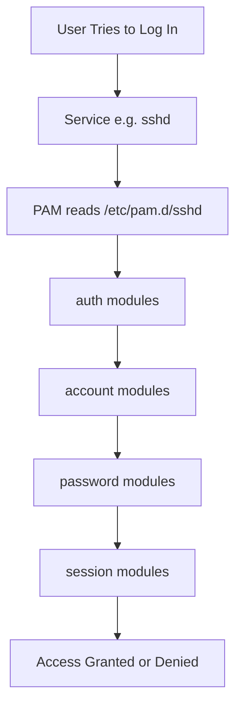

# How to Configure PAM Authentication Modules on RHEL

Author: [nawazdhandala](https://www.github.com/nawazdhandala)

Tags: RHEL, PAM, Authentication, Security, Linux

Description: A practical guide to understanding and configuring PAM (Pluggable Authentication Modules) on RHEL, covering module types, stacking order, and common configurations.

---

PAM (Pluggable Authentication Modules) is the framework that controls how authentication works on RHEL. Every time a user logs in via SSH, the console, or even runs sudo, PAM decides whether to let them in. Understanding PAM is essential if you want to enforce password policies, enable multi-factor auth, or integrate with external identity systems.

## How PAM Works

PAM configuration lives in `/etc/pam.d/`, with one file per service. Each file contains a stack of rules that are processed in order.



### The four PAM module types

| Type | Purpose |
|---|---|
| auth | Verifies user identity (password, token, etc.) |
| account | Checks account restrictions (expired, locked, time-based) |
| password | Handles password changes |
| session | Sets up or tears down the user session |

### Control flags

Each rule has a control flag that determines what happens if the module succeeds or fails:

- **required** - Must succeed, but continue processing the stack.
- **requisite** - Must succeed, and fail immediately if it does not.
- **sufficient** - If this succeeds (and no prior required module failed), stop processing and grant access.
- **optional** - Result only matters if it is the only module in the stack.
- **include** - Include rules from another PAM configuration file.

## Examining the Default PAM Configuration

RHEL uses authselect to manage PAM profiles. Look at a typical service file:

```bash
# View the PAM configuration for the SSH service
cat /etc/pam.d/sshd
```

You will typically see lines like:

```bash
auth       substack     password-auth
auth       include      postlogin
account    required     pam_sepermit.so
account    required     pam_nologin.so
account    include      password-auth
password   include      password-auth
session    required     pam_selinux.so close
session    required     pam_loginuid.so
session    optional     pam_console.so
session    required     pam_selinux.so open env_params
session    optional     pam_keyinit.so force revoke
session    include      password-auth
session    include      postlogin
```

The `password-auth` file referenced above is the central configuration that most services share.

```bash
# View the shared password-auth configuration
cat /etc/pam.d/password-auth
```

## Common PAM Modules on RHEL

Here are the modules you will work with most often:

### pam_unix.so - Standard UNIX authentication

This is the workhorse module that checks `/etc/shadow` for passwords.

```bash
auth    required    pam_unix.so nullok try_first_pass
```

The `nullok` option allows empty passwords (remove it to require passwords). The `try_first_pass` option tells the module to use a previously entered password before prompting again.

### pam_faillock.so - Account lockout after failed attempts

```bash
auth    required    pam_faillock.so preauth silent deny=5 unlock_time=900
auth    required    pam_faillock.so authfail deny=5 unlock_time=900
```

This locks an account for 15 minutes after 5 failed login attempts.

### pam_pwquality.so - Password complexity

```bash
password    requisite    pam_pwquality.so retry=3 minlen=12 dcredit=-1 ucredit=-1 lcredit=-1 ocredit=-1
```

This enforces a minimum 12-character password with at least one digit, one uppercase letter, one lowercase letter, and one special character.

### pam_pwhistory.so - Password history

```bash
password    required    pam_pwhistory.so remember=12 use_authtok
```

This prevents reuse of the last 12 passwords.

### pam_access.so - Access control by user, group, or host

```bash
account    required    pam_access.so
```

This module uses `/etc/security/access.conf` to control who can log in from where.

### pam_limits.so - Resource limits

```bash
session    required    pam_limits.so
```

Enforces limits defined in `/etc/security/limits.conf`.

## Configuring Access Controls with pam_access

The `pam_access.so` module lets you restrict login access based on user, group, and origin.

### Edit the access configuration

```bash
sudo vi /etc/security/access.conf
```

Add rules like these:

```bash
# Allow the admin group from anywhere
+ : @admins : ALL

# Allow developers only from the office network
+ : @developers : 10.0.0.0/24

# Deny everyone else
- : ALL : ALL
```

### Enable pam_access for a service

Add this line to the appropriate PAM service file (or use authselect, which is preferred):

```bash
# Check if pam_access is already configured
grep pam_access /etc/pam.d/sshd
```

## Using authselect to Safely Modify PAM

RHEL strongly recommends using authselect rather than editing PAM files directly. Direct edits can be overwritten by authselect operations.

```bash
# View the current authselect profile
sudo authselect current

# List available profiles
sudo authselect list

# Apply the sssd profile with faillock enabled
sudo authselect select sssd with-faillock --force

# Enable additional features
sudo authselect enable-feature with-pamaccess
```

## Creating a Custom PAM Configuration

If you need a completely custom setup that authselect profiles do not cover, you can create a custom profile:

```bash
# Create a custom profile based on sssd
sudo authselect create-profile mycompany --base-on sssd

# Edit the custom profile templates
sudo vi /etc/authselect/custom/mycompany/system-auth
```

Then apply it:

```bash
sudo authselect select custom/mycompany --force
```

## Testing PAM Changes

Always test PAM changes carefully. A misconfiguration can lock you out entirely.

### Before making changes

1. Keep a root shell open as a safety net.
2. Test with a non-root user first.
3. Use `pamtester` if available.

### Install and use pamtester

```bash
sudo dnf install pamtester -y

# Test authentication for a specific user and service
pamtester sshd testuser authenticate

# Test account verification
pamtester sshd testuser acct_mgmt
```

### Check PAM configuration syntax

```bash
# Verify that authselect is managing the configuration correctly
sudo authselect check
```

## Troubleshooting PAM Issues

When PAM is not behaving as expected:

```bash
# Check for PAM-related errors in the journal
sudo journalctl -t pam --since "1 hour ago"

# Check the secure log for authentication details
sudo tail -50 /var/log/secure

# List loaded PAM modules for a service
sudo ldd /usr/lib64/security/pam_unix.so
```

## Wrapping Up

PAM is one of those subsystems that you rarely think about until something breaks, but understanding it well saves you hours of debugging when authentication issues crop up. Stick with authselect for managing profiles whenever possible, test changes before applying them broadly, and always keep a root shell open when modifying PAM configuration. The modular design of PAM is powerful, but one wrong line can lock everyone out of the system.
