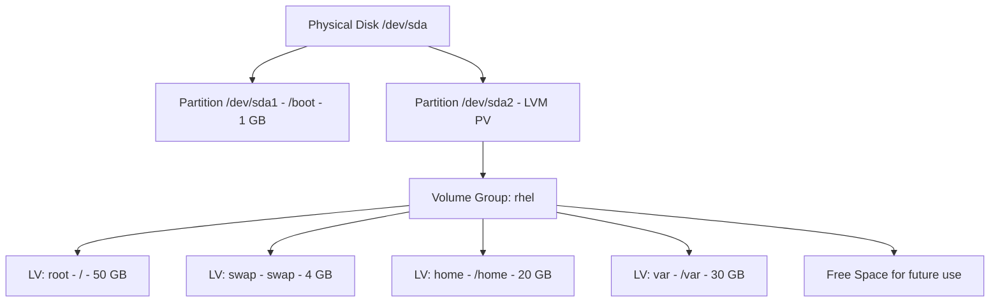

# How to Configure Partitioning and Disk Layout During RHEL Installation

Author: [nawazdhandala](https://www.github.com/nawazdhandala)

Tags: RHEL, Partitioning, Disk Layout, LVM, Installation, Linux

Description: A hands-on guide to planning and configuring disk partitioning during RHEL installation, covering standard partitions, LVM, recommended mount point layouts, and best practices for production servers.

---

Disk partitioning is one of those things that is easy to get wrong during installation and painful to fix later. RHEL's Anaconda installer gives you automatic partitioning, but blindly accepting the defaults on a production server is asking for trouble. A full /var partition will take down your logging, a missing swap partition will hurt under memory pressure, and an undersized /boot will block future kernel updates.

This guide covers how to think about partitioning and how to configure it properly during the RHEL installation process.

## Standard Partitions vs LVM

Before diving into layouts, you need to understand the two main approaches RHEL offers.

### Standard Partitions

Traditional fixed-size partitions directly on the disk. Simple, predictable, and easy to understand. The downside is that resizing them later requires unmounting, running filesystem tools, and hoping nothing goes wrong.

### LVM (Logical Volume Manager)

LVM adds a layer of abstraction between the physical disk and your filesystems. Physical volumes (PVs) are grouped into volume groups (VGs), and logical volumes (LVs) are carved out of those groups. The big advantage is that you can resize logical volumes on the fly, add new disks to a volume group, and take snapshots.



For production servers, LVM is the standard. Use it unless you have a specific reason not to.

## Recommended Partition Layout

Here is a layout that works well for most RHEL servers. Adjust sizes based on your workload.

### UEFI Systems

| Mount Point | Type | Recommended Size | Purpose |
|---|---|---|---|
| /boot/efi | EFI System Partition | 600 MB | UEFI bootloader files |
| /boot | Standard partition (xfs) | 1 GB | Kernel images, initramfs |
| / | LVM (xfs) | 30-50 GB | Root filesystem |
| /home | LVM (xfs) | 10-20 GB | User home directories |
| /var | LVM (xfs) | 20-50 GB | Logs, containers, spool data |
| /var/log | LVM (xfs) | 10-20 GB | System logs (optional split) |
| /tmp | LVM (xfs) | 5-10 GB | Temporary files |
| swap | LVM | See below | Virtual memory |

### Legacy BIOS Systems

Same as above, but replace `/boot/efi` with a 1 MB `biosboot` partition (no filesystem, just a BIOS Boot Partition for GRUB on GPT disks).

## Swap Sizing

Swap sizing depends on your RAM and whether you need hibernation support (rare on servers). Here are Red Hat's recommendations:

| RAM | Recommended Swap |
|---|---|
| 2 GB or less | 2x RAM |
| 2 GB - 8 GB | Equal to RAM |
| 8 GB - 64 GB | At least 4 GB |
| 64 GB+ | At least 4 GB |

For servers with large amounts of RAM (128 GB+), many sysadmins still allocate 4-8 GB of swap as a safety net. Running with zero swap is risky because the OOM killer becomes the only defense against memory exhaustion.

## Configuring Partitions in Anaconda

During the RHEL installation, click on "Installation Destination" to access disk configuration. You have two main choices.

### Option 1: Automatic Partitioning

Select your disk, choose "Automatic" under Storage Configuration, and click Done. Anaconda will create a reasonable layout using LVM. You can then click "Done" and review the automatic proposal.

The automatic layout creates /boot, /, /home, and swap. It works fine for test systems but often does not separate /var, which is a problem for production servers.

### Option 2: Custom Partitioning

Select "Custom" under Storage Configuration and click Done. This opens the manual partitioning interface where you have full control.

In the manual interface:

1. Click the `+` button to add a mount point
2. Enter the mount point (e.g., `/boot`)
3. Set the desired capacity (e.g., `1 GiB`)
4. Choose the device type (Standard Partition or LVM)
5. Choose the filesystem (xfs is the default and recommended for RHEL)
6. Repeat for each partition

## Creating the Layout from the Command Line (Kickstart)

If you are automating installations with Kickstart, here is a partition configuration that matches the recommended layout:

```bash
# Kickstart partitioning section for a UEFI system with a 200 GB disk
# Clear existing partitions
clearpart --all --initlabel

# EFI System Partition
part /boot/efi --fstype="efi" --size=600

# Boot partition - standard, not LVM
part /boot --fstype="xfs" --size=1024

# Physical volume for LVM - use remaining space
part pv.01 --fstype="lvmpv" --size=1 --grow

# Create the volume group
volgroup rhel pv.01

# Logical volumes
logvol /     --fstype="xfs" --vgname=rhel --name=root --size=51200
logvol /home --fstype="xfs" --vgname=rhel --name=home --size=20480
logvol /var  --fstype="xfs" --vgname=rhel --name=var  --size=30720
logvol /tmp  --fstype="xfs" --vgname=rhel --name=tmp  --size=10240
logvol swap  --fstype="swap" --vgname=rhel --name=swap --size=4096
```

## Verifying the Layout After Installation

Once RHEL is installed and booted, verify your partition layout:

```bash
# Show all mounted filesystems with usage
df -hT

# Show LVM physical volumes
pvs

# Show LVM volume groups with free space
vgs

# Show LVM logical volumes with sizes
lvs

# Show the full block device tree
lsblk -f
```

Example output from `lsblk -f` on a properly configured system:

```bash
NAME            FSTYPE      MOUNTPOINTS
sda
├─sda1          vfat        /boot/efi
├─sda2          xfs         /boot
└─sda3          LVM2_member
  ├─rhel-root   xfs         /
  ├─rhel-home   xfs         /home
  ├─rhel-var    xfs         /var
  ├─rhel-tmp    xfs         /tmp
  └─rhel-swap   swap        [SWAP]
```

## Resizing LVM Volumes After Installation

One of the biggest advantages of LVM is the ability to resize volumes after the fact. Here is how to grow a logical volume when you need more space.

```bash
# Check free space in the volume group
vgs

# Extend the /var logical volume by 10 GB
sudo lvextend -L +10G /dev/rhel/var

# Grow the XFS filesystem to fill the new space
sudo xfs_growfs /var
```

If you need to shrink a volume (only possible with ext4, not xfs), the process is more involved and requires unmounting the filesystem first. This is one reason to leave free space in your volume group during initial setup.

```bash
# Leave unallocated space in the VG during initial partitioning
# This gives you room to grow whichever volume needs it later
vgs
# Look for "VFree" column - that is your unallocated space
```

## Best Practices for Production Servers

### Separate /var for Logging and Containers

The /var directory holds system logs (/var/log), package caches (/var/cache), and if you are running Podman or Docker, container images and volumes live under /var/lib/containers. A runaway log file or a container image pull should not fill up your root filesystem.

### Keep /boot Outside LVM

The /boot partition must be a standard partition, not an LVM logical volume. GRUB needs to read kernels and initramfs images at boot time before LVM is available. RHEL expects /boot to be XFS or ext4 on a standard partition.

### Leave Free Space in the Volume Group

Do not allocate every last gigabyte during installation. Leave 10-20% of your volume group free. You will thank yourself six months later when /var fills up and you can extend it in 30 seconds without downtime.

### Use XFS as the Default Filesystem

RHEL defaults to XFS and it is the recommended choice. XFS handles large files and high-throughput workloads well, supports online growth (no unmount needed), and is heavily tested by Red Hat. Only choose ext4 if you specifically need online shrink capability.

## Handling Multiple Disks

If your server has multiple disks, you can either create separate volume groups per disk or span a single volume group across multiple disks.

```bash
# Kickstart example: two disks, mirrored /boot, single VG across both
clearpart --all --initlabel --drives=sda,sdb

part /boot/efi --fstype="efi" --size=600 --ondisk=sda
part /boot     --fstype="xfs" --size=1024 --ondisk=sda

part pv.01 --fstype="lvmpv" --size=1 --grow --ondisk=sda
part pv.02 --fstype="lvmpv" --size=1 --grow --ondisk=sdb

volgroup data pv.01 pv.02

logvol / --fstype="xfs" --vgname=data --name=root --size=51200
logvol /var --fstype="xfs" --vgname=data --name=var --size=102400
logvol swap --fstype="swap" --vgname=data --name=swap --size=4096
```

For redundancy, use hardware RAID or Linux software RAID (mdadm) underneath LVM rather than spanning a single volume group across independent disks.

## Wrapping Up

Good partitioning is about anticipating where disk space will be consumed and making sure one runaway process cannot take down the whole system. The key takeaways are: use LVM for flexibility, separate /var from root, leave free space in your volume group, and keep /boot as a standard partition. These choices take five extra minutes during installation and save real headaches in production.
