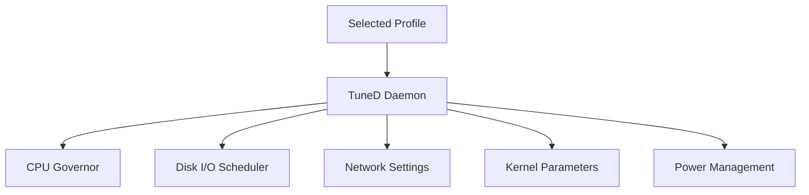

# How to Configure Performance Profiles with TuneD Using the RHEL 9 Web Console

Author: [nawazdhandala](https://www.github.com/nawazdhandala)

Tags: RHEL, Cockpit, TuneD, Performance, Linux

Description: Learn how to select and manage TuneD performance profiles through the Cockpit web console on RHEL 9 to optimize your system for different workloads.

---

Every RHEL 9 system ships with TuneD, a daemon that automatically adjusts system settings like CPU frequency scaling, disk I/O schedulers, and kernel parameters based on predefined profiles. Picking the right profile for your workload can make a noticeable difference in performance. Cockpit lets you switch profiles with a single click.

## What TuneD Does

TuneD applies a collection of tuning parameters as a single profile. Instead of manually tweaking sysctl values, scheduler settings, and power management options, you select a profile that matches your workload and TuneD handles the rest.



## Checking TuneD Status

Make sure TuneD is installed and running:

```bash
# Check if TuneD is installed
rpm -q tuned

# Enable and start TuneD
sudo systemctl enable --now tuned

# Check the current active profile
tuned-adm active

# Verify TuneD is running
systemctl status tuned
```

## Available Profiles

RHEL 9 includes several profiles out of the box:

| Profile | Best For |
|---------|----------|
| `balanced` | Default, balances performance and power |
| `throughput-performance` | High throughput server workloads |
| `latency-performance` | Low-latency workloads |
| `network-latency` | Low-latency network applications |
| `network-throughput` | High network throughput |
| `virtual-guest` | VMs running on a hypervisor |
| `virtual-host` | KVM/libvirt hypervisor hosts |
| `powersave` | Maximum power savings |
| `desktop` | Desktop/workstation use |
| `hpc-compute` | High-performance computing |
| `oracle` | Oracle database workloads |
| `mssql` | Microsoft SQL Server on Linux |

List all available profiles:

```bash
tuned-adm list
```

## Changing Profiles in Cockpit

In Cockpit, the performance profile is shown on the Overview page. You'll see the current profile listed under "Performance profile" with a link to change it.

Click on the profile name, and a dropdown or dialog appears listing all available profiles. Select the one you want and click "Change profile." TuneD applies the new settings immediately.

That's it. No reboot needed.

## Changing Profiles from the CLI

```bash
# Switch to the throughput-performance profile
sudo tuned-adm profile throughput-performance

# Verify the change
tuned-adm active

# Check that the profile is applied correctly
sudo tuned-adm verify
```

The `verify` command checks whether the system's current settings match what the profile expects. If something has been manually overridden, it will tell you.

## Profile Details: What They Actually Change

Let's look at what some common profiles do under the hood.

**throughput-performance** - good for general server workloads:

```bash
# View what a profile configures
tuned-adm profile_info throughput-performance
```

Key settings:
- CPU governor set to `performance` (max frequency always)
- Transparent huge pages enabled
- Disk readahead increased
- Kernel scheduler tuned for throughput

**latency-performance** - for applications where response time matters:

- CPU governor set to `performance`
- CPU C-states disabled (no power saving sleep)
- Transparent huge pages enabled
- Scheduler tuned for low latency

**virtual-guest** - for VMs:

- Reduced disk readahead
- Virtual disk I/O tuning
- Memory management optimized for guest behavior

## Using TuneD Recommendations

TuneD can analyze your system and recommend a profile:

```bash
# Get TuneD's recommendation
tuned-adm recommend
```

This looks at your hardware and environment (physical vs virtual) and suggests the best fit. On a bare-metal server, it typically recommends `throughput-performance`. Inside a VM, it recommends `virtual-guest`.

## Creating a Custom Profile

If the built-in profiles don't quite fit, you can create a custom one that inherits from an existing profile and overrides specific settings.

Create a custom profile directory:

```bash
# Create the profile directory
sudo mkdir -p /etc/tuned/my-custom-profile
```

Create the profile configuration:

```bash
sudo tee /etc/tuned/my-custom-profile/tuned.conf << 'EOF'
[main]
# Inherit from throughput-performance
include=throughput-performance

[sysctl]
# Increase network buffer sizes
net.core.rmem_max=16777216
net.core.wmem_max=16777216
net.ipv4.tcp_rmem=4096 87380 16777216
net.ipv4.tcp_wmem=4096 65536 16777216

# Increase connection tracking table
net.netfilter.nf_conntrack_max=1048576

# Increase file descriptor limits
fs.file-max=2097152

[vm]
# Set transparent huge pages to madvise instead of always
transparent_hugepages=madvise

[disk]
# Set readahead for all disks
readahead=4096
EOF
```

Activate the custom profile:

```bash
sudo tuned-adm profile my-custom-profile
sudo tuned-adm verify
```

Your custom profile now appears in both the CLI listing and in Cockpit's profile selector.

## Profile Configuration Sections

TuneD profiles support these configuration sections:

```bash
# [main] - inheritance and plugin options
# [cpu] - CPU settings
# [disk] - disk I/O settings
# [net] - network settings
# [sysctl] - kernel sysctl parameters
# [vm] - virtual memory settings
# [audio] - audio settings
# [video] - video settings
# [bootloader] - kernel boot parameters
# [script] - custom scripts
# [scheduler] - process scheduler settings
```

## Running Custom Scripts with TuneD

For tuning that goes beyond configuration files, TuneD can run scripts when a profile is activated or deactivated:

```bash
# Create a script in your custom profile directory
sudo tee /etc/tuned/my-custom-profile/script.sh << 'SCRIPTEOF'
#!/bin/bash
# This runs when the profile is activated
echo "Custom profile activated at $(date)" >> /var/log/tuned-custom.log

# Set CPU frequency governor
for cpu in /sys/devices/system/cpu/cpu*/cpufreq/scaling_governor; do
    echo performance > "$cpu" 2>/dev/null
done
SCRIPTEOF

sudo chmod +x /etc/tuned/my-custom-profile/script.sh
```

Reference the script in the profile:

```bash
# Add to tuned.conf
[script]
script=script.sh
```

## Monitoring the Impact of Profile Changes

After switching profiles, monitor the effect on your system:

```bash
# Check CPU frequency and governor
cat /sys/devices/system/cpu/cpu0/cpufreq/scaling_governor
cat /sys/devices/system/cpu/cpu0/cpufreq/scaling_cur_freq

# Check transparent huge pages setting
cat /sys/kernel/mm/transparent_hugepage/enabled

# Check disk readahead
blockdev --getra /dev/sda

# Check sysctl values
sysctl net.core.rmem_max
sysctl vm.swappiness
```

In Cockpit, the performance graphs on the Overview page will reflect the impact of the profile change. You should see changes in CPU frequency patterns and potentially in throughput metrics.

## TuneD Dynamic Tuning

TuneD can dynamically adjust settings based on current system load. This is disabled by default but can be useful for variable workloads.

Enable dynamic tuning:

```bash
# Edit the TuneD main configuration
sudo tee /etc/tuned/tuned-main.conf << 'EOF'
[main]
dynamic_tuning = 1
update_interval = 10
EOF

# Restart TuneD
sudo systemctl restart tuned
```

With dynamic tuning enabled, TuneD periodically checks system metrics and adjusts parameters. For example, it might reduce CPU frequency during idle periods even while using a performance profile.

## Common Scenarios

**Database server**: Use `throughput-performance` as a base and add custom sysctl settings for your database engine. Oracle and MSSQL have dedicated profiles.

**Web server**: `throughput-performance` works well. Consider tuning network buffer sizes in a custom profile.

**KVM hypervisor**: Use `virtual-host` on the hypervisor and `virtual-guest` on the VMs.

**Power-sensitive environment**: Start with `balanced` and only switch to `powersave` if needed.

```bash
# Quick profile selection based on role
# Database server
sudo tuned-adm profile throughput-performance

# KVM host
sudo tuned-adm profile virtual-host

# VM guest
sudo tuned-adm profile virtual-guest

# Laptop or power-constrained
sudo tuned-adm profile balanced
```

## Wrapping Up

TuneD takes the guesswork out of system tuning. The built-in profiles cover the most common workloads, and Cockpit makes switching between them trivial. For specialized needs, custom profiles let you define exactly the settings you want while inheriting sensible defaults from existing profiles. The key is to start with the recommendation from `tuned-adm recommend`, benchmark your workload, and adjust from there.
