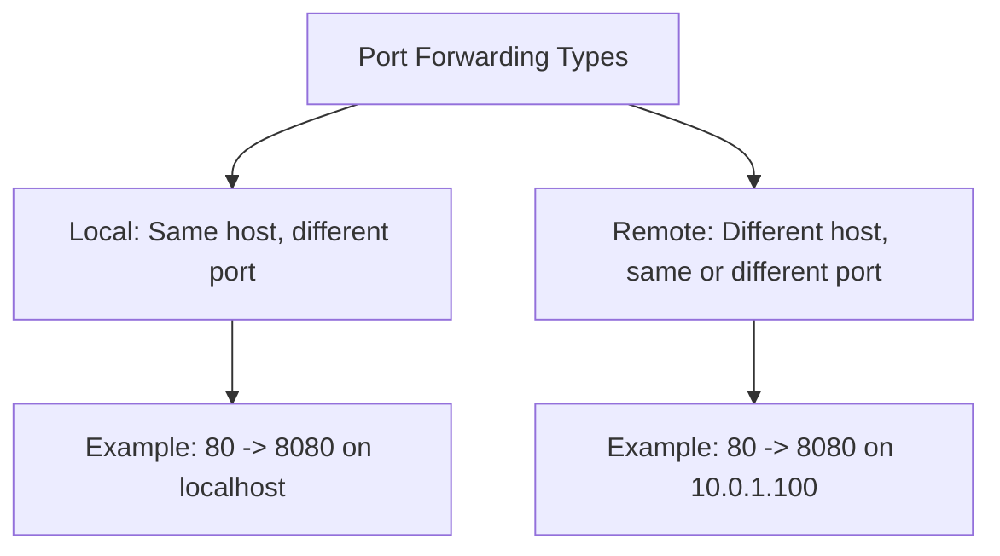

# How to Configure Port Forwarding with Firewalld on RHEL 9

Author: [nawazdhandala](https://www.github.com/nawazdhandala)

Tags: RHEL, Firewalld, Port Forwarding, Networking, Linux

Description: How to set up port forwarding with firewalld on RHEL 9, covering local port redirection, forwarding to other hosts, and common use cases like NAT and load balancing.

---

Port forwarding redirects traffic arriving on one port to a different port or a different host. On RHEL 9, firewalld handles this through its port forwarding rules, which translate to NAT rules in the underlying nftables framework. Common use cases include redirecting port 80 to 8080 for a non-root web server, or forwarding traffic to a backend server on a private network.

## Types of Port Forwarding



## Local Port Forwarding

Redirect traffic from one port to another on the same machine.

### Forward Port 80 to 8080

```bash
# Forward incoming port 80 to local port 8080
firewall-cmd --zone=public --add-forward-port=port=80:proto=tcp:toport=8080 --permanent
firewall-cmd --reload
```

This is useful when your application runs as a non-root user on port 8080 but you want users to access it on the standard HTTP port.

### Forward a Range of Ports

```bash
# Forward UDP ports 5000-5010 to 6000-6010
firewall-cmd --zone=public --add-forward-port=port=5000-5010:proto=udp:toport=6000-6010 --permanent
firewall-cmd --reload
```

## Remote Port Forwarding

Forward traffic to a different host. This requires masquerading to be enabled.

### Step 1: Enable IP Forwarding

```bash
# Enable IP forwarding in the kernel
echo "net.ipv4.ip_forward = 1" > /etc/sysctl.d/99-forward.conf
sysctl -p /etc/sysctl.d/99-forward.conf

# Verify
sysctl net.ipv4.ip_forward
```

### Step 2: Enable Masquerading

```bash
# Enable masquerading on the zone
firewall-cmd --zone=public --add-masquerade --permanent
firewall-cmd --reload
```

### Step 3: Add the Forward Rule

```bash
# Forward port 80 to port 8080 on backend server 10.0.1.100
firewall-cmd --zone=public --add-forward-port=port=80:proto=tcp:toport=8080:toaddr=10.0.1.100 --permanent
firewall-cmd --reload
```

### Step 4: Verify

```bash
# List forward rules
firewall-cmd --zone=public --list-forward-ports

# Test from a client
curl http://your-public-ip
```

## Port Forwarding with Rich Rules

For more control (e.g., forwarding only from specific source IPs), use rich rules:

```bash
# Forward port 3306 to a database server, but only from the app subnet
firewall-cmd --zone=public --add-rich-rule='rule family="ipv4" source address="10.0.1.0/24" forward-port port="3306" protocol="tcp" to-port="3306" to-addr="10.0.2.50"' --permanent
firewall-cmd --reload
```

## Common Use Cases

### Redirect HTTP to HTTPS

While this is usually done at the web server level, you can do it with firewalld:

```bash
# This is a local redirect, not a true HTTP redirect
# It forwards TCP port 80 to port 443 on the same host
firewall-cmd --zone=public --add-forward-port=port=80:proto=tcp:toport=443 --permanent
firewall-cmd --reload
```

Note: This performs a TCP-level redirect, not an HTTP 301/302 redirect. The client will not see the URL change. For proper HTTP redirects, configure your web server.

### Forward SSH to a Jump Host

```bash
# Forward SSH on port 2222 to an internal server
firewall-cmd --zone=public --add-forward-port=port=2222:proto=tcp:toport=22:toaddr=10.0.1.50 --permanent
firewall-cmd --reload
```

Users connect to your-public-ip:2222 and reach the internal server's SSH.

### Forward to Multiple Backend Servers

Firewalld does not do load balancing, but you can forward different ports to different backends:

```bash
# Web server 1
firewall-cmd --zone=public --add-forward-port=port=8081:proto=tcp:toport=80:toaddr=10.0.1.101 --permanent

# Web server 2
firewall-cmd --zone=public --add-forward-port=port=8082:proto=tcp:toport=80:toaddr=10.0.1.102 --permanent

# Web server 3
firewall-cmd --zone=public --add-forward-port=port=8083:proto=tcp:toport=80:toaddr=10.0.1.103 --permanent

firewall-cmd --reload
```

## Listing and Removing Forward Rules

```bash
# List all forward port rules
firewall-cmd --zone=public --list-forward-ports

# Remove a specific forward rule
firewall-cmd --zone=public --remove-forward-port=port=80:proto=tcp:toport=8080 --permanent
firewall-cmd --reload

# Remove a remote forward
firewall-cmd --zone=public --remove-forward-port=port=80:proto=tcp:toport=8080:toaddr=10.0.1.100 --permanent
firewall-cmd --reload
```

## Troubleshooting

### Forward Not Working

```bash
# Check if IP forwarding is enabled
sysctl net.ipv4.ip_forward
# Must be 1

# Check if masquerading is enabled (required for remote forwarding)
firewall-cmd --zone=public --query-masquerade

# Check the forward rules are in place
firewall-cmd --zone=public --list-forward-ports

# Verify with nftables
nft list ruleset | grep "dnat"
```

### Traffic Reaches the Frontend but Not the Backend

```bash
# From the frontend, verify you can reach the backend
ping 10.0.1.100

# Check routing
ip route show

# Check if the backend has a route back to the client
# (It needs to route return traffic through the frontend,
# or you need masquerading so return traffic goes through the frontend automatically)
```

### Source IP Preservation

When using masquerading, the backend server sees the frontend's IP as the source, not the original client IP. If you need the real client IP, you have to use a different approach (like proxy protocol or X-Forwarded-For at the application level).

## Performance Considerations

Port forwarding adds NAT overhead. For high-traffic scenarios:

- Use connection tracking tuning
- Monitor the conntrack table size

```bash
# Check current conntrack usage
cat /proc/sys/net/netfilter/nf_conntrack_count
cat /proc/sys/net/netfilter/nf_conntrack_max

# Increase if needed
echo 262144 > /proc/sys/net/netfilter/nf_conntrack_max
```

## Summary

Port forwarding with firewalld covers two scenarios: local redirection (same host, different port) and remote forwarding (different host). Local forwarding is simple and does not need masquerading. Remote forwarding requires IP forwarding enabled in the kernel and masquerading enabled on the zone. Use rich rules for source-based forwarding control. Always verify with `--list-forward-ports` and test from a client to confirm traffic flows correctly.
