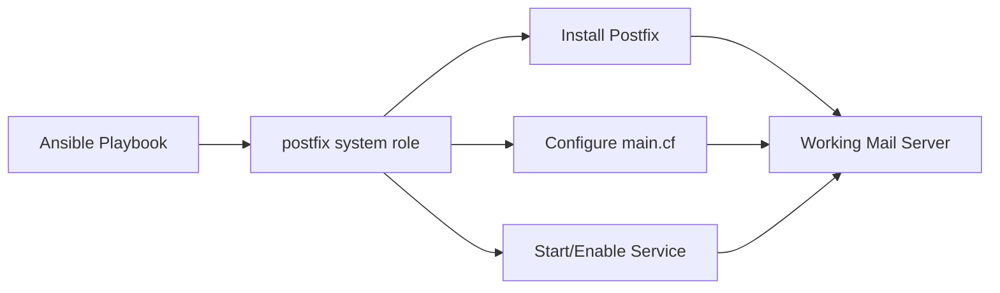

# How to Configure Postfix with RHEL System Roles

Author: [nawazdhandala](https://www.github.com/nawazdhandala)

Tags: RHEL, System Roles, Postfix, Email, Ansible, Linux

Description: Automate Postfix mail server configuration on RHEL using the postfix RHEL System Role for consistent mail delivery across your infrastructure.

---

Every RHEL server needs to send email for cron job reports, monitoring alerts, and system notifications. Configuring Postfix consistently across dozens or hundreds of servers is exactly the kind of problem that the RHEL postfix system role solves.

## What the Postfix System Role Does

The `rhel-system-roles.postfix` role installs and configures Postfix with the settings you define. It manages the main.cf configuration and ensures the service is running.



## Prerequisites

```bash
# Install system roles on the control node
sudo dnf install rhel-system-roles
```

## Basic Relay Configuration

The most common setup is configuring Postfix as a relay that forwards all mail through a central mail server:

```yaml
# playbook-postfix-relay.yml
# Configure Postfix as a mail relay on all servers
---
- name: Configure Postfix mail relay
  hosts: all
  become: true
  vars:
    postfix_conf:
      # Set the relay host
      relayhost: "[smtp.example.com]:587"
      # Only listen on localhost
      inet_interfaces: "loopback-only"
      # Set the mail domain
      mydomain: "example.com"
      myorigin: "$mydomain"
      # Restrict who can send
      mynetworks: "127.0.0.0/8 [::1]/128"

  roles:
    - rhel-system-roles.postfix
```

Run it:

```bash
# Configure Postfix across all servers
ansible-playbook -i inventory playbook-postfix-relay.yml
```

## Postfix with SMTP Authentication

If your relay requires authentication:

```yaml
# playbook-postfix-auth.yml
# Configure Postfix with SMTP authentication for relay
---
- name: Configure Postfix with SMTP auth
  hosts: all
  become: true
  vars:
    postfix_conf:
      relayhost: "[smtp.example.com]:587"
      inet_interfaces: "loopback-only"
      mydomain: "example.com"
      myorigin: "$mydomain"
      # Enable TLS
      smtp_use_tls: "yes"
      smtp_tls_security_level: "encrypt"
      smtp_tls_CAfile: "/etc/pki/tls/certs/ca-bundle.crt"
      # Enable SASL authentication
      smtp_sasl_auth_enable: "yes"
      smtp_sasl_password_maps: "hash:/etc/postfix/sasl_passwd"
      smtp_sasl_security_options: "noanonymous"

  tasks:
    - name: Apply postfix system role
      ansible.builtin.include_role:
        name: rhel-system-roles.postfix

    - name: Create SASL password file
      ansible.builtin.copy:
        # Store relay credentials
        content: "[smtp.example.com]:587 relay_user:relay_password"
        dest: /etc/postfix/sasl_passwd
        owner: root
        group: root
        mode: "0600"

    - name: Generate SASL password database
      ansible.builtin.command: postmap /etc/postfix/sasl_passwd
      notify: Restart postfix

  handlers:
    - name: Restart postfix
      ansible.builtin.service:
        name: postfix
        state: restarted
```

## Configuring Postfix as a Local-Only Mail Server

For servers that only need to deliver mail locally (no external sending):

```yaml
# playbook-postfix-local.yml
# Configure Postfix for local mail delivery only
---
- name: Configure local-only Postfix
  hosts: all
  become: true
  vars:
    postfix_conf:
      # Only listen on localhost
      inet_interfaces: "loopback-only"
      # Only accept mail from this machine
      mydestination: "$myhostname, localhost.$mydomain, localhost"
      mynetworks: "127.0.0.0/8 [::1]/128"
      # Deliver to local mailboxes
      home_mailbox: "Maildir/"
      # No relay
      relayhost: ""

  roles:
    - rhel-system-roles.postfix
```

## Postfix with TLS for Incoming Connections

If the server needs to accept mail from other systems:

```yaml
# playbook-postfix-tls.yml
# Configure Postfix with TLS for incoming and outgoing mail
---
- name: Configure Postfix with TLS
  hosts: mailservers
  become: true
  vars:
    postfix_conf:
      # Listen on all interfaces
      inet_interfaces: "all"
      mydomain: "example.com"
      myhostname: "mail.example.com"
      myorigin: "$mydomain"
      mydestination: "$myhostname, $mydomain, localhost.$mydomain, localhost"
      # TLS for incoming connections
      smtpd_tls_cert_file: "/etc/pki/tls/certs/mail.crt"
      smtpd_tls_key_file: "/etc/pki/tls/private/mail.key"
      smtpd_tls_security_level: "may"
      # TLS for outgoing connections
      smtp_tls_security_level: "may"
      smtp_tls_CAfile: "/etc/pki/tls/certs/ca-bundle.crt"
      # Restrict relaying
      mynetworks: "127.0.0.0/8 10.0.0.0/8 [::1]/128"
      # Message size limit (25 MB)
      message_size_limit: "26214400"

  roles:
    - rhel-system-roles.postfix
```

## Verifying the Configuration

After running the playbook:

```bash
# Check Postfix configuration for errors
sudo postfix check

# View the active configuration
sudo postconf -n

# Check the service status
sudo systemctl status postfix

# Send a test email
echo "Test email from $(hostname)" | mail -s "Test" admin@example.com

# Check the mail queue
sudo mailq

# View the mail log
sudo tail -f /var/log/maillog
```

## Wrapping Up

The Postfix system role is one of the simpler RHEL system roles, but it solves a real problem. Every server in your fleet needs consistent mail configuration for system notifications to work properly. Without it, you end up with servers that silently fail to deliver cron reports or monitoring alerts because someone forgot to configure the relay host. One playbook, applied everywhere, fixes that.
