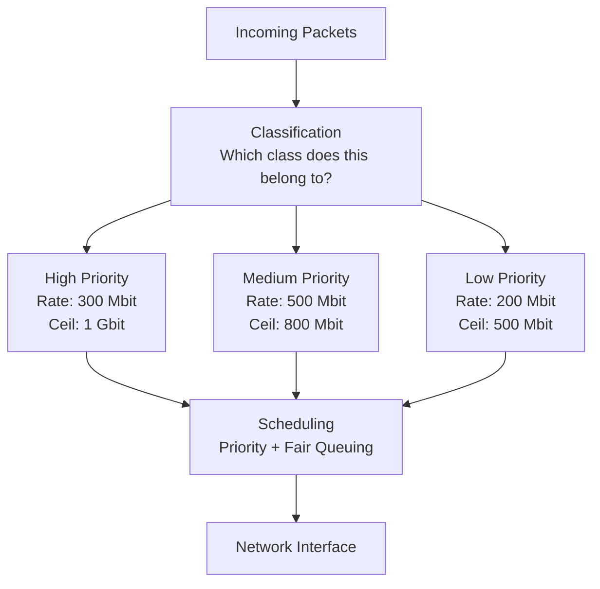

# How to Configure Quality of Service (QoS) with Traffic Control on RHEL

Author: [nawazdhandala](https://www.github.com/nawazdhandala)

Tags: RHEL, QoS, Traffic Control, Tc, Linux

Description: A comprehensive guide to setting up Quality of Service on RHEL using tc, including traffic classification, priority queuing, bandwidth guarantees, and practical QoS policies for common scenarios.

---

Quality of Service (QoS) ensures that critical traffic gets the bandwidth and low latency it needs, even when the network is congested. Without QoS, a large file transfer can starve your SSH sessions, and a backup job can make your VoIP calls unusable. On RHEL, tc (traffic control) provides the building blocks for sophisticated QoS policies.

## QoS Concepts



Key terms:
- **Rate** - Guaranteed minimum bandwidth for a class
- **Ceil** - Maximum bandwidth a class can use (borrowing from others)
- **Priority** - Which class gets served first during congestion

## Designing a QoS Policy

Before touching tc, plan your traffic classes. Here's a common policy:

| Class | Traffic | Rate | Ceil | Priority |
|-------|---------|------|------|----------|
| Interactive | SSH, DNS, ICMP | 100 Mbit | 1 Gbit | 1 (highest) |
| Business | HTTP, HTTPS, API | 500 Mbit | 900 Mbit | 2 |
| Bulk | Backups, updates, FTP | 200 Mbit | 500 Mbit | 3 |
| Default | Everything else | 200 Mbit | 500 Mbit | 4 |

Total guaranteed: 1 Gbit (matches the link speed).

## Building the QoS Configuration

### Step 1: Clear Existing Configuration

```bash
# Remove any existing tc rules
sudo tc qdisc del dev ens192 root 2>/dev/null
```

### Step 2: Create the Root HTB Qdisc

```bash
# HTB with default class 40 (for unclassified traffic)
sudo tc qdisc add dev ens192 root handle 1: htb default 40
```

### Step 3: Create the Root Class

```bash
# Root class matching your link speed
sudo tc class add dev ens192 parent 1: classid 1:1 htb rate 1gbit
```

### Step 4: Create Traffic Classes

```bash
# Interactive: guaranteed 100 Mbit, can burst to full link
sudo tc class add dev ens192 parent 1:1 classid 1:10 htb rate 100mbit ceil 1gbit prio 1

# Business: guaranteed 500 Mbit, can burst to 900 Mbit
sudo tc class add dev ens192 parent 1:1 classid 1:20 htb rate 500mbit ceil 900mbit prio 2

# Bulk: guaranteed 200 Mbit, can burst to 500 Mbit
sudo tc class add dev ens192 parent 1:1 classid 1:30 htb rate 200mbit ceil 500mbit prio 3

# Default: guaranteed 200 Mbit, can burst to 500 Mbit
sudo tc class add dev ens192 parent 1:1 classid 1:40 htb rate 200mbit ceil 500mbit prio 4
```

### Step 5: Add Fair Queuing to Each Class

```bash
# fq_codel on each leaf class prevents bufferbloat within the class
sudo tc qdisc add dev ens192 parent 1:10 handle 10: fq_codel
sudo tc qdisc add dev ens192 parent 1:20 handle 20: fq_codel
sudo tc qdisc add dev ens192 parent 1:30 handle 30: fq_codel
sudo tc qdisc add dev ens192 parent 1:40 handle 40: fq_codel
```

### Step 6: Classify Traffic with Filters

```bash
# Interactive traffic
# SSH
sudo tc filter add dev ens192 parent 1: protocol ip prio 1 u32 match ip dport 22 0xffff flowid 1:10
sudo tc filter add dev ens192 parent 1: protocol ip prio 1 u32 match ip sport 22 0xffff flowid 1:10

# DNS
sudo tc filter add dev ens192 parent 1: protocol ip prio 1 u32 match ip dport 53 0xffff flowid 1:10

# ICMP (ping)
sudo tc filter add dev ens192 parent 1: protocol ip prio 1 u32 match ip protocol 1 0xff flowid 1:10

# Business traffic
# HTTP
sudo tc filter add dev ens192 parent 1: protocol ip prio 2 u32 match ip dport 80 0xffff flowid 1:20

# HTTPS
sudo tc filter add dev ens192 parent 1: protocol ip prio 2 u32 match ip dport 443 0xffff flowid 1:20

# API port
sudo tc filter add dev ens192 parent 1: protocol ip prio 2 u32 match ip dport 8080 0xffff flowid 1:20

# Bulk traffic
# rsync
sudo tc filter add dev ens192 parent 1: protocol ip prio 3 u32 match ip dport 873 0xffff flowid 1:30

# FTP
sudo tc filter add dev ens192 parent 1: protocol ip prio 3 u32 match ip dport 21 0xffff flowid 1:30

# Everything else falls to default class 1:40
```

## Using DSCP for Classification

If your applications set DSCP (Differentiated Services Code Point) values, you can classify based on those:

```bash
# Match DSCP EF (Expedited Forwarding) - voice/interactive
# DSCP EF = 46, TOS value = 46 << 2 = 0xb8
sudo tc filter add dev ens192 parent 1: protocol ip prio 1 u32 match ip tos 0xb8 0xfc flowid 1:10

# Match DSCP AF41 (Assured Forwarding) - business
# DSCP AF41 = 34, TOS value = 34 << 2 = 0x88
sudo tc filter add dev ens192 parent 1: protocol ip prio 2 u32 match ip tos 0x88 0xfc flowid 1:20
```

## Monitoring QoS Performance

```bash
# Show class statistics
tc -s class show dev ens192

# Watch in real time
watch -n 1 'tc -s class show dev ens192'

# Show detailed statistics including backlog
tc -s -d class show dev ens192
```

Look for:
- **Sent** - Total bytes/packets through each class
- **Dropped** - Packets dropped (indicates congestion in that class)
- **Overlimits** - Times the class exceeded its rate (borrowed bandwidth)
- **Backlog** - Packets queued, waiting to be sent

## The Complete QoS Script

```bash
#!/bin/bash
# qos-setup.sh - Complete QoS configuration for RHEL
# Run with: sudo bash qos-setup.sh

IFACE="ens192"
LINK_SPEED="1gbit"

# Clear existing rules
tc qdisc del dev $IFACE root 2>/dev/null

# Root qdisc and class
tc qdisc add dev $IFACE root handle 1: htb default 40
tc class add dev $IFACE parent 1: classid 1:1 htb rate $LINK_SPEED

# Traffic classes
tc class add dev $IFACE parent 1:1 classid 1:10 htb rate 100mbit ceil $LINK_SPEED prio 1
tc class add dev $IFACE parent 1:1 classid 1:20 htb rate 500mbit ceil 900mbit prio 2
tc class add dev $IFACE parent 1:1 classid 1:30 htb rate 200mbit ceil 500mbit prio 3
tc class add dev $IFACE parent 1:1 classid 1:40 htb rate 200mbit ceil 500mbit prio 4

# Fair queueing on leaves
tc qdisc add dev $IFACE parent 1:10 handle 10: fq_codel
tc qdisc add dev $IFACE parent 1:20 handle 20: fq_codel
tc qdisc add dev $IFACE parent 1:30 handle 30: fq_codel
tc qdisc add dev $IFACE parent 1:40 handle 40: fq_codel

# Classification filters
tc filter add dev $IFACE parent 1: protocol ip prio 1 u32 match ip dport 22 0xffff flowid 1:10
tc filter add dev $IFACE parent 1: protocol ip prio 1 u32 match ip sport 22 0xffff flowid 1:10
tc filter add dev $IFACE parent 1: protocol ip prio 1 u32 match ip dport 53 0xffff flowid 1:10
tc filter add dev $IFACE parent 1: protocol ip prio 1 u32 match ip protocol 1 0xff flowid 1:10
tc filter add dev $IFACE parent 1: protocol ip prio 2 u32 match ip dport 80 0xffff flowid 1:20
tc filter add dev $IFACE parent 1: protocol ip prio 2 u32 match ip dport 443 0xffff flowid 1:20
tc filter add dev $IFACE parent 1: protocol ip prio 3 u32 match ip dport 873 0xffff flowid 1:30

echo "QoS configured on $IFACE"
tc -s class show dev $IFACE
```

## Wrapping Up

QoS with tc on RHEL is about three things: defining classes with bandwidth guarantees, classifying traffic into those classes, and using fair queueing within each class. HTB handles the bandwidth allocation, u32 filters handle the classification, and fq_codel prevents bufferbloat at each level. Plan your classes around your actual traffic patterns, monitor with `tc -s class show`, and adjust rates based on what you observe.
