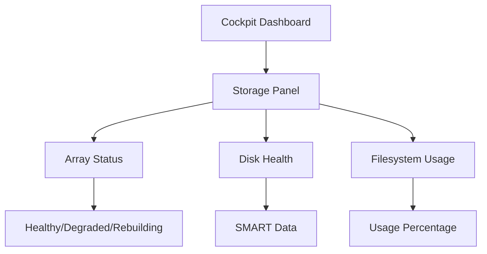

# How to Configure RAID in the RHEL Web Console (Cockpit)

Author: [nawazdhandala](https://www.github.com/nawazdhandala)

Tags: RHEL, RAID, Cockpit, Storage, Linux

Description: Use the RHEL Cockpit web console to create and manage RAID arrays through a browser-based interface, with no command line required.

---

## Why Use Cockpit for RAID?

Cockpit is the web-based administration console that ships with RHEL. It provides a clean graphical interface for storage management, including RAID array creation and monitoring. If you prefer a visual approach or need to hand off RAID management to team members who are not comfortable with the command line, Cockpit is an excellent option.

Under the hood, Cockpit uses the same mdadm tools, so everything it creates is standard and can be managed from the CLI as well.

## Prerequisites

- RHEL with Cockpit installed and enabled
- Unused disks for the RAID array
- A web browser

## Step 1 - Enable Cockpit

Cockpit is installed by default on RHEL. Just enable and start it:

```bash
# Enable and start the Cockpit socket
sudo systemctl enable --now cockpit.socket

# Open the firewall for Cockpit
sudo firewall-cmd --permanent --add-service=cockpit
sudo firewall-cmd --reload
```

Access Cockpit at `https://your-server-ip:9090` in your browser. Log in with a user that has sudo privileges.

## Step 2 - Install the Storage Module

The storage management module may not be installed by default:

```bash
# Install the Cockpit storage module
sudo dnf install -y cockpit-storaged
```

After installation, refresh the Cockpit page in your browser. You should see a "Storage" option in the left sidebar.

## Step 3 - Navigate to Storage

Click on **Storage** in the Cockpit sidebar. You will see:

- An overview of all disks and partitions
- Existing RAID arrays (if any)
- Filesystems and mount points
- NFS mounts

## Step 4 - Create a RAID Array

1. In the Storage section, look for the **RAID devices** panel
2. Click the **Create RAID device** button (the "+" icon)
3. A dialog appears where you configure:
   - **Name**: Give the array a meaningful name
   - **RAID Level**: Choose from RAID 0, 1, 4, 5, 6, or 10
   - **Chunk Size**: Leave default or customize
   - **Disks**: Select the disks to include

4. Click **Create** to build the array

The interface will show the sync progress as a percentage bar.

## Step 5 - Create a Filesystem

Once the array exists:

1. Click on the new RAID device in the storage overview
2. Click **Create partition table** if needed (choose GPT)
3. Click **Create partition** or use the entire device
4. Choose your filesystem type (XFS is recommended)
5. Set the mount point
6. Check "Mount at boot" for persistent mounting
7. Click **Create**

Cockpit handles the mkfs command, fstab entry, and mounting automatically.

## Managing the Array in Cockpit

### Viewing Status

The Storage page shows the array state at a glance. Healthy arrays show a green indicator. Degraded arrays are highlighted in yellow or red.

### Adding a Disk

1. Click on the RAID device
2. Look for an option to add disks
3. Select an unused disk
4. Click **Add**

The disk will be added as a spare if the array is already at its configured device count.

### Removing a Disk

1. Click on the RAID device
2. Click on the disk you want to remove
3. Choose **Remove** or **Mark as faulty**

## Monitoring from Cockpit

Cockpit shows real-time information:



You can click into individual disks to see SMART data, serial numbers, and error logs.

## Limitations of Cockpit for RAID

While Cockpit handles the basics well, some advanced operations still require the command line:

- Reshaping arrays (changing RAID level or adding disks to active arrays)
- Configuring spare groups
- Fine-tuning rebuild speeds
- Setting up email alerts
- Advanced bitmap configuration

For these operations, drop to the terminal (Cockpit has a built-in terminal tab) and use mdadm directly.

## Using the Built-in Terminal

Cockpit includes a terminal emulator. Click on **Terminal** in the sidebar to get a shell session. This is useful for running mdadm commands without leaving the browser.

```bash
# Example: check array details from the Cockpit terminal
sudo mdadm --detail /dev/md5
```

## Combining Cockpit with CLI Management

Everything Cockpit creates uses standard Linux tools. Arrays created in Cockpit appear in `/proc/mdstat`, and CLI-created arrays show up in Cockpit. There is no conflict between the two approaches.

```bash
# Arrays created in Cockpit are visible on the CLI
cat /proc/mdstat
sudo mdadm --detail --scan
```

## Security Considerations

Cockpit runs over HTTPS on port 9090. To restrict access:

```bash
# Allow only specific IPs to access Cockpit
sudo firewall-cmd --permanent --remove-service=cockpit
sudo firewall-cmd --permanent --add-rich-rule='rule family="ipv4" source address="10.0.0.0/24" service name="cockpit" accept'
sudo firewall-cmd --reload
```

## Wrap-Up

Cockpit provides a solid graphical interface for basic RAID management on RHEL. It covers array creation, filesystem setup, and monitoring without requiring any CLI knowledge. For advanced operations, the command line is still necessary, but for day-to-day management and monitoring, Cockpit handles the job well. The combination of Cockpit for visual management and mdadm for advanced tasks gives you the best of both worlds.
