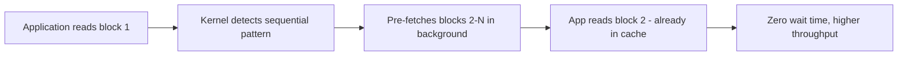

# How to Configure Read-Ahead Settings for Sequential Workloads on RHEL

Author: [nawazdhandala](https://www.github.com/nawazdhandala)

Tags: RHEL, Read-Ahead, Performance, Storage, Linux

Description: Learn how to tune read-ahead settings on RHEL to boost performance for sequential workloads like backups, media streaming, and large data processing.

---

Read-ahead is a kernel feature that pre-fetches data from disk before an application asks for it. For sequential workloads - where data is read in order from beginning to end - tuning read-ahead can dramatically improve throughput. For random workloads, too much read-ahead wastes I/O bandwidth. Getting it right for your workload matters.

## How Read-Ahead Works

When the kernel detects a sequential read pattern, it starts pre-fetching the next blocks before the application requests them. This means by the time the application needs the data, it is already in the page cache.



The default read-ahead on RHEL is typically 128 KB (256 sectors of 512 bytes each).

## Check Current Read-Ahead

```bash
# Check read-ahead for a specific device
blockdev --getra /dev/sda
```

The value is in 512-byte sectors. So 256 means 128 KB.

```bash
# Check for all block devices
for dev in /dev/sd* /dev/nvme*n1 2>/dev/null; do
    [ -b "$dev" ] && echo "$dev: $(blockdev --getra $dev) sectors ($(( $(blockdev --getra $dev) / 2 )) KB)"
done
```

## Setting Read-Ahead

### Temporary Change

```bash
# Set read-ahead to 2048 KB (4096 sectors) for a device
blockdev --setra 4096 /dev/sda
```

This takes effect immediately but resets on reboot.

### Persistent via udev Rule

Create a udev rule to set read-ahead at boot:

```bash
# Create a udev rule for persistent read-ahead
cat > /etc/udev/rules.d/99-readahead.rules << 'EOF'
# Set read-ahead to 2048 KB for all SCSI disks
ACTION=="add|change", KERNEL=="sd[a-z]", ATTR{bdi/read_ahead_kb}="2048"

# Set read-ahead to 4096 KB for NVMe devices
ACTION=="add|change", KERNEL=="nvme[0-9]*n[0-9]*", ATTR{bdi/read_ahead_kb}="4096"
EOF

# Reload udev rules
udevadm control --reload-rules
udevadm trigger
```

### Persistent via tuned

If you are using the `tuned` daemon (which you should be on RHEL), add read-ahead to a custom profile:

```bash
# Create a custom tuned profile
mkdir -p /etc/tuned/custom-sequential

cat > /etc/tuned/custom-sequential/tuned.conf << 'EOF'
[main]
include=throughput-performance

[disk]
readahead=4096
EOF

# Activate the profile
tuned-adm profile custom-sequential
```

## Recommended Values by Workload

| Workload | Read-Ahead | Sectors |
|----------|-----------|---------|
| Default / Mixed | 128 KB | 256 |
| Database (random I/O) | 64-128 KB | 128-256 |
| Backup/Restore | 2048-4096 KB | 4096-8192 |
| Video streaming | 2048-8192 KB | 4096-16384 |
| Log processing | 1024-2048 KB | 2048-4096 |
| Virtual machine storage | 256-1024 KB | 512-2048 |

## Testing the Impact

### Benchmark Sequential Reads

Use `fio` to test sequential read performance with different read-ahead values:

```bash
# Install fio
dnf install -y fio
```

```bash
# Test with default read-ahead
blockdev --setra 256 /dev/sda
fio --name=seqread --filename=/data/testfile --rw=read --bs=1M \
    --size=1G --numjobs=1 --time_based --runtime=30 --group_reporting

# Test with larger read-ahead
blockdev --setra 4096 /dev/sda
fio --name=seqread --filename=/data/testfile --rw=read --bs=1M \
    --size=1G --numjobs=1 --time_based --runtime=30 --group_reporting
```

Compare the throughput numbers between runs.

### Using dd for Quick Tests

```bash
# Drop caches first for a clean test
echo 3 > /proc/sys/vm/drop_caches

# Sequential read test
dd if=/data/largefile of=/dev/null bs=1M count=1024 iflag=direct
```

## Per-Process Read-Ahead with posix_fadvise

Applications can hint to the kernel about their access patterns. If you are writing scripts or applications, use `posix_fadvise` or `madvise`. For shell scripts, the `readahead` system call is not directly available, but you can use:

```bash
# Pre-read a file into cache before processing
cat /data/largefile > /dev/null
# Then process it (it will be in cache now)
```

## Read-Ahead for LVM and Device-Mapper

LVM devices have their own read-ahead setting:

```bash
# Check LVM read-ahead
lvs -o lv_name,lv_read_ahead

# Set read-ahead for a logical volume
lvchange -r 4096 /dev/vg_data/lv_data
```

The `-r` value is in sectors (512 bytes each). Use `auto` to let LVM choose:

```bash
# Let LVM auto-detect optimal read-ahead
lvchange -r auto /dev/vg_data/lv_data
```

## Read-Ahead for RAID Arrays

RAID arrays benefit significantly from read-ahead values that match the stripe width:

```bash
# For a RAID with 64K stripe, 4 data disks = 256K stripe width
# Set read-ahead to at least the stripe width, ideally 2-4x
blockdev --setra 2048 /dev/md0
```

Check your RAID stripe information:

```bash
# mdadm RAID details
mdadm --detail /dev/md0 | grep -i "chunk\|layout"
```

## When NOT to Increase Read-Ahead

High read-ahead hurts performance when:

- The workload is primarily random I/O (databases with random queries)
- RAM is limited (read-ahead uses page cache memory)
- Multiple processes compete for I/O bandwidth
- The storage backend is already saturated

For database servers, keep read-ahead at the default or lower:

```bash
# Lower read-ahead for database workloads
blockdev --setra 128 /dev/sda
```

## Monitoring Read-Ahead Effectiveness

Check if read-ahead is helping by monitoring cache hit rates:

```bash
# Monitor page cache activity
sar -B 1 10
```

Look at:
- `pgpgin/s` - pages paged in from disk
- `pgpgout/s` - pages paged out to disk
- `fault/s` and `majflt/s` - page faults (major faults mean disk reads)

Lower major faults with higher throughput indicates read-ahead is helping.

## Summary

Read-ahead tuning on RHEL is most effective for sequential workloads like backups, media streaming, and log processing. The default 128 KB is conservative. For sequential workloads, try 2048-4096 KB and measure the impact with `fio` or `dd`. Make changes persistent with udev rules or tuned profiles. Keep read-ahead low for random I/O workloads where pre-fetching wastes bandwidth.
