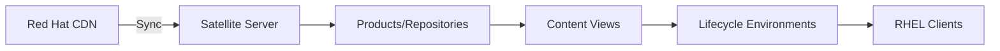
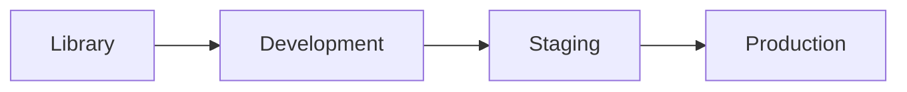

# How to Configure a Red Hat Satellite Server for Content Management

Author: [nawazdhandala](https://www.github.com/nawazdhandala)

Tags: RHEL, Satellite Server, Content Management, Red Hat, Linux

Description: A practical guide to configuring Red Hat Satellite Server for content management, covering repository syncing, content views, lifecycle environments, and best practices for managing RHEL content at scale.

---

Red Hat Satellite Server is the centerpiece of enterprise RHEL content management. It acts as a local mirror for Red Hat repositories, lets you control which packages reach which systems through content views, and stages content through lifecycle environments. Setting it up properly from the start saves you from painful rework later. This guide focuses on the content management side of Satellite configuration.

## Satellite Content Management Overview

Satellite's content management pipeline works like this:



You sync content from Red Hat, organize it into content views, promote those views through lifecycle environments, and clients consume content from their assigned environment.

## Prerequisites

Before configuring content management, ensure you have:

- A running Satellite Server (6.x) installed and configured
- A valid Satellite subscription manifest uploaded
- Network access to cdn.redhat.com for content syncing
- Sufficient disk space (plan for at least 300 GB for a basic RHEL 9 sync)

## Step 1 - Upload a Subscription Manifest

If you have not already done this, generate a manifest in the Red Hat Customer Portal and upload it to Satellite:

1. Log in to access.redhat.com
2. Go to Subscriptions, then Subscription Allocations
3. Create a new allocation for your Satellite
4. Add subscriptions and download the manifest ZIP file

Then upload it via the Satellite CLI:

```bash
# Upload the subscription manifest
sudo hammer subscription upload \
    --organization "MyOrganization" \
    --file /path/to/manifest.zip
```

Or through the web UI: Content, then Subscriptions, then "Manage Manifest", then Upload.

## Step 2 - Enable Red Hat Repositories

After uploading the manifest, enable the repositories you want to sync. For a basic RHEL 9 setup:

```bash
# Enable RHEL 9 BaseOS repository
sudo hammer repository-set enable \
    --organization "MyOrganization" \
    --product "Red Hat Enterprise Linux for x86_64" \
    --name "Red Hat Enterprise Linux 9 for x86_64 - BaseOS (RPMs)" \
    --releasever "9" \
    --basearch "x86_64"

# Enable RHEL 9 AppStream repository
sudo hammer repository-set enable \
    --organization "MyOrganization" \
    --product "Red Hat Enterprise Linux for x86_64" \
    --name "Red Hat Enterprise Linux 9 for x86_64 - AppStream (RPMs)" \
    --releasever "9" \
    --basearch "x86_64"
```

For additional repositories like Satellite Client tools:

```bash
# Enable Satellite Client repository for RHEL 9
sudo hammer repository-set enable \
    --organization "MyOrganization" \
    --product "Red Hat Enterprise Linux for x86_64" \
    --name "Red Hat Satellite Client 6 for RHEL 9 x86_64 (RPMs)" \
    --basearch "x86_64"
```

## Step 3 - Synchronize Repositories

Start syncing content from the Red Hat CDN:

```bash
# Sync a specific product (syncs all enabled repos under it)
sudo hammer product synchronize \
    --organization "MyOrganization" \
    --name "Red Hat Enterprise Linux for x86_64" \
    --async
```

The `--async` flag starts the sync in the background. Monitor progress in the Satellite web UI under Monitor, then Tasks.

Initial syncs take a long time depending on your bandwidth. The RHEL 9 BaseOS and AppStream repos together are around 30-40 GB.

## Step 4 - Set Up Sync Plans

Automate regular syncing with a sync plan:

```bash
# Create a daily sync plan
sudo hammer sync-plan create \
    --organization "MyOrganization" \
    --name "Daily RHEL Sync" \
    --interval "daily" \
    --sync-date "2026-03-04 02:00:00" \
    --enabled true

# Associate the RHEL product with the sync plan
sudo hammer product set-sync-plan \
    --organization "MyOrganization" \
    --name "Red Hat Enterprise Linux for x86_64" \
    --sync-plan "Daily RHEL Sync"
```

This ensures your Satellite always has the latest packages and errata from Red Hat.

## Step 5 - Create Lifecycle Environments

Lifecycle environments let you stage content before it reaches production systems:

```bash
# Create Development environment (child of Library)
sudo hammer lifecycle-environment create \
    --organization "MyOrganization" \
    --name "Development" \
    --prior "Library"

# Create Staging environment (child of Development)
sudo hammer lifecycle-environment create \
    --organization "MyOrganization" \
    --name "Staging" \
    --prior "Development"

# Create Production environment (child of Staging)
sudo hammer lifecycle-environment create \
    --organization "MyOrganization" \
    --name "Production" \
    --prior "Staging"
```

This creates a pipeline: Library -> Development -> Staging -> Production.



## Step 6 - Create Content Views

Content views define which repositories and packages are available to systems:

```bash
# Create a content view for RHEL 9 servers
sudo hammer content-view create \
    --organization "MyOrganization" \
    --name "RHEL9-Server" \
    --description "Content view for RHEL 9 servers"
```

Add repositories to the content view:

```bash
# Add BaseOS repository
sudo hammer content-view add-repository \
    --organization "MyOrganization" \
    --name "RHEL9-Server" \
    --product "Red Hat Enterprise Linux for x86_64" \
    --repository "Red Hat Enterprise Linux 9 for x86_64 - BaseOS RPMs 9"

# Add AppStream repository
sudo hammer content-view add-repository \
    --organization "MyOrganization" \
    --name "RHEL9-Server" \
    --product "Red Hat Enterprise Linux for x86_64" \
    --repository "Red Hat Enterprise Linux 9 for x86_64 - AppStream RPMs 9"
```

## Step 7 - Publish and Promote Content Views

Publishing creates a versioned snapshot of the content:

```bash
# Publish the content view
sudo hammer content-view publish \
    --organization "MyOrganization" \
    --name "RHEL9-Server" \
    --description "Initial publish" \
    --async
```

Promote the published version through lifecycle environments:

```bash
# Promote to Development
sudo hammer content-view version promote \
    --organization "MyOrganization" \
    --content-view "RHEL9-Server" \
    --to-lifecycle-environment "Development" \
    --async

# After testing, promote to Staging
sudo hammer content-view version promote \
    --organization "MyOrganization" \
    --content-view "RHEL9-Server" \
    --to-lifecycle-environment "Staging" \
    --async

# After validation, promote to Production
sudo hammer content-view version promote \
    --organization "MyOrganization" \
    --content-view "RHEL9-Server" \
    --to-lifecycle-environment "Production" \
    --async
```

## Step 8 - Create Activation Keys Per Environment

Create activation keys that map to specific lifecycle environments and content views:

```bash
# Activation key for Development
sudo hammer activation-key create \
    --organization "MyOrganization" \
    --name "rhel9-development" \
    --lifecycle-environment "Development" \
    --content-view "RHEL9-Server"

# Activation key for Production
sudo hammer activation-key create \
    --organization "MyOrganization" \
    --name "rhel9-production" \
    --lifecycle-environment "Production" \
    --content-view "RHEL9-Server"
```

## Content View Filters

Filters let you include or exclude specific packages from a content view:

```bash
# Create an exclude filter to block a specific package
sudo hammer content-view filter create \
    --organization "MyOrganization" \
    --content-view "RHEL9-Server" \
    --name "Exclude-kernel-debug" \
    --type rpm \
    --inclusion false

# Add a rule to the filter
sudo hammer content-view filter rule create \
    --organization "MyOrganization" \
    --content-view "RHEL9-Server" \
    --content-view-filter "Exclude-kernel-debug" \
    --name "kernel-debug*"
```

After adding filters, republish the content view for the changes to take effect.

## Composite Content Views

For complex environments, combine multiple content views into a composite:

```bash
# Create a composite content view
sudo hammer content-view create \
    --organization "MyOrganization" \
    --name "RHEL9-Full-Stack" \
    --composite

# Add component content views
sudo hammer content-view component add \
    --organization "MyOrganization" \
    --composite-content-view "RHEL9-Full-Stack" \
    --component-content-view "RHEL9-Server" \
    --latest
```

## Monitoring Content

Check the status of your content at any time:

```bash
# List all content views
sudo hammer content-view list --organization "MyOrganization"

# List sync status for all products
sudo hammer product list --organization "MyOrganization"

# Check the last sync time for a repository
sudo hammer repository info \
    --organization "MyOrganization" \
    --product "Red Hat Enterprise Linux for x86_64" \
    --name "Red Hat Enterprise Linux 9 for x86_64 - BaseOS RPMs 9"
```

## Best Practices

- **Sync regularly**: Set up sync plans to run nightly during off-peak hours
- **Publish deliberately**: Do not auto-publish content views. Review errata before publishing
- **Test before promoting**: Always test content view versions in Development before promoting to Production
- **Keep content views focused**: Create separate content views for different system roles rather than one giant view
- **Monitor disk space**: Satellite content storage grows over time. Keep an eye on `/var/lib/pulp/`
- **Clean up old versions**: Remove old, unpromoted content view versions to free disk space

```bash
# Remove an old content view version
sudo hammer content-view version delete \
    --organization "MyOrganization" \
    --content-view "RHEL9-Server" \
    --version "1.0"
```

## Summary

Satellite Server's content management capabilities give you full control over what packages reach your RHEL systems and when. The key components, repositories, content views, and lifecycle environments, form a pipeline that lets you test updates before they hit production. Take the time to set up this pipeline correctly, with clear naming conventions and a promotion process that includes testing. Your future self will thank you when the next critical security update arrives and you have a well-oiled process for rolling it out safely.
