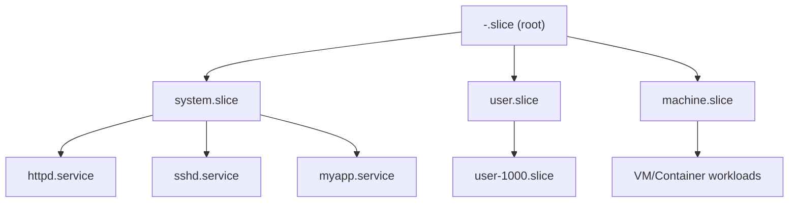

# How to Configure Resource Limits (CPU, Memory) for Services Using systemd Cgroups on RHEL

Author: [nawazdhandala](https://www.github.com/nawazdhandala)

Tags: RHEL, systemd, Cgroups, Resource Limits, Linux, Performance

Description: A practical guide to using systemd cgroup directives on RHEL to limit CPU, memory, and I/O for services, preventing runaway processes from taking down your server.

---

## Why Resource Limits Matter

Every sysadmin has a war story about a process eating all the RAM on a production server and triggering the OOM killer, which then killed something important. Or a CPU-hungry batch job starving a web application of cycles. systemd on RHEL uses cgroups v2 to let you put hard limits on what each service can consume. Once you set these up, a misbehaving service can only hurt itself.

## Cgroups v2 on RHEL

RHEL uses cgroups v2 by default. This is a change from RHEL 7 and 8 where cgroups v1 was the norm. The unified cgroup hierarchy in v2 is cleaner and gives you better control.

Verify that your system is using cgroups v2:

```bash
# Check cgroup version - should show cgroup2fs
stat -f /sys/fs/cgroup/ | grep Type
```

You should see `Type: cgroup2fs`. If you see `tmpfs`, you are on cgroups v1 and some of the directives below will not work.

## Setting CPU Limits

### CPUQuota

This is the simplest way to cap CPU usage. It specifies a percentage of a single CPU core.

```bash
# Create a drop-in override to limit a service to 50% of one CPU core
sudo systemctl edit myapp.service
```

In the editor that opens, add:

```ini
# Limit this service to 50% of one CPU core
[Service]
CPUQuota=50%
```

Some key points:
- `CPUQuota=100%` means one full core
- `CPUQuota=200%` means two full cores
- `CPUQuota=25%` means a quarter of one core

This is a hard limit. Even if the system is idle, the service will not exceed this quota.

### CPUWeight

If you want relative priority rather than hard limits, use `CPUWeight`. This only matters when there is contention for CPU time.

```bash
# Set CPU weight (priority relative to other services)
sudo systemctl edit myapp.service
```

```ini
# Give this service lower CPU priority (default is 100)
[Service]
CPUWeight=50
```

The range is 1 to 10000, with 100 being the default. A service with `CPUWeight=200` gets roughly twice the CPU time of a service with `CPUWeight=100` when both are competing for cycles. When there is no contention, both can use as much CPU as they want.

## Setting Memory Limits

### MemoryMax

This is a hard upper limit. If the service tries to allocate more than this, the OOM killer steps in and kills processes in that cgroup.

```bash
# Set a hard memory limit
sudo systemctl edit myapp.service
```

```ini
# Hard memory limit - OOM killer activates above this
[Service]
MemoryMax=1G
```

You can use `K`, `M`, `G`, or `T` suffixes, or specify in bytes.

### MemoryHigh

This is a soft limit. When the cgroup exceeds this threshold, the kernel starts aggressively reclaiming memory from it (swapping, dropping caches). The service is not killed, but it will slow down.

```ini
# Soft memory limit - system starts reclaiming memory above this
[Service]
MemoryHigh=768M
MemoryMax=1G
```

Using both together is a good pattern. `MemoryHigh` provides back-pressure before the hard `MemoryMax` triggers the OOM killer.

### MemorySwapMax

Control how much swap a service can use:

```ini
# Limit swap usage for this service
[Service]
MemorySwapMax=512M
```

Set to `0` to prevent the service from using swap at all.

## Setting I/O Limits

### IOWeight

Similar to `CPUWeight`, this sets relative I/O priority.

```ini
# Give this service lower I/O priority (default is 100)
[Service]
IOWeight=50
```

Range is 1 to 10000, default is 100.

### IOReadBandwidthMax and IOWriteBandwidthMax

These set hard limits on read/write bandwidth for specific block devices.

```ini
# Limit write bandwidth to 10MB/s on the root device
[Service]
IOWriteBandwidthMax=/dev/sda 10M
IOReadBandwidthMax=/dev/sda 50M
```

## Applying Limits Without Restarting

You can apply resource limits to a running service using `systemctl set-property`. These changes are persistent by default.

```bash
# Set a memory limit on a running service (persists across reboots)
sudo systemctl set-property httpd.service MemoryMax=2G

# Set CPU quota on a running service
sudo systemctl set-property httpd.service CPUQuota=150%

# Make a temporary change that does not persist
sudo systemctl set-property --runtime httpd.service MemoryMax=2G
```

## Slice Units

systemd organizes cgroups into a hierarchy using "slices." Every service belongs to a slice. The default hierarchy looks like this:



You can create custom slices to group services and apply limits to the group:

```bash
# Create a custom slice for application services
sudo vi /etc/systemd/system/apps.slice
```

```ini
# Custom slice that limits all assigned services to 2 cores and 4GB total
[Unit]
Description=Application Services Slice

[Slice]
CPUQuota=200%
MemoryMax=4G
```

Then assign services to this slice:

```bash
# Edit a service to run in the custom slice
sudo systemctl edit myapp.service
```

```ini
# Run this service in the apps slice
[Service]
Slice=apps.slice
```

```bash
# Reload and restart to apply
sudo systemctl daemon-reload
sudo systemctl restart myapp.service
```

Now all services in `apps.slice` share the 2-core and 4GB limits.

## Monitoring with systemd-cgtop

`systemd-cgtop` is like `top` but for cgroups. It shows real-time resource usage per cgroup.

```bash
# Monitor cgroup resource usage in real-time
sudo systemd-cgtop
```

The output shows CPU time, memory usage, and I/O for each cgroup. Press `q` to quit.

For a one-shot view:

```bash
# Show current cgroup resource usage (non-interactive)
sudo systemd-cgtop -b -n 1
```

You can also check the resource usage of a specific service:

```bash
# Show current resource consumption for a service
systemctl status httpd.service

# Show the cgroup path for a service
systemctl show httpd.service -p ControlGroup

# Check memory usage directly from the cgroup filesystem
cat /sys/fs/cgroup/system.slice/httpd.service/memory.current
```

## A Practical Example

Let me walk through a realistic scenario. You have a Java application that occasionally leaks memory and a batch processing script that spikes CPU usage.

```bash
# Set limits for the Java app - cap memory, allow plenty of CPU
sudo systemctl edit javaapp.service
```

```ini
# Protect the system from memory leaks
[Service]
MemoryHigh=3G
MemoryMax=4G
MemorySwapMax=0
```

```bash
# Set limits for the batch job - cap CPU, generous on memory
sudo systemctl edit batchjob.service
```

```ini
# Prevent batch jobs from starving other services
[Service]
CPUQuota=100%
CPUWeight=25
IOWeight=25
```

```bash
# Apply changes
sudo systemctl daemon-reload
sudo systemctl restart javaapp.service
sudo systemctl restart batchjob.service
```

## Checking Current Limits

To see what limits are set on a service:

```bash
# Show resource-related properties for a service
systemctl show httpd.service -p CPUQuota -p MemoryMax -p MemoryHigh -p IOWeight
```

## Wrapping Up

Resource limits through systemd cgroups are one of the most underused features on RHEL. They are straightforward to set up, they survive reboots, and they prevent the kind of cascading failures that happen when one service goes rogue. Start with `MemoryMax` on your most memory-hungry services, add `CPUQuota` on CPU-intensive batch jobs, and use slices when you want to limit a group of related services together. Keep `systemd-cgtop` in your toolkit for monitoring. It takes minutes to configure and can save you from a middle-of-the-night outage.
