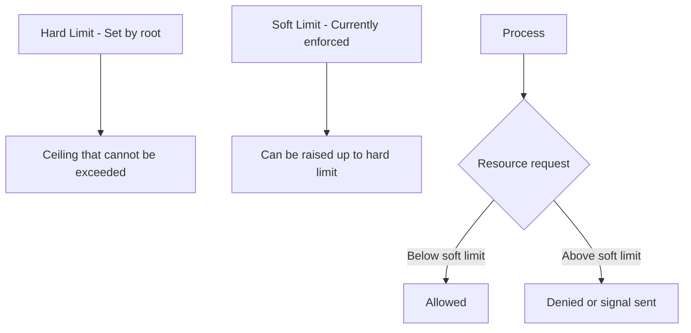

# How to Configure Resource Limits with ulimit and limits.conf on RHEL

Author: [nawazdhandala](https://www.github.com/nawazdhandala)

Tags: RHEL, ulimit, Resource Limits, limits.conf, Linux, Performance

Description: A complete guide to configuring resource limits on RHEL using ulimit and /etc/security/limits.conf, covering soft and hard limits, common settings for production workloads, and troubleshooting.

---

## Why Resource Limits Matter

Every process on a Linux system consumes resources - memory, file descriptors, CPU time, and more. Without limits, a single misbehaving process can consume all available resources and bring down the entire system. I have seen runaway log writes fill up all file descriptors, memory leaks eat up all RAM, and fork bombs spawn processes until the system became unresponsive.

Resource limits are your safety net. They protect the system from individual processes going out of control, and they are essential for production workloads where stability is non-negotiable.

## Understanding Soft and Hard Limits

Linux has two types of resource limits:

- **Soft limit** - the currently enforced limit. Processes can raise this up to the hard limit.
- **Hard limit** - the ceiling. Only root can raise hard limits. Regular users can lower them but never raise them back.



Think of the hard limit as the maximum your sysadmin allows, and the soft limit as what is actually being enforced right now. Users can adjust their soft limits within the boundary set by the hard limit.

## Checking Current Limits with ulimit

The `ulimit` command shows and sets resource limits for the current shell session.

```bash
# Show all current limits (soft limits by default)
ulimit -a

# Show all hard limits
ulimit -Ha

# Show all soft limits explicitly
ulimit -Sa
```

Here are the most commonly checked individual limits:

```bash
# Maximum number of open file descriptors
ulimit -n

# Maximum number of processes (per user)
ulimit -u

# Maximum file size (in blocks)
ulimit -f

# Maximum stack size (in KB)
ulimit -s

# Maximum virtual memory (in KB)
ulimit -v

# Core file size (0 means core dumps are disabled)
ulimit -c
```

## Setting Limits with ulimit (Temporary)

You can change limits in the current shell session with `ulimit`. These changes only last for the current session and any child processes it spawns.

```bash
# Increase the open file limit for this session
ulimit -n 65536

# Set a soft limit for max processes
ulimit -Su 4096

# Set a hard limit (only root can increase hard limits)
sudo bash -c 'ulimit -Hn 131072'

# Enable core dumps (set core file size to unlimited)
ulimit -c unlimited

# Disable core dumps
ulimit -c 0
```

This is useful for testing, but for permanent changes you need to use the configuration files.

## Persistent Limits with /etc/security/limits.conf

The `/etc/security/limits.conf` file sets resource limits that are applied at login time through the PAM (Pluggable Authentication Module) system. Changes here persist across reboots.

```bash
# View the current limits.conf
cat /etc/security/limits.conf
```

The format is:

```
<domain>  <type>  <item>  <value>
```

Where:
- **domain** - username, @groupname, or * for all users
- **type** - soft, hard, or - (both)
- **item** - the resource being limited
- **value** - the limit value

### Common Production Settings

Here are the settings I typically configure on production RHEL servers.

```bash
# Edit limits.conf
sudo vi /etc/security/limits.conf
```

Add these entries:

```
# Increase open file limits for all users
*               soft    nofile          65536
*               hard    nofile          131072

# Increase process limits for all users
*               soft    nproc           4096
*               hard    nproc           65536

# Settings for a specific application user
appuser         soft    nofile          65536
appuser         hard    nofile          131072
appuser         soft    nproc           8192
appuser         hard    nproc           16384
appuser         soft    memlock         unlimited
appuser         hard    memlock         unlimited

# Settings for the database group
@dba            soft    nofile          131072
@dba            hard    nofile          262144
@dba            soft    nproc           16384
@dba            hard    nproc           32768

# Enable core dumps for developers (for debugging)
@developers     soft    core            unlimited
@developers     hard    core            unlimited

# Limit regular users more tightly
@users          soft    nproc           512
@users          hard    nproc           1024
@users          soft    nofile          4096
@users          hard    nofile          8192
```

## Using /etc/security/limits.d/ for Modular Configuration

Instead of putting everything in `limits.conf`, you can create separate files in `/etc/security/limits.d/`. This is the preferred approach because it keeps things organized and avoids merge conflicts during system updates.

```bash
# Create a file for database limits
sudo tee /etc/security/limits.d/90-database.conf > /dev/null <<'EOF'
# Resource limits for PostgreSQL
postgres        soft    nofile          131072
postgres        hard    nofile          131072
postgres        soft    nproc           16384
postgres        hard    nproc           16384
postgres        soft    memlock         unlimited
postgres        hard    memlock         unlimited
EOF

# Create a file for web application limits
sudo tee /etc/security/limits.d/91-webapp.conf > /dev/null <<'EOF'
# Resource limits for web application
webapp          soft    nofile          65536
webapp          hard    nofile          131072
webapp          soft    nproc           4096
webapp          hard    nproc           8192
EOF
```

Files in `limits.d/` are processed in alphabetical order, and they override settings in `limits.conf`. Use a numeric prefix to control the order.

```bash
# RHEL ships with this default file for nproc
cat /etc/security/limits.d/20-nproc.conf
```

You will typically see:

```
# Default limit for number of user's processes to prevent
# accidental fork bombs.
*          soft    nproc     4096
root       soft    nproc     unlimited
```

## Common Resource Limit Items

Here is a reference table of the most useful limit items:

| Item | Description | ulimit flag | Typical production value |
|------|-------------|-------------|------------------------|
| nofile | Max open files | -n | 65536 |
| nproc | Max processes | -u | 4096-16384 |
| memlock | Max locked memory (KB) | -l | unlimited for DB/JVM |
| stack | Max stack size (KB) | -s | 8192-65536 |
| core | Core file size (KB) | -c | 0 or unlimited |
| as | Max virtual memory (KB) | -v | Depends on workload |
| fsize | Max file size (KB) | -f | unlimited usually |
| data | Max data segment size (KB) | -d | unlimited usually |

## Applying Changes

Changes to `limits.conf` and `limits.d/` take effect at the next login. Existing sessions are not affected.

```bash
# After modifying limits, log out and log back in
# Then verify the new limits
ulimit -a

# Or switch to the user and check
sudo -u appuser bash -c 'ulimit -a'
```

For services managed by systemd, resource limits in `limits.conf` may not apply because systemd has its own limit controls. You need to set limits in the service unit file instead.

```bash
# Check current limits for a running service
cat /proc/$(pgrep -f postgres | head -1)/limits

# Set limits in a systemd service override
sudo systemctl edit postgresql
```

Add the limits:

```ini
[Service]
LimitNOFILE=131072
LimitNPROC=16384
LimitMEMLOCK=infinity
```

Then reload:

```bash
# Apply systemd service limits
sudo systemctl daemon-reload
sudo systemctl restart postgresql
```

## System-Wide Limits

Beyond per-user limits, there are system-wide kernel limits that set the overall ceiling.

```bash
# Check the system-wide maximum number of open files
cat /proc/sys/fs/file-max

# Check current usage
cat /proc/sys/fs/file-nr
# Output: allocated  free  maximum

# Increase system-wide file limit temporarily
sudo sysctl -w fs.file-max=2097152

# Make it permanent
sudo tee /etc/sysctl.d/99-file-limits.conf > /dev/null <<'EOF'
fs.file-max = 2097152
EOF

sudo sysctl --system
```

The per-user limits from `limits.conf` cannot exceed the system-wide kernel limits. Make sure the kernel limits are high enough first.

## Troubleshooting Resource Limit Issues

### "Too many open files" Errors

```bash
# Check current file descriptor usage for a specific process
ls /proc/$(pgrep -f myapp | head -1)/fd | wc -l

# Check the limit for that process
cat /proc/$(pgrep -f myapp | head -1)/limits | grep "open files"

# Find which processes have the most open file descriptors
for pid in /proc/[0-9]*/fd; do
    count=$(ls "$pid" 2>/dev/null | wc -l)
    if [ "$count" -gt 100 ]; then
        proc_pid=$(echo "$pid" | cut -d/ -f3)
        proc_name=$(cat /proc/$proc_pid/comm 2>/dev/null)
        echo "$count $proc_name (PID: $proc_pid)"
    fi
done | sort -rn | head -20
```

### Limits Not Being Applied

```bash
# Check if PAM is configured to use limits
grep pam_limits /etc/pam.d/system-auth

# You should see a line like:
# session     required      pam_limits.so

# If it is missing, the limits.conf settings will not be applied
```

### Verifying Limits for a Service

```bash
# Check effective limits for a running process
sudo cat /proc/$(systemctl show -p MainPID --value postgresql)/limits
```

## Real-World Configuration Examples

### High-Traffic Web Server (nginx)

```bash
sudo tee /etc/security/limits.d/90-nginx.conf > /dev/null <<'EOF'
nginx           soft    nofile          65536
nginx           hard    nofile          65536
nginx           soft    nproc           4096
nginx           hard    nproc           4096
EOF
```

### Elasticsearch Node

```bash
sudo tee /etc/security/limits.d/90-elasticsearch.conf > /dev/null <<'EOF'
elasticsearch   soft    nofile          65536
elasticsearch   hard    nofile          65536
elasticsearch   soft    nproc           4096
elasticsearch   hard    nproc           4096
elasticsearch   soft    memlock         unlimited
elasticsearch   hard    memlock         unlimited
EOF
```

### Java Application Server

```bash
sudo tee /etc/security/limits.d/90-javaapp.conf > /dev/null <<'EOF'
javaapp         soft    nofile          65536
javaapp         hard    nofile          131072
javaapp         soft    nproc           4096
javaapp         hard    nproc           8192
javaapp         soft    memlock         unlimited
javaapp         hard    memlock         unlimited
EOF
```

## Summary

Resource limits on RHEL are a critical part of system hardening and stability. Use `ulimit` for quick checks and temporary adjustments, `limits.conf` and `limits.d/` for persistent per-user limits, and systemd unit overrides for service-specific limits. Always verify that system-wide kernel limits are high enough to accommodate your per-user settings, and remember that changes require a new login session or service restart to take effect. Getting these right up front prevents a lot of late-night pages about crashed services.
