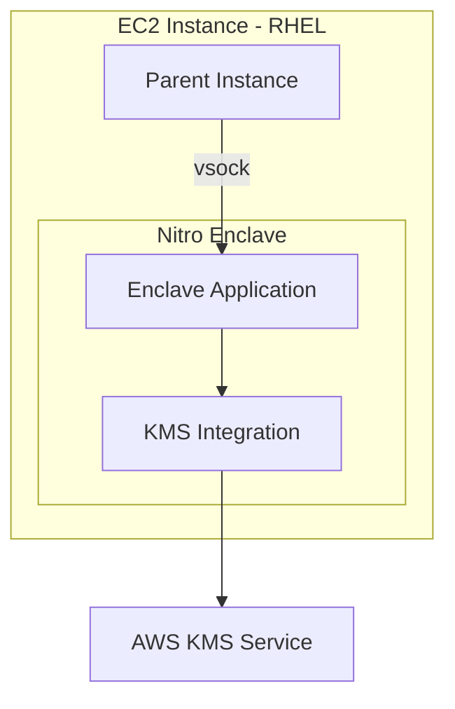

# How to Configure RHEL for AWS Nitro Enclaves

Author: [nawazdhandala](https://www.github.com/nawazdhandala)

Tags: RHEL, AWS, Nitro Enclaves, Security, Confidential Computing, Linux

Description: Set up AWS Nitro Enclaves on RHEL for isolated, confidential computing environments that protect sensitive data processing.

---

AWS Nitro Enclaves create isolated compute environments on EC2 instances, providing hardware-level isolation for processing sensitive data. This guide configures RHEL to use Nitro Enclaves for confidential computing workloads.

## Nitro Enclaves Architecture



## Prerequisites

- An EC2 instance type that supports Nitro Enclaves (e.g., m5.xlarge, c5.2xlarge)
- RHEL AMI
- Enclave-enabled instance launched with `--enclave-options Enabled=true`

## Step 1: Launch an Enclave-Enabled Instance

```bash
# Launch an EC2 instance with Nitro Enclaves enabled
aws ec2 run-instances \
  --image-id ami-rhel9-id \
  --instance-type m5.xlarge \
  --enclave-options Enabled=true \
  --key-name my-key \
  --tag-specifications 'ResourceType=instance,Tags=[{Key=Name,Value=rhel9-enclave}]'
```

## Step 2: Install the Nitro Enclaves CLI

```bash
# SSH into the instance
ssh -i my-key.pem ec2-user@<public-ip>

# Install the Nitro Enclaves CLI and tools
sudo dnf install -y aws-nitro-enclaves-cli aws-nitro-enclaves-cli-devel

# Add the ec2-user to the ne group
sudo usermod -aG ne ec2-user

# Start the Nitro Enclaves allocator service
sudo systemctl enable --now nitro-enclaves-allocator

# Configure memory and CPU allocation for enclaves
sudo tee /etc/nitro_enclaves/allocator.yaml > /dev/null <<'ALLOCATOR'
---
# Amount of memory (in MiB) to allocate for enclaves
memory_mib: 2048
# Number of CPUs to reserve for enclaves
cpu_count: 2
ALLOCATOR

# Restart the allocator
sudo systemctl restart nitro-enclaves-allocator
```

## Step 3: Build an Enclave Image

```bash
# Create a simple enclave application
mkdir -p ~/enclave-app
cd ~/enclave-app

# Create a Dockerfile for the enclave
cat <<'DOCKERFILE' > Dockerfile
FROM amazonlinux:2023-minimal

# Install your application
RUN dnf install -y python3
COPY app.py /app.py

CMD ["python3", "/app.py"]
DOCKERFILE

# Create a simple enclave application
cat <<'APP' > app.py
import socket
import json

# Create a vsock server to communicate with the parent
server = socket.socket(socket.AF_VSOCK, socket.SOCK_STREAM)
server.bind((socket.VMADDR_CID_ANY, 5000))
server.listen(1)

print("Enclave application running...")
while True:
    conn, addr = server.accept()
    data = conn.recv(4096)
    # Process sensitive data inside the enclave
    result = {"status": "processed", "data_length": len(data)}
    conn.send(json.dumps(result).encode())
    conn.close()
APP

# Build the Docker image
sudo docker build -t enclave-app .

# Convert to an enclave image file (EIF)
nitro-cli build-enclave \
  --docker-uri enclave-app:latest \
  --output-file enclave-app.eif
```

## Step 4: Run the Enclave

```bash
# Start the enclave
nitro-cli run-enclave \
  --eif-path enclave-app.eif \
  --memory 512 \
  --cpu-count 2 \
  --enclave-cid 16

# Check enclave status
nitro-cli describe-enclaves

# View enclave console output
nitro-cli console --enclave-id <enclave-id>
```

## Step 5: Communicate with the Enclave

```bash
# From the parent instance, send data to the enclave via vsock
cat <<'CLIENT' > client.py
import socket
import json

# Connect to the enclave via vsock
# CID 16 is the enclave, port 5000 is our application
client = socket.socket(socket.AF_VSOCK, socket.SOCK_STREAM)
client.connect((16, 5000))

# Send sensitive data
client.send(b"sensitive data to process")

# Receive the result
result = client.recv(4096)
print(f"Enclave response: {json.loads(result)}")
client.close()
CLIENT

python3 client.py
```

## Step 6: Terminate the Enclave

```bash
# Stop the enclave when done
nitro-cli terminate-enclave --enclave-id <enclave-id>

# Verify it is terminated
nitro-cli describe-enclaves
```

## Conclusion

Nitro Enclaves on RHEL provide hardware-isolated environments for processing sensitive data. The parent instance communicates with the enclave exclusively through vsock, and the enclave has no network access, no persistent storage, and no interactive access, making it ideal for cryptographic operations, key management, and processing personally identifiable information.
