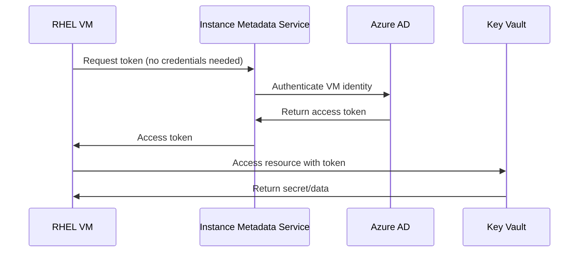

# How to Configure RHEL with Azure Managed Identities

Author: [nawazdhandala](https://www.github.com/nawazdhandala)

Tags: RHEL, Azure, Managed Identity, Security, Cloud, Linux

Description: Configure Azure Managed Identities on RHEL VMs to securely access Azure services without storing credentials on the server.

---

Azure Managed Identities eliminate the need to store credentials on your RHEL virtual machines. Instead, the VM gets an automatically managed identity in Azure AD that can be granted access to Azure resources. This guide shows you how to set up and use managed identities on RHEL.

## Managed Identity Flow



## Step 1: Enable System-Assigned Managed Identity

```bash
# Enable managed identity on an existing VM
az vm identity assign \
  --resource-group rg-rhel9 \
  --name rhel9-vm

# Get the principal ID for RBAC assignments
PRINCIPAL_ID=$(az vm show \
  --resource-group rg-rhel9 \
  --name rhel9-vm \
  --query identity.principalId -o tsv)
echo "Principal ID: $PRINCIPAL_ID"
```

## Step 2: Grant Access to Azure Resources

```bash
# Grant access to Key Vault secrets
az keyvault set-policy \
  --name my-keyvault \
  --object-id $PRINCIPAL_ID \
  --secret-permissions get list

# Grant access to Storage Account
az role assignment create \
  --assignee $PRINCIPAL_ID \
  --role "Storage Blob Data Reader" \
  --scope /subscriptions/.../storageAccounts/mystorageaccount

# Grant access to Azure SQL
az role assignment create \
  --assignee $PRINCIPAL_ID \
  --role "Contributor" \
  --scope /subscriptions/.../servers/myserver
```

## Step 3: Use the Managed Identity from RHEL

```bash
# On the RHEL VM, get a token from the Instance Metadata Service
# This works without any credentials

# Get a token for Azure Resource Manager
TOKEN=$(curl -s 'http://169.254.169.254/metadata/identity/oauth2/token?api-version=2018-02-01&resource=https://vault.azure.net' \
  -H 'Metadata: true' | python3 -c "import sys,json; print(json.load(sys.stdin)['access_token'])")

# Use the token to access Key Vault
curl -s "https://my-keyvault.vault.azure.net/secrets/my-secret?api-version=7.4" \
  -H "Authorization: Bearer $TOKEN"
```

## Step 4: Use Managed Identity with Azure CLI

```bash
# Install Azure CLI on RHEL
sudo dnf install -y azure-cli

# Login using the managed identity (no credentials needed)
az login --identity

# Now you can use az commands with the VM's identity
az keyvault secret show --vault-name my-keyvault --name my-secret
az storage blob list --account-name mystorageaccount --container-name mycontainer
```

## Step 5: Use in Application Code (Python Example)

```bash
# Install the Azure Identity library
sudo dnf install -y python3-pip
pip3 install azure-identity azure-keyvault-secrets

# Create a Python script that uses managed identity
cat <<'PYSCRIPT' > /opt/app/get_secrets.py
from azure.identity import ManagedIdentityCredential
from azure.keyvault.secrets import SecretClient

# No credentials needed - uses managed identity automatically
credential = ManagedIdentityCredential()
client = SecretClient(
    vault_url="https://my-keyvault.vault.azure.net",
    credential=credential
)

# Retrieve a secret
secret = client.get_secret("database-password")
print(f"Secret retrieved successfully: {secret.name}")
PYSCRIPT
```

## Conclusion

Azure Managed Identities on RHEL provide a secure, credential-free way to access Azure services. System-assigned identities are tied to the VM lifecycle, while user-assigned identities can be shared across multiple VMs. Use managed identities whenever possible to eliminate credential management overhead and reduce security risk.
