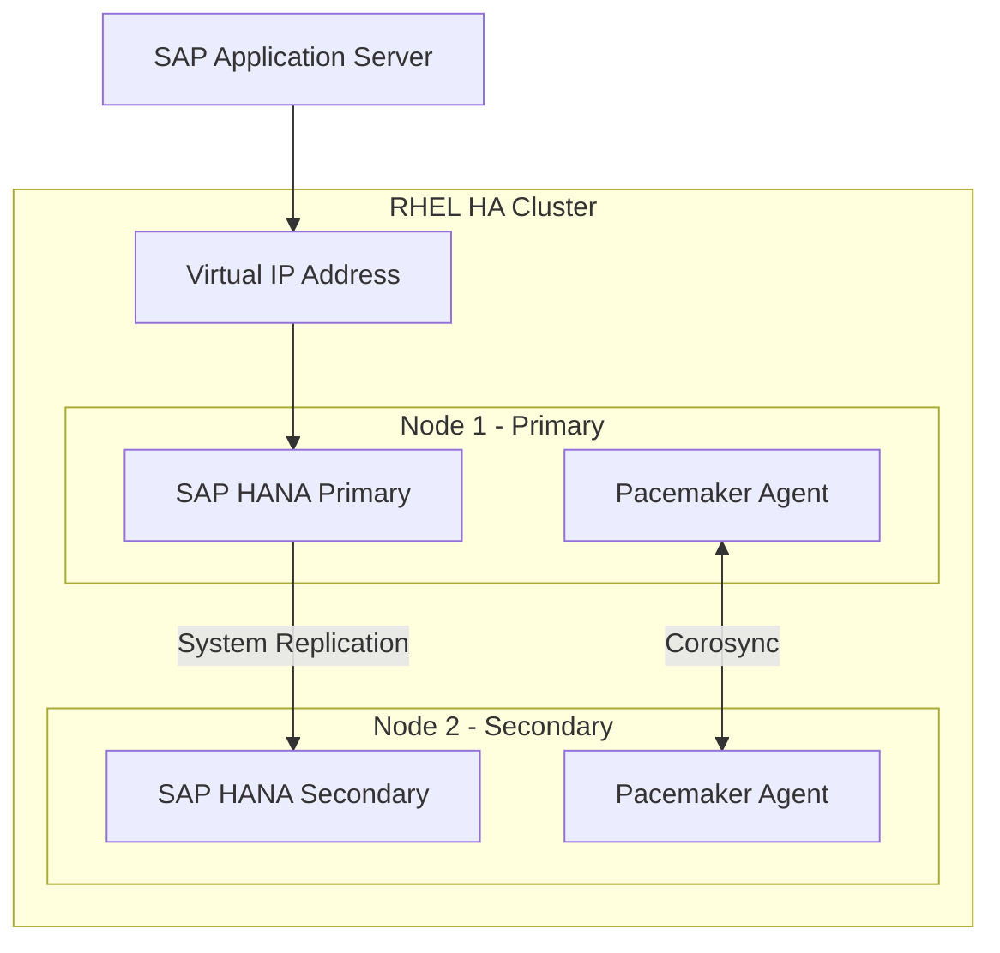
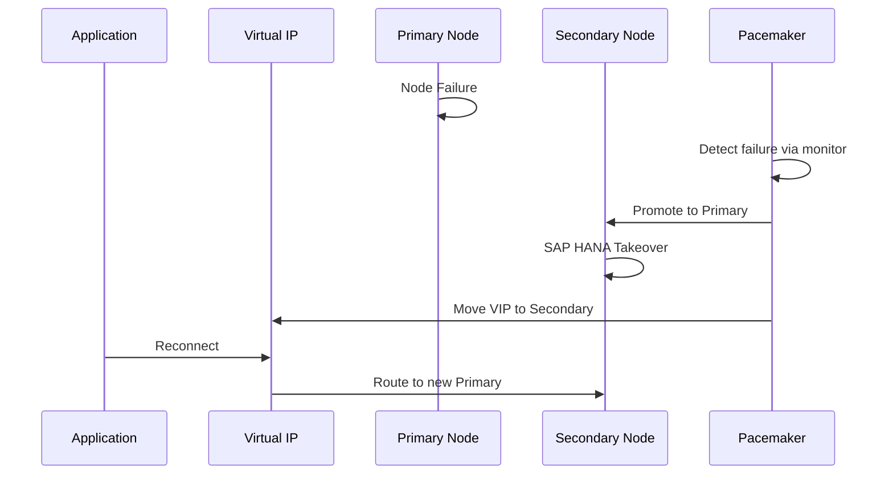

# How to Configure RHEL High Availability for SAP HANA System Replication

Author: [nawazdhandala](https://www.github.com/nawazdhandala)

Tags: RHEL, SAP HANA, High Availability, Pacemaker, Corosync, Linux

Description: Set up RHEL High Availability clustering with Pacemaker and Corosync for SAP HANA System Replication to ensure automatic failover.

---

SAP HANA System Replication (HSR) combined with RHEL High Availability provides automated failover for your database tier. This guide configures a two-node Pacemaker cluster on RHEL that manages SAP HANA System Replication and performs automatic takeover when the primary node fails.

## Architecture Overview



## Prerequisites

- Two RHEL servers with SAP HANA installed on both
- RHEL High Availability Add-On subscription
- SAP HANA System Replication already configured between the two nodes
- Shared fencing mechanism (SBD, IPMI, or cloud fencing agent)

## Step 1: Install High Availability Packages

Run these commands on both nodes:

```bash
# Enable the HA repository
sudo subscription-manager repos --enable=rhel-9-for-x86_64-highavailability-rpms

# Install Pacemaker, Corosync, and SAP HANA resource agents
sudo dnf install -y \
  pacemaker \
  pcs \
  fence-agents-all \
  resource-agents-sap-hana \
  sap-cluster-connector

# Enable and start the pcs daemon on both nodes
sudo systemctl enable --now pcsd

# Set the password for the hacluster user on both nodes
echo "StrongClusterPassword" | sudo passwd --stdin hacluster
```

## Step 2: Create the Cluster

Run these commands on one node only:

```bash
# Authenticate to both cluster nodes
sudo pcs host auth node1 node2 -u hacluster -p StrongClusterPassword

# Create the cluster
sudo pcs cluster setup sap-hana-cluster node1 node2

# Start and enable the cluster
sudo pcs cluster start --all
sudo pcs cluster enable --all

# Verify cluster status
sudo pcs cluster status
```

## Step 3: Configure Fencing

Fencing is mandatory for SAP HANA HA clusters.

```bash
# Example using IPMI fencing
# Configure fence device for node1
sudo pcs stonith create fence_node1 fence_ipmilan \
  ipaddr=192.168.1.101 \
  login=admin \
  passwd=password \
  pcmk_host_list=node1 \
  lanplus=1

# Configure fence device for node2
sudo pcs stonith create fence_node2 fence_ipmilan \
  ipaddr=192.168.1.102 \
  login=admin \
  passwd=password \
  pcmk_host_list=node2 \
  lanplus=1

# Verify fencing is configured
sudo pcs stonith config
```

## Step 4: Configure SAP HANA Resources

```bash
# Set cluster properties for SAP HANA
sudo pcs property set maintenance-mode=true

# Create the SAPHanaTopology resource (runs on all nodes)
sudo pcs resource create SAPHanaTopology_HDB_00 SAPHanaTopology \
  SID=HDB InstanceNumber=00 \
  op start timeout=600 \
  op stop timeout=300 \
  op monitor interval=10 timeout=600 \
  clone clone-max=2 clone-node-max=1 interleave=true

# Create the SAPHana resource (primary/secondary)
sudo pcs resource create SAPHana_HDB_00 SAPHana \
  SID=HDB InstanceNumber=00 \
  PREFER_SITE_TAKEOVER=true \
  DUPLICATE_PRIMARY_TIMEOUT=7200 \
  AUTOMATED_REGISTER=true \
  op start timeout=3600 \
  op stop timeout=3600 \
  op monitor interval=61 role=Slave timeout=700 \
  op monitor interval=59 role=Master timeout=700 \
  op promote timeout=3600 \
  op demote timeout=3600 \
  promotable notify=true clone-max=2 clone-node-max=1 interleave=true

# Create the Virtual IP resource
sudo pcs resource create vip_HDB_00 IPaddr2 \
  ip=192.168.1.200 \
  cidr_netmask=24 \
  op monitor interval=10 timeout=20

# Set constraints so the VIP follows the primary HANA
sudo pcs constraint colocation add vip_HDB_00 with master SAPHana_HDB_00-clone 4000
sudo pcs constraint order SAPHanaTopology_HDB_00-clone then SAPHana_HDB_00-clone

# Exit maintenance mode
sudo pcs property set maintenance-mode=false
```

## Step 5: Verify the Cluster

```bash
# Check the overall cluster status
sudo pcs status

# Check the HANA-specific attributes
sudo crm_mon -A1

# Verify system replication status
sudo su - hdbadm -c 'python /usr/sap/HDB/HDB00/exe/python_support/systemReplicationStatus.py'
```

## Step 6: Test Failover

```bash
# Simulate a primary failure by stopping HANA on the primary node
# WARNING: Only do this in a test environment
sudo pcs resource move SAPHana_HDB_00-clone node2

# Watch the cluster perform the takeover
watch sudo pcs status

# After successful failover, clear the move constraint
sudo pcs resource clear SAPHana_HDB_00-clone
```

## Failover Process



## Conclusion

You now have a fully automated SAP HANA HA cluster on RHEL. Pacemaker monitors the HANA system replication status and automatically performs takeover if the primary node fails. Always test your failover procedures regularly and keep the resource agents updated with the latest versions from Red Hat.
