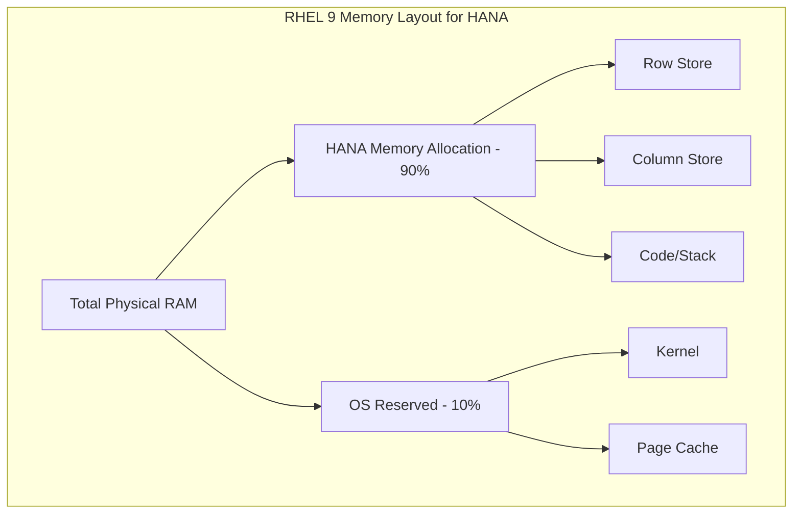

# How to Configure RHEL 9 Memory and CPU for SAP HANA Best Practices

Author: [nawazdhandala](https://www.github.com/nawazdhandala)

Tags: RHEL, SAP HANA, Memory, CPU, Performance, Linux

Description: Optimize RHEL 9 memory and CPU settings for SAP HANA following SAP and Red Hat best practices for maximum database performance.

---

SAP HANA is an in-memory database that demands careful memory and CPU configuration at the OS level. Getting these settings right on RHEL 9 directly impacts HANA performance, stability, and the ability to handle large workloads. This guide covers the essential memory and CPU tuning parameters.

## Memory Architecture for SAP HANA



## Prerequisites

- RHEL 9 with SAP HANA installed or planned
- Minimum 64 GB RAM (128 GB+ recommended for production)
- Root or sudo access

## Step 1: Configure NUMA Settings

SAP HANA is NUMA-aware and performs best with proper NUMA configuration.

```bash
# Check the current NUMA topology
numactl --hardware

# Verify NUMA balancing is enabled (recommended by SAP)
cat /proc/sys/kernel/numa_balancing
# Should return 1

# If NUMA balancing is off, enable it
echo 1 | sudo tee /proc/sys/kernel/numa_balancing

# Make it persistent
echo 'kernel.numa_balancing = 1' | sudo tee /etc/sysctl.d/sap-numa.conf
sudo sysctl --system
```

## Step 2: Disable Transparent Huge Pages

```bash
# THP must be disabled for SAP HANA
# Check current status
cat /sys/kernel/mm/transparent_hugepage/enabled

# Disable via kernel parameter (persistent across reboots)
sudo grubby --update-kernel=ALL --args="transparent_hugepage=never"

# Disable immediately without reboot
echo never | sudo tee /sys/kernel/mm/transparent_hugepage/enabled
echo never | sudo tee /sys/kernel/mm/transparent_hugepage/defrag

# Verify
cat /sys/kernel/mm/transparent_hugepage/enabled
# Expected: always madvise [never]
```

## Step 3: Configure Memory Overcommit

```bash
# SAP HANA requires specific overcommit settings
sudo tee /etc/sysctl.d/sap-hana-memory.conf > /dev/null <<'EOF'
# Do not overcommit memory - HANA needs real memory guarantees
vm.overcommit_memory = 0

# Set swappiness low to avoid swapping HANA data
vm.swappiness = 10

# Maximum number of memory map areas
# Required by SAP HANA for large memory allocations
vm.max_map_count = 2147483647

# Shared memory settings
# SHMMAX should be set to total RAM in bytes
kernel.shmmax = 137438953472
kernel.shmall = 33554432

# Dirty page writeback tuning
vm.dirty_ratio = 10
vm.dirty_background_ratio = 3

# Zone reclaim mode - disable for NUMA systems
vm.zone_reclaim_mode = 0
EOF

sudo sysctl --system
```

## Step 4: Configure CPU Governor

```bash
# Use the performance CPU governor for consistent CPU frequency
# Check the current governor
cat /sys/devices/system/cpu/cpu0/cpufreq/scaling_governor

# Set performance governor for all CPUs
sudo cpupower frequency-set -g performance

# Make persistent via tuned
sudo tuned-adm profile sap-hana

# Verify the profile
tuned-adm active
```

## Step 5: Configure CPU Isolation (Optional for Large Systems)

For very large HANA instances, you can isolate CPUs from the OS scheduler:

```bash
# Check the number of CPUs
nproc

# Isolate CPUs 2-63 for HANA (keep CPUs 0-1 for OS tasks)
# Add to kernel command line
sudo grubby --update-kernel=ALL --args="isolcpus=2-63"

# Alternative: use cgroups to allocate CPUs to HANA
# This is less disruptive and does not require a reboot
sudo mkdir -p /sys/fs/cgroup/cpuset/sap_hana
echo "2-63" | sudo tee /sys/fs/cgroup/cpuset/sap_hana/cpuset.cpus
echo "0-1" | sudo tee /sys/fs/cgroup/cpuset/sap_hana/cpuset.mems
```

## Step 6: Configure Huge Pages for SAP HANA

While THP is disabled, static huge pages can be beneficial:

```bash
# Calculate the number of huge pages needed
# Example: 120 GB for HANA / 2 MB per huge page = 61440 pages
echo 61440 | sudo tee /proc/sys/vm/nr_hugepages

# Make persistent
echo 'vm.nr_hugepages = 61440' | sudo tee -a /etc/sysctl.d/sap-hana-memory.conf
sudo sysctl --system

# Verify huge pages allocation
grep HugePages /proc/meminfo
```

## Step 7: Validate the Configuration

```bash
# Run the SAP HANA hardware check tool
# As the hdbadm user:
sudo su - hdbadm -c '/usr/sap/HDB/HDB00/exe/hdbcheck'

# Check memory allocation
free -h

# Verify NUMA memory distribution
numactl --hardware

# Check CPU governor
cpupower frequency-info | grep governor

# Verify kernel parameters
sysctl vm.overcommit_memory vm.swappiness vm.max_map_count
```

## Conclusion

Proper memory and CPU configuration on RHEL 9 is fundamental to SAP HANA performance. The key settings are disabling THP, configuring appropriate swap and overcommit settings, ensuring NUMA awareness, and using the performance CPU governor. Always validate your configuration with the SAP HANA hardware check tool before going into production.
