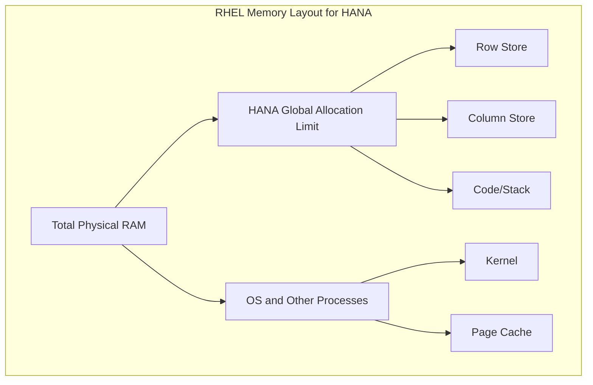

# How to Configure RHEL Memory and CPU for SAP HANA Best Practices

Author: [nawazdhandala](https://www.github.com/nawazdhandala)

Tags: RHEL, SAP HANA, Memory, CPU, Performance, Linux

Description: Optimize RHEL memory and CPU settings for SAP HANA following SAP and Red Hat best practices for maximum database performance.

---

SAP HANA is an in-memory database that demands careful memory and CPU configuration at the OS level. Getting these settings right on RHEL directly impacts HANA performance, stability, and the ability to handle large workloads. This guide covers the essential memory and CPU tuning parameters.

## Memory Architecture for SAP HANA


```mermaid
graph TB
    subgraph "RHEL Memory Layout for HANA"
        Total[Total Physical RAM]
        Total --> HANA_Alloc[HANA Global Allocation Limit]
        Total --> OS_Reserve[OS and Other Processes]
        HANA_Alloc --> Row[Row Store]
        HANA_Alloc --> Column[Column Store]
        HANA_Alloc --> Code[Code/Stack]
        OS_Reserve --> Kernel[Kernel]
        OS_Reserve --> Cache[Page Cache]
    end
```

## Prerequisites

- RHEL with SAP HANA installed or planned
- Minimum 64 GB RAM (128 GB+ recommended for production)
- Root or sudo access

## Step 1: Configure NUMA Settings

SAP HANA is NUMA-aware and performs best with proper NUMA configuration.

```bash
# Check the current NUMA topology

numactl --hardware

# Verify automatic NUMA balancing is disabled for SAP HANA
cat /proc/sys/kernel/numa_balancing
# Should return 0

# If automatic NUMA balancing is on, disable it
echo 0 | sudo tee /proc/sys/kernel/numa_balancing

# Stop numad if it is installed and running
sudo systemctl disable --now numad

# Make it persistent
echo 'kernel.numa_balancing = 0' | sudo tee /etc/sysctl.d/sap-numa.conf
sudo sysctl --system
```

## Step 2: Configure Transparent Huge Pages

```bash
# SAP recommends THP madvise for SAP HANA on RHEL 9.2 and later
# For older supported OS combinations, use transparent_hugepage=never
# Check current status
cat /sys/kernel/mm/transparent_hugepage/enabled

# Set via kernel parameter (persistent across reboots)
sudo grubby --update-kernel=ALL --args="transparent_hugepage=madvise"

# Apply immediately without reboot
echo madvise | sudo tee /sys/kernel/mm/transparent_hugepage/enabled
echo never | sudo tee /sys/kernel/mm/transparent_hugepage/defrag

# Verify
cat /sys/kernel/mm/transparent_hugepage/enabled
# Expected: always [madvise] never
```

## Step 3: Configure Memory Overcommit

```bash
# SAP HANA requires specific overcommit settings
sudo tee /etc/sysctl.d/sap-hana-memory.conf > /dev/null <<'EOF'
# Use the kernel default heuristic overcommit policy
vm.overcommit_memory = 0

# Set swappiness low to avoid swapping HANA data
vm.swappiness = 10

# Maximum number of memory map areas
# Required by SAP HANA for large memory allocations
vm.max_map_count = 2147483647

# Shared memory settings
# SHMMAX should be set to total RAM in bytes
kernel.shmmax = 137438953472
kernel.shmall = 33554432

# Dirty page writeback tuning
vm.dirty_ratio = 10
vm.dirty_background_ratio = 3

# Zone reclaim mode - disable for NUMA systems
vm.zone_reclaim_mode = 0
EOF

sudo sysctl --system
```

## Step 4: Configure CPU Governor

```bash
# Use the performance CPU governor for consistent CPU frequency
# Check the current governor
cat /sys/devices/system/cpu/cpu0/cpufreq/scaling_governor

# Set performance governor for all CPUs
sudo cpupower frequency-set -g performance

# Make persistent via tuned
sudo tuned-adm profile sap-hana

# Verify the profile
tuned-adm active
```

## Step 5: Configure CPU Affinity (Optional for Large Systems)

For very large HANA instances, you can reserve CPUs for HANA services:

```bash
# Check the number of CPUs
nproc

# Isolate CPUs 2-63 from the general scheduler (keep CPUs 0-1 for OS tasks)
# Add to kernel command line
sudo grubby --update-kernel=ALL --args="isolcpus=2-63"

# Alternative: use systemd resource control to allocate CPUs to a HANA service
# This is less disruptive and does not require a reboot
sudo systemctl set-property SAP<SID>_<INSTANCE>.service AllowedCPUs=2-63
```

## Step 6: Avoid Unused Static Huge Pages for SAP HANA

Static HugeTLB pages reserve memory that normal processes cannot use. Do not reserve them unless SAP, Red Hat, or your hardware vendor explicitly requires them for your deployment:

```bash
# Check whether static huge pages are reserved
grep HugePages /proc/meminfo

# Clear unused static huge page reservations
echo 0 | sudo tee /proc/sys/vm/nr_hugepages

# Make the setting persistent
echo 'vm.nr_hugepages = 0' | sudo tee -a /etc/sysctl.d/sap-hana-memory.conf
sudo sysctl --system

# Verify huge pages allocation is not reserved
grep HugePages /proc/meminfo
```

## Step 7: Validate the Configuration

```bash
# Run the SAP HANA hardware and cloud measurement tool
hcmt -v

# Check memory allocation
free -h

# Verify NUMA memory distribution
numactl --hardware

# Check CPU governor
cpupower frequency-info | grep governor

# Verify kernel parameters
sysctl vm.overcommit_memory vm.swappiness vm.max_map_count
```

## Conclusion

Proper memory and CPU configuration on RHEL is fundamental to SAP HANA performance. The key settings are configuring THP according to SAP guidance, configuring appropriate swap and overcommit settings, ensuring NUMA awareness, and using the performance CPU governor. Always validate your configuration with the SAP HANA hardware and cloud measurement tool before going into production.
