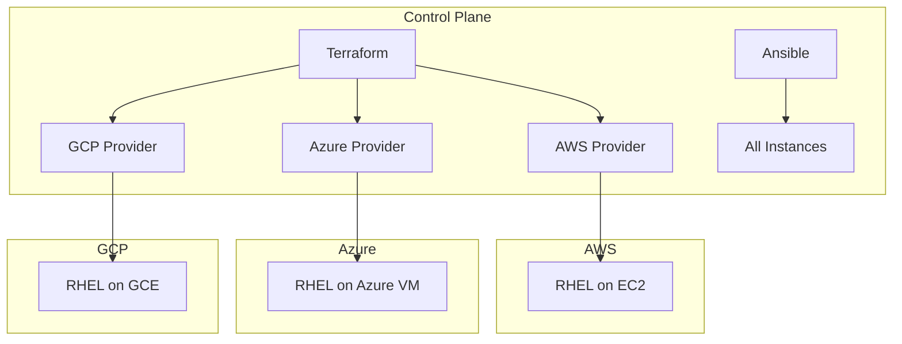

# How to Configure RHEL for Multi-Cloud Deployments

Author: [nawazdhandala](https://www.github.com/nawazdhandala)

Tags: RHEL, Multi-Cloud, AWS, Azure, GCP, Terraform, Linux

Description: Configure RHEL for consistent deployment across AWS, Azure, and GCP using Terraform and standardized configuration management.

---

Running RHEL across multiple cloud providers requires a consistent configuration strategy. This guide covers using Terraform for provisioning and Ansible for configuration management to ensure your RHEL instances behave identically regardless of where they run.

## Multi-Cloud Architecture



## Step 1: Create a Terraform Module for RHEL

```hcl
# modules/rhel9-instance/main.tf
# This module abstracts cloud-specific details

variable "cloud_provider" {
  description = "Cloud provider: aws, azure, or gcp"
  type        = string
}

variable "instance_name" {
  type = string
}

variable "instance_size" {
  description = "Normalized size: small, medium, large"
  type        = string
  default     = "medium"
}

# Map normalized sizes to cloud-specific instance types
locals {
  instance_types = {
    aws = {
      small  = "t3.medium"
      medium = "m6i.large"
      large  = "m6i.xlarge"
    }
    azure = {
      small  = "Standard_B2ms"
      medium = "Standard_D2s_v5"
      large  = "Standard_D4s_v5"
    }
    gcp = {
      small  = "e2-medium"
      medium = "e2-standard-2"
      large  = "e2-standard-4"
    }
  }
}
```

## Step 2: AWS Instance Configuration

```hcl
# modules/rhel9-instance/aws.tf
resource "aws_instance" "rhel9" {
  count = var.cloud_provider == "aws" ? 1 : 0

  ami           = data.aws_ami.rhel9[0].id
  instance_type = local.instance_types["aws"][var.instance_size]

  metadata_options {
    http_tokens = "required"
  }

  root_block_device {
    volume_size = 50
    volume_type = "gp3"
    encrypted   = true
  }

  user_data = file("${path.module}/cloud-init.yaml")

  tags = {
    Name = var.instance_name
    OS   = "RHEL9"
  }
}

data "aws_ami" "rhel9" {
  count       = var.cloud_provider == "aws" ? 1 : 0
  most_recent = true
  owners      = ["309956199498"]

  filter {
    name   = "name"
    values = ["RHEL-9.*_HVM-*-x86_64-*"]
  }
}
```

## Step 3: Shared Cloud-Init Configuration

```yaml
# modules/rhel9-instance/cloud-init.yaml
#cloud-config

# Consistent base configuration across all clouds
package_update: true
packages:
  - vim
  - git
  - firewalld
  - dnf-automatic

write_files:
  - path: /etc/sysctl.d/99-standard.conf
    content: |
      net.core.somaxconn = 4096
      vm.swappiness = 10

runcmd:
  - systemctl enable --now firewalld
  - firewall-cmd --permanent --add-service=ssh
  - firewall-cmd --permanent --add-service=https
  - firewall-cmd --reload
  - sysctl --system
```

## Step 4: Ansible Playbook for Consistent Configuration

```yaml
# configure-rhel9.yml
---
- name: Configure RHEL instances across clouds
  hosts: all
  become: true
  tasks:
    - name: Ensure standard packages are installed
      ansible.builtin.dnf:
        name:
          - firewalld
          - chrony
          - aide
          - dnf-automatic
        state: present

    - name: Configure automatic security updates
      ansible.builtin.lineinfile:
        path: /etc/dnf/automatic.conf
        regexp: '^apply_updates'
        line: 'apply_updates = yes'

    - name: Ensure firewalld is running
      ansible.builtin.service:
        name: firewalld
        state: started
        enabled: true

    - name: Harden SSH
      ansible.builtin.lineinfile:
        path: /etc/ssh/sshd_config
        regexp: "{{ item.regexp }}"
        line: "{{ item.line }}"
      loop:
        - { regexp: '^#?PermitRootLogin', line: 'PermitRootLogin no' }
        - { regexp: '^#?PasswordAuthentication', line: 'PasswordAuthentication no' }
      notify: Restart SSH

  handlers:
    - name: Restart SSH
      ansible.builtin.service:
        name: sshd
        state: restarted
```

## Step 5: Deploy Across Clouds

```bash
# Deploy to AWS
cd terraform/aws
terraform apply -var="cloud_provider=aws" -var="instance_name=web-aws"

# Deploy to Azure
cd terraform/azure
terraform apply -var="cloud_provider=azure" -var="instance_name=web-azure"

# Deploy to GCP
cd terraform/gcp
terraform apply -var="cloud_provider=gcp" -var="instance_name=web-gcp"

# Configure all instances with Ansible
ansible-playbook -i inventory/all configure-rhel9.yml
```

## Conclusion

Multi-cloud RHEL deployments benefit from a layered approach: use Terraform to handle cloud-specific provisioning, cloud-init for first-boot configuration, and Ansible for ongoing configuration management. This ensures your RHEL instances are consistent across providers while still taking advantage of each cloud's native features.
