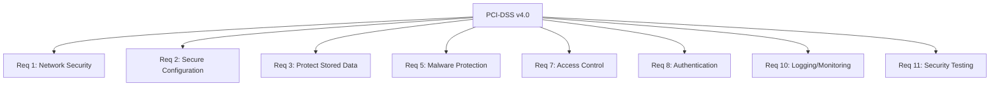

# How to Configure RHEL for PCI-DSS v4.0 Compliance

Author: [nawazdhandala](https://www.github.com/nawazdhandala)

Tags: RHEL, PCI-DSS, Compliance, Security, Linux

Description: Configure RHEL to meet PCI-DSS v4.0 requirements, covering encryption, access control, logging, and network security controls.

---

PCI-DSS v4.0 raised the bar for systems that handle payment card data. If your RHEL servers are in scope for PCI compliance, whether they process, store, or transmit cardholder data, they need to meet specific technical requirements. This guide maps the key PCI-DSS v4.0 requirements to practical RHEL configurations.

## PCI-DSS v4.0 Requirements Mapped to RHEL



## Use the PCI-DSS OpenSCAP Profile

RHEL's SCAP Security Guide includes a PCI-DSS profile:

```bash
# Install OpenSCAP and SSG
dnf install -y openscap-scanner scap-security-guide

# Check available PCI-DSS profile
oscap info /usr/share/xml/scap/ssg/content/ssg-rhel9-ds.xml | grep -i pci

# Run a PCI-DSS compliance scan
oscap xccdf eval \
  --profile xccdf_org.ssgproject.content_profile_pci-dss \
  --results /var/log/compliance/pci-dss-results.xml \
  --report /var/log/compliance/pci-dss-report.html \
  /usr/share/xml/scap/ssg/content/ssg-rhel9-ds.xml || true
```

## Requirement 1: Network Security Controls

### Configure firewalld

```bash
# Enable and configure firewalld
systemctl enable --now firewalld

# Set default zone to drop (deny all by default)
firewall-cmd --set-default-zone=drop

# Only allow required services
firewall-cmd --permanent --zone=drop --add-service=ssh
# Add application-specific ports
firewall-cmd --permanent --zone=drop --add-port=443/tcp

firewall-cmd --reload
firewall-cmd --list-all

# Log dropped packets
firewall-cmd --permanent --set-log-denied=all
firewall-cmd --reload
```

### Disable IP forwarding

```bash
# PCI-DSS requires that servers do not route traffic
cat > /etc/sysctl.d/99-pci-network.conf << 'EOF'
net.ipv4.ip_forward = 0
net.ipv6.conf.all.forwarding = 0
net.ipv4.conf.all.send_redirects = 0
net.ipv4.conf.default.send_redirects = 0
net.ipv4.conf.all.accept_redirects = 0
net.ipv4.conf.default.accept_redirects = 0
net.ipv4.conf.all.accept_source_route = 0
net.ipv4.conf.default.accept_source_route = 0
EOF

sysctl --system
```

## Requirement 2: Secure Configuration

### Remove unnecessary services

```bash
# List running services and remove what is not needed
systemctl list-units --type=service --state=running

# Disable common unnecessary services
for svc in cups avahi-daemon bluetooth rpcbind; do
    systemctl disable --now ${svc}.service 2>/dev/null
done

# Remove unnecessary packages
dnf remove -y telnet tftp-server vsftpd 2>/dev/null
```

### Apply secure defaults

```bash
# Set umask to 027 or more restrictive
echo "umask 027" >> /etc/profile.d/pci-dss.sh

# Disable core dumps
echo "* hard core 0" >> /etc/security/limits.d/pci.conf
echo "fs.suid_dumpable = 0" >> /etc/sysctl.d/99-pci-network.conf
sysctl -w fs.suid_dumpable=0
```

## Requirement 3: Protect Stored Account Data

### Configure disk encryption

```bash
# PCI-DSS v4.0 requires encryption of stored cardholder data
# Use LUKS for disk encryption
# Check if LUKS is in use
lsblk -f | grep crypto_LUKS

# For database servers, ensure data-at-rest encryption is enabled
# For file systems, use LUKS encryption
```

### Set file permissions

```bash
# Ensure cardholder data files have restrictive permissions
chmod 600 /path/to/cardholder/data/
chown appuser:appgroup /path/to/cardholder/data/
```

## Requirement 5: Anti-Malware

```bash
# Install and configure ClamAV or another anti-malware solution
dnf install -y clamav clamd clamav-update

# Update virus definitions
freshclam

# Enable and start the daemon
systemctl enable --now clamd@scan

# Schedule daily scans
echo "0 2 * * * root /usr/bin/clamscan -r /var /home --log=/var/log/clamav/daily-scan.log" >> /etc/crontab
```

## Requirement 7: Restrict Access

```bash
# Implement least privilege with sudo
# Remove users from unnecessary groups
# Ensure only authorized users can access cardholder data

# Configure sudo for specific commands only
cat > /etc/sudoers.d/pci-access << 'EOF'
# PCI-DSS: Only allow specific commands
%appteam ALL=(root) /usr/bin/systemctl restart application.service
%dbateam ALL=(root) /usr/bin/systemctl restart postgresql.service
EOF
chmod 440 /etc/sudoers.d/pci-access
```

## Requirement 8: Authentication Controls

### Password requirements

```bash
# PCI-DSS v4.0 requires minimum 12 character passwords
cat > /etc/security/pwquality.conf.d/pci-dss.conf << 'EOF'
minlen = 12
minclass = 3
dcredit = -1
ucredit = -1
lcredit = -1
maxrepeat = 4
EOF

# Password aging
sed -i 's/^PASS_MAX_DAYS.*/PASS_MAX_DAYS   90/' /etc/login.defs
sed -i 's/^PASS_MIN_DAYS.*/PASS_MIN_DAYS   1/' /etc/login.defs
```

### Account lockout

```bash
# Lock accounts after 10 failed attempts (PCI-DSS v4.0 changed from 6 to 10)
cat > /etc/security/faillock.conf << 'EOF'
deny = 10
unlock_time = 1800
fail_interval = 900
audit
silent
EOF
```

### SSH hardening

```bash
# PCI-DSS SSH requirements
cat > /etc/ssh/sshd_config.d/pci-dss.conf << 'EOF'
PermitRootLogin no
PermitEmptyPasswords no
ClientAliveInterval 900
ClientAliveCountMax 0
MaxAuthTries 6
Protocol 2
X11Forwarding no
Banner /etc/issue.net
Ciphers aes256-gcm@openssh.com,aes128-gcm@openssh.com,aes256-ctr,aes128-ctr
MACs hmac-sha2-512-etm@openssh.com,hmac-sha2-256-etm@openssh.com,hmac-sha2-512,hmac-sha2-256
EOF

systemctl restart sshd
```

## Requirement 10: Logging and Monitoring

### Configure comprehensive auditing

```bash
# Enable and configure auditd
systemctl enable --now auditd

# PCI-DSS requires logging of all access to cardholder data
cat > /etc/audit/rules.d/pci-dss.rules << 'EOF'
# Log all access to cardholder data
-w /var/lib/pci-data/ -p rwxa -k cardholder_access

# Log authentication events
-w /var/log/lastlog -p wa -k logins
-w /etc/passwd -p wa -k identity
-w /etc/shadow -p wa -k identity

# Log privilege escalation
-w /etc/sudoers -p wa -k actions
-w /etc/sudoers.d/ -p wa -k actions

# Log audit configuration changes
-w /etc/audit/ -p wa -k audit_config
-w /etc/audisp/ -p wa -k audit_config

# Log time changes
-a always,exit -F arch=b64 -S adjtimex -S settimeofday -k time-change
EOF

augenrules --load
```

### Configure time synchronization

```bash
# PCI-DSS requires accurate time synchronization
systemctl enable --now chronyd

# Verify chrony is syncing
chronyc tracking
chronyc sources
```

### Set up log retention

```bash
# PCI-DSS requires at least 12 months of audit logs
# with 3 months immediately available
sed -i 's/^max_log_file_action.*/max_log_file_action = rotate/' /etc/audit/auditd.conf
sed -i 's/^num_logs.*/num_logs = 99/' /etc/audit/auditd.conf
```

## Requirement 11: Regular Security Testing

### Configure file integrity monitoring

```bash
# Install and configure AIDE
dnf install -y aide
aide --init
mv /var/lib/aide/aide.db.new.gz /var/lib/aide/aide.db.gz

# Schedule daily integrity checks
echo "0 5 * * * root /usr/sbin/aide --check | mail -s 'AIDE Report - $(hostname)' security@example.com" >> /etc/crontab
```

## Run the PCI-DSS Compliance Scan

After applying all configurations, verify compliance:

```bash
oscap xccdf eval \
  --profile xccdf_org.ssgproject.content_profile_pci-dss \
  --results /var/log/compliance/pci-final.xml \
  --report /var/log/compliance/pci-final.html \
  /usr/share/xml/scap/ssg/content/ssg-rhel9-ds.xml || true

echo "Pass: $(grep -c 'result="pass"' /var/log/compliance/pci-final.xml)"
echo "Fail: $(grep -c 'result="fail"' /var/log/compliance/pci-final.xml)"
```

PCI-DSS v4.0 compliance on RHEL is achievable with the right configuration. The key is to use the built-in tools, scan regularly, and keep your documentation current. Auditors appreciate systems where the compliance evidence is generated automatically.
