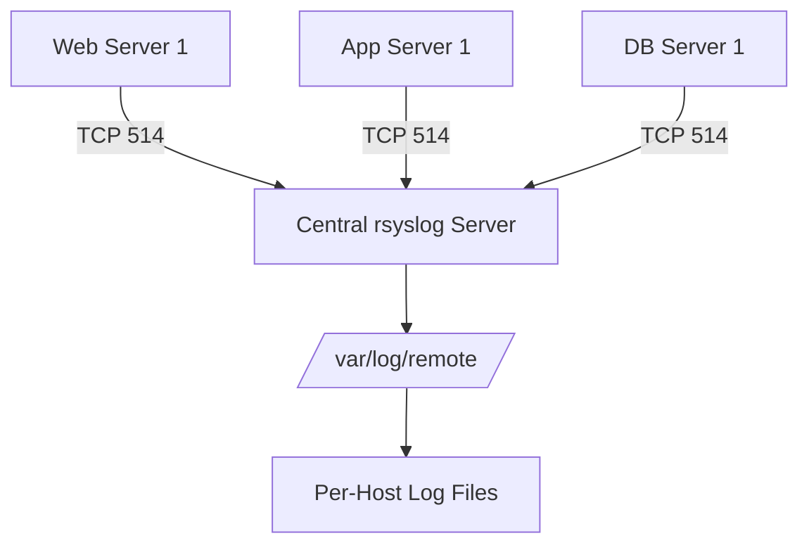

# How to Configure rsyslog for Centralized Log Collection on RHEL

Author: [nawazdhandala](https://www.github.com/nawazdhandala)

Tags: RHEL, rsyslog, Logging, Centralized Logging, Linux

Description: Learn how to set up rsyslog on RHEL for centralized log collection, allowing you to aggregate logs from multiple servers into a single location for easier analysis and troubleshooting.

---

Managing logs across dozens or hundreds of servers individually is not practical. A centralized logging setup collects all logs in one place, making it much easier to search, correlate events, and troubleshoot issues. On RHEL, rsyslog is the default logging daemon and it supports both receiving and forwarding logs out of the box.

## Architecture Overview

The centralized logging model involves a single log server (the collector) and multiple log clients (the senders). Clients forward their logs to the collector using either UDP or TCP.



## Prerequisites

- RHEL servers with root or sudo access
- Firewall access between clients and the central log server on port 514
- rsyslog installed (it comes pre-installed on RHEL)

Verify rsyslog is installed and running:

```bash
# Check rsyslog version
rsyslogd -v

# Check service status
sudo systemctl status rsyslog
```

## Setting Up the Central Log Server

### Step 1: Enable TCP Reception

Edit the rsyslog configuration to accept incoming log messages over TCP.

```bash
# Open the main rsyslog configuration file
sudo vi /etc/rsyslog.conf
```

Uncomment or add these lines to enable TCP reception on port 514:

```bash
# Load the TCP input module
module(load="imtcp")

# Listen on TCP port 514 for incoming logs
input(type="imtcp" port="514")
```

If you also want UDP reception (less reliable but lower overhead):

```bash
# Load the UDP input module
module(load="imudp")

# Listen on UDP port 514
input(type="imudp" port="514")
```

### Step 2: Create a Template for Per-Host Log Files

Without a template, all remote logs would mix into the local log files. Create a template that organizes logs by hostname.

```bash
# Create a custom configuration file for remote logging
sudo vi /etc/rsyslog.d/remote.conf
```

Add the following content:

```bash
# Template to create per-host directories and log files
# Logs will be stored as /var/log/remote/HOSTNAME/PROGRAMNAME.log
template(name="RemoteLogs" type="string"
    string="/var/log/remote/%HOSTNAME%/%PROGRAMNAME%.log"
)

# Apply the template to all incoming remote logs
# The ampersand-tilde stops further processing of remote messages
if $fromhost-ip != '127.0.0.1' then {
    action(type="omfile" dynaFile="RemoteLogs")
    stop
}
```

### Step 3: Create the Remote Log Directory

```bash
# Create the directory for remote logs
sudo mkdir -p /var/log/remote

# Set appropriate ownership
sudo chown root:root /var/log/remote

# Set permissions so only root can read
sudo chmod 700 /var/log/remote
```

### Step 4: Configure the Firewall

```bash
# Allow syslog traffic through the firewall on TCP port 514
sudo firewall-cmd --permanent --add-port=514/tcp

# If using UDP as well
sudo firewall-cmd --permanent --add-port=514/udp

# Reload firewall rules
sudo firewall-cmd --reload

# Verify the rules
sudo firewall-cmd --list-ports
```

### Step 5: Configure SELinux

SELinux on RHEL may block rsyslog from listening on non-standard configurations. Allow it:

```bash
# Allow rsyslog to use the syslogd port
sudo semanage port -a -t syslogd_port_t -p tcp 514

# If the port is already defined, modify it instead
# sudo semanage port -m -t syslogd_port_t -p tcp 514
```

### Step 6: Restart rsyslog

```bash
# Restart rsyslog to apply changes
sudo systemctl restart rsyslog

# Verify it is listening on port 514
sudo ss -tlnp | grep 514
```

You should see output showing rsyslog listening on port 514.

## Setting Up the Log Clients

On each client server, configure rsyslog to forward logs to the central server.

### Step 1: Create a Forwarding Configuration

```bash
# Create a forwarding configuration file
sudo vi /etc/rsyslog.d/forward.conf
```

Add the following:

```bash
# Forward all logs to the central server over TCP
# Use @@ for TCP (@ for UDP)
# Replace 192.168.1.100 with your central log server IP or hostname
*.* @@192.168.1.100:514
```

For a more resilient setup with a disk queue (so logs are not lost if the server is temporarily down):

```bash
# Forward logs with disk-assisted queue for reliability
*.* action(
    type="omfwd"
    target="192.168.1.100"
    port="514"
    protocol="tcp"
    # Queue settings for reliability
    queue.type="LinkedList"
    queue.filename="fwdRule1"
    queue.maxdiskspace="1g"
    queue.saveonshutdown="on"
    queue.size="10000"
    action.resumeRetryCount="-1"
    action.resumeInterval="30"
)
```

### Step 2: Restart rsyslog on the Client

```bash
# Restart rsyslog
sudo systemctl restart rsyslog

# Verify the service is running
sudo systemctl status rsyslog
```

### Step 3: Test the Setup

From the client, send a test message:

```bash
# Send a test log message
logger "Test message from $(hostname) to central log server"
```

On the central server, check for the message:

```bash
# List remote log directories - you should see the client hostname
ls /var/log/remote/

# Check the log file for the test message
cat /var/log/remote/CLIENT_HOSTNAME/root.log
```

## Configuring Log Rotation for Remote Logs

Remote logs can grow quickly. Set up logrotate to manage them:

```bash
# Create a logrotate configuration for remote logs
sudo vi /etc/logrotate.d/remote-logs
```

Add the following:

```bash
/var/log/remote/*/*.log {
    daily
    rotate 30
    compress
    delaycompress
    missingok
    notifempty
    create 0640 root root
    sharedscripts
    postrotate
        /usr/bin/systemctl restart rsyslog > /dev/null 2>&1 || true
    endscript
}
```

## Filtering Logs by Facility and Severity

You can fine-tune what gets forwarded from the client side:

```bash
# Only forward auth and authpriv messages (security-related)
auth,authpriv.* @@192.168.1.100:514

# Forward everything at warning level or above
*.warn @@192.168.1.100:514

# Forward everything except mail and cron logs
*.*;mail.none;cron.none @@192.168.1.100:514
```

## Verifying the Setup

Run these checks to confirm everything is working:

```bash
# On the server: check rsyslog is listening
sudo ss -tlnp | grep :514

# On the server: watch incoming logs in real time
sudo tail -f /var/log/remote/*/*

# On the client: verify forwarding is configured
rsyslogd -N1

# Check for any rsyslog errors
sudo journalctl -u rsyslog --no-pager -n 20
```

## Troubleshooting

If logs are not arriving on the central server:

1. Check firewall rules on both client and server
2. Verify network connectivity with `telnet log-server 514`
3. Check SELinux denials with `sudo ausearch -m AVC -ts recent`
4. Review rsyslog errors with `journalctl -u rsyslog`
5. Test with UDP first (simpler) before switching to TCP

```bash
# Quick connectivity test from client to server
nc -zv 192.168.1.100 514

# Check for SELinux denials related to syslog
sudo ausearch -m AVC -c rsyslogd
```

## Summary

Centralized log collection with rsyslog on RHEL gives you a single place to search and analyze logs from your entire infrastructure. The key steps are enabling TCP reception on the central server, creating per-host templates for organized storage, and configuring clients to forward their logs with reliable queuing. Combined with log rotation, this setup scales well and keeps your logging manageable.
