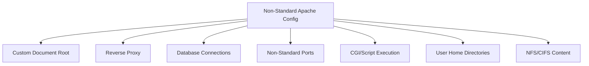

# How to Configure SELinux for Apache HTTPD Non-Standard Configs on RHEL

Author: [nawazdhandala](https://www.github.com/nawazdhandala)

Tags: RHEL, SELinux, Apache, Security, Linux

Description: Adjust SELinux settings on RHEL to support Apache HTTPD configurations that use custom directories, ports, and features beyond the default setup.

---

## The Default SELinux Policy for Apache

Out of the box, SELinux on RHEL confines Apache (httpd) to a strict policy. It can serve files from `/var/www/html`, listen on standard HTTP/HTTPS ports, and not much else. The moment you customize Apache, whether it is a different document root, a reverse proxy, CGI scripts, or database connections, SELinux steps in and blocks it.

This post covers the most common non-standard Apache configurations and the SELinux adjustments each one requires.

## Common Scenarios



## Custom Document Root

If you serve content from somewhere other than `/var/www/html`:

```bash
# Define the file context for your custom document root
sudo semanage fcontext -a -t httpd_sys_content_t "/data/website(/.*)?"

# Apply the context
sudo restorecon -Rv /data/website/

# Verify
ls -Zd /data/website/
```

For directories that Apache needs to write to (upload directories, cache):

```bash
# Writable content type
sudo semanage fcontext -a -t httpd_sys_rw_content_t "/data/website/uploads(/.*)?"
sudo restorecon -Rv /data/website/uploads/
```

### File Context Types for Apache

| Type | Permission | Use Case |
|---|---|---|
| httpd_sys_content_t | Read only | Static web content |
| httpd_sys_rw_content_t | Read/Write | Upload directories, caches |
| httpd_sys_script_exec_t | Execute | CGI scripts |
| httpd_sys_ra_content_t | Read/Append | Log directories |

## Reverse Proxy Configuration

Apache acting as a reverse proxy needs to make outbound network connections. By default, SELinux blocks this:

```bash
# Allow Apache to make network connections (required for reverse proxy)
sudo setsebool -P httpd_can_network_connect on
```

If the backend is on a specific port:

```bash
# Allow Apache to connect to any network port
sudo setsebool -P httpd_can_network_relay on
```

## Database Connections

For PHP or Python applications that connect to databases:

```bash
# Allow Apache to connect to database servers
sudo setsebool -P httpd_can_network_connect_db on
```

This allows connections to MySQL, PostgreSQL, and other database ports.

## Non-Standard Listening Ports

```bash
# Check current HTTP port assignments
sudo semanage port -l | grep http_port_t

# Add a non-standard port
sudo semanage port -a -t http_port_t -p tcp 8888

# Verify
sudo semanage port -l | grep http_port_t
```

## CGI Script Execution

If you use CGI scripts in a custom location:

```bash
# Label CGI scripts for execution
sudo semanage fcontext -a -t httpd_sys_script_exec_t "/data/website/cgi-bin(/.*)?"
sudo restorecon -Rv /data/website/cgi-bin/

# Allow CGI scripts to make network connections
sudo setsebool -P httpd_can_network_connect on

# Allow CGI scripts to send mail
sudo setsebool -P httpd_can_sendmail on
```

## User Home Directories (UserDir)

If you enable Apache's `mod_userdir` to serve content from `~/public_html`:

```bash
# Allow Apache to read user home directories
sudo setsebool -P httpd_enable_homedirs on

# Allow Apache to read user content
sudo setsebool -P httpd_read_user_content on
```

## NFS or CIFS Mounted Content

If Apache serves content from network-mounted filesystems:

```bash
# Allow Apache to use NFS
sudo setsebool -P httpd_use_nfs on

# Allow Apache to use CIFS (Samba)
sudo setsebool -P httpd_use_cifs on
```

## PHP-FPM with Apache

If using PHP-FPM (FastCGI Process Manager):

```bash
# Allow Apache to connect to PHP-FPM socket
sudo setsebool -P httpd_can_network_connect on
```

If using a Unix socket for PHP-FPM, make sure the socket has the correct context:

```bash
# Check the PHP-FPM socket context
ls -Z /run/php-fpm/www.sock
```

## SSL/TLS with Custom Certificate Locations

If your certificates are not in the standard locations:

```bash
# Label custom certificate directory
sudo semanage fcontext -a -t cert_t "/data/ssl/certs(/.*)?"
sudo semanage fcontext -a -t cert_t "/data/ssl/private(/.*)?"
sudo restorecon -Rv /data/ssl/
```

## Apache Sending Email

If your web application sends email (contact forms, notifications):

```bash
# Allow Apache to send mail
sudo setsebool -P httpd_can_sendmail on
```

## Comprehensive Boolean Reference for Apache

List all Apache-related booleans:

```bash
# Show all httpd booleans with descriptions
sudo semanage boolean -l | grep httpd
```

Key booleans:

```bash
# Common set for a typical web application server
sudo setsebool -P httpd_can_network_connect on      # Outbound connections
sudo setsebool -P httpd_can_network_connect_db on    # Database connections
sudo setsebool -P httpd_can_sendmail on              # Send email
sudo setsebool -P httpd_enable_homedirs on           # UserDir support
sudo setsebool -P httpd_use_nfs on                   # NFS content
sudo setsebool -P httpd_execmem on                   # JIT compilation (PHP, etc.)
```

## Troubleshooting Apache SELinux Issues

### Step 1: Check for Denials

```bash
# Find Apache-specific denials
sudo ausearch -m avc -c httpd -ts recent
```

### Step 2: Get Fix Suggestions

```bash
# Analyze the denials
sudo ausearch -m avc -c httpd -ts recent | sealert -a -
```

### Step 3: Common Error Messages

**"Permission denied" in Apache error log:**

```bash
# Check the file context
ls -Z /path/to/file

# Fix if needed
sudo restorecon -v /path/to/file
```

**"(13)Permission denied: AH00957":**

This usually means SELinux is blocking file access. Check the audit log:

```bash
sudo ausearch -m avc -ts recent | grep httpd
```

**"proxy: HTTP: disabled connection for":**

```bash
sudo setsebool -P httpd_can_network_connect on
```

### Step 4: Test in Permissive Mode (Per-Domain)

```bash
# Set only httpd to permissive
sudo semanage permissive -a httpd_t

# Test your configuration
# ...

# Fix all denials, then re-enable enforcement
sudo semanage permissive -d httpd_t
```

## Wrapping Up

Apache is one of the most commonly customized services on RHEL, and every customization potentially needs an SELinux adjustment. The good news is that most adjustments are just a boolean toggle or a file context rule. Follow the pattern: check denials with `ausearch`, get suggestions from `sealert`, apply the fix (boolean, file context, or port), and test. You will have Apache running with full SELinux enforcement even with the most complex configurations.
