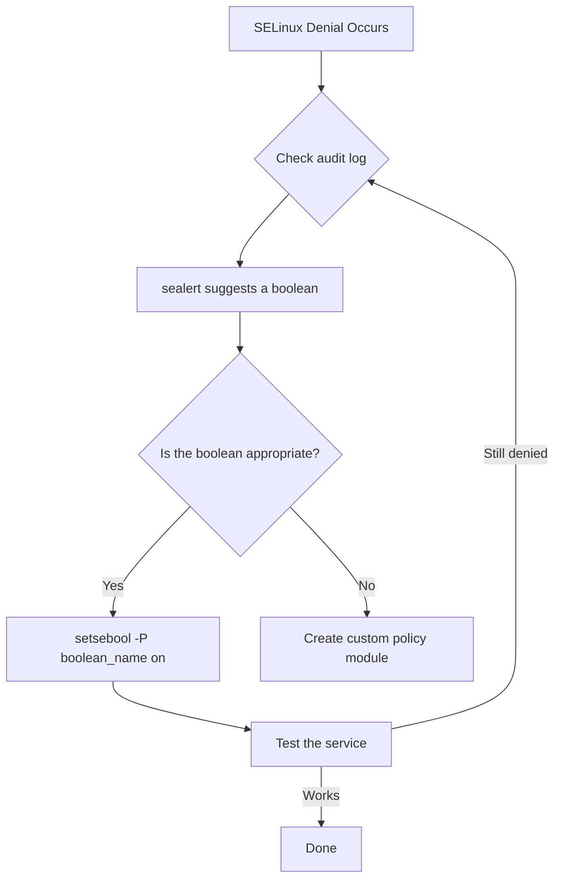

# How to Configure SELinux Booleans to Customize Policy on RHEL

Author: [nawazdhandala](https://www.github.com/nawazdhandala)

Tags: RHEL, SELinux, Booleans, Security, Linux

Description: Use SELinux booleans on RHEL to toggle specific policy features without writing custom modules, enabling or restricting service capabilities.

---

## What Are SELinux Booleans?

SELinux booleans are on/off switches that control specific aspects of the SELinux policy. They let you customize what services are allowed to do without writing custom policy modules. For example, the `httpd_can_network_connect` boolean controls whether Apache can make outgoing network connections. Flip it on, and Apache can connect to remote databases or APIs. Leave it off, and Apache is confined to serving local files.

Booleans are the easiest way to adjust SELinux policy for your specific environment.

## Listing Booleans

### See All Booleans

```bash
# List all booleans with their current values
sudo getsebool -a

# Count total booleans
sudo getsebool -a | wc -l
```

There are hundreds of booleans on a typical RHEL system.

### Search for Specific Booleans

```bash
# Find all booleans related to httpd
sudo getsebool -a | grep httpd

# Find all booleans related to Samba
sudo getsebool -a | grep samba

# Find all booleans related to NFS
sudo getsebool -a | grep nfs
```

### Get Boolean Description

```bash
# Show description for a specific boolean
sudo semanage boolean -l | grep httpd_can_network_connect
```

Output:

```
httpd_can_network_connect      (off  ,  off)  Allow httpd to can network connect
```

The two values in parentheses show (current, default).

## Checking a Boolean Value

```bash
# Check a specific boolean
sudo getsebool httpd_can_network_connect
```

Output:

```
httpd_can_network_connect --> off
```

## Setting Booleans

### Temporary Change

```bash
# Enable a boolean (does not survive reboot)
sudo setsebool httpd_can_network_connect on

# Disable a boolean temporarily
sudo setsebool httpd_can_network_connect off
```

### Permanent Change

```bash
# Enable a boolean permanently (survives reboot)
sudo setsebool -P httpd_can_network_connect on

# Disable a boolean permanently
sudo setsebool -P httpd_can_network_connect off
```

The `-P` flag writes the change to the policy store on disk. Without it, the change is lost after reboot. The persistent write takes a moment because it recompiles part of the policy.

## Common Booleans by Service

### Apache/HTTPD

```bash
# Allow Apache to make network connections (for reverse proxy, API calls)
sudo setsebool -P httpd_can_network_connect on

# Allow Apache to connect to databases
sudo setsebool -P httpd_can_network_connect_db on

# Allow Apache to send mail
sudo setsebool -P httpd_can_sendmail on

# Allow Apache to read user home directories
sudo setsebool -P httpd_enable_homedirs on

# Allow Apache CGI scripts to make network connections
sudo setsebool -P httpd_can_network_relay on

# Allow Apache to use NFS-mounted content
sudo setsebool -P httpd_use_nfs on

# Allow Apache to use CIFS (Samba) mounted content
sudo setsebool -P httpd_use_cifs on
```

### Samba

```bash
# Allow Samba to share home directories
sudo setsebool -P samba_enable_home_dirs on

# Allow Samba to export NFS volumes
sudo setsebool -P samba_export_all_ro on
sudo setsebool -P samba_export_all_rw on

# Allow Samba to use CUPS for printing
sudo setsebool -P samba_domain_controller on
```

### NFS

```bash
# Allow NFS to export home directories
sudo setsebool -P use_nfs_home_dirs on

# Allow NFS to export all filesystems (read-only)
sudo setsebool -P nfs_export_all_ro on

# Allow NFS to export all filesystems (read-write)
sudo setsebool -P nfs_export_all_rw on
```

### FTP

```bash
# Allow FTP users to access home directories
sudo setsebool -P ftp_home_dir on

# Allow anonymous FTP write
sudo setsebool -P allow_ftpd_anon_write on

# Allow FTP full access
sudo setsebool -P ftpd_full_access on
```

### Mail

```bash
# Allow Postfix to connect to external databases
sudo setsebool -P postfix_local_write_mail_spool on

# Allow mail to use the network
sudo setsebool -P nis_enabled on
```

## Using semanage to Manage Booleans

`semanage boolean` gives you more detail and control:

```bash
# List all booleans with descriptions
sudo semanage boolean -l

# List only locally modified booleans
sudo semanage boolean -l -C

# Set a boolean via semanage
sudo semanage boolean -m --on httpd_can_network_connect
```

The `-C` flag is very useful for documenting what you have changed from the defaults.

## Finding Which Boolean to Set

When you hit an SELinux denial, the audit log often tells you which boolean to set. Check with `sealert`:

```bash
# Look at recent denials
sudo ausearch -m avc -ts recent

# Use sealert for human-readable suggestions
sudo sealert -a /var/log/audit/audit.log
```

`sealert` will often suggest a specific boolean to enable:

```
If you want to allow httpd to can network connect
Then you must tell SELinux about this by enabling the 'httpd_can_network_connect' boolean.
setsebool -P httpd_can_network_connect 1
```

## Boolean Decision Flow



## Scripting Boolean Configuration

For automated server builds, set all your booleans in a script:

```bash
#!/bin/bash
# Configure SELinux booleans for a web server

# Web server booleans
setsebool -P httpd_can_network_connect on
setsebool -P httpd_can_network_connect_db on
setsebool -P httpd_can_sendmail on

# NFS home directories
setsebool -P use_nfs_home_dirs on

echo "SELinux booleans configured"
```

## Verifying Boolean Changes

```bash
# Show all locally modified booleans
sudo semanage boolean -l -C
```

This shows you exactly which booleans have been changed from their defaults, which is helpful for auditing and documentation.

## Wrapping Up

SELinux booleans are the simplest way to customize policy on RHEL. Before reaching for `audit2allow` or writing custom modules, check if there is a boolean for what you need. The `sealert` tool usually tells you exactly which boolean to enable. Use `-P` to make changes permanent, and document your changes by checking `semanage boolean -l -C` regularly.
