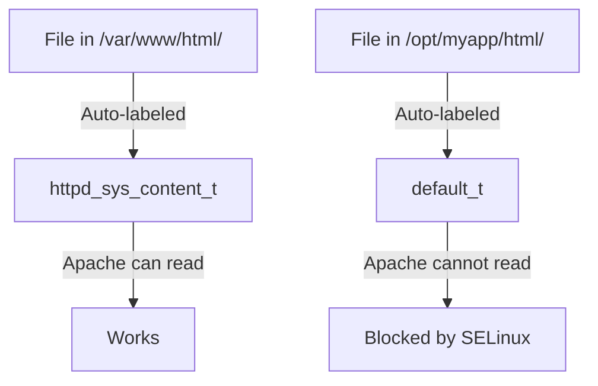

# How to Configure SELinux for Custom Application Directories on RHEL 9

Author: [nawazdhandala](https://www.github.com/nawazdhandala)

Tags: RHEL, SELinux, Custom Directories, Security, Linux

Description: Set up SELinux file contexts for custom application directories on RHEL 9 so services can access files stored outside their default locations.

---

## The Problem

You installed a web application in `/opt/myapp` instead of `/var/www`. You put database files in `/data/mysql` instead of `/var/lib/mysql`. You store logs in `/data/logs` instead of `/var/log`. SELinux blocks access because the files in these custom locations have the wrong labels.

This is one of the most common SELinux issues, and the fix is straightforward once you understand file contexts.

## Why Custom Directories Get Blocked

SELinux labels files based on their path. The policy maps path patterns to context types:

- `/var/www/html(/.*)?` maps to `httpd_sys_content_t`
- `/var/lib/mysql(/.*)?` maps to `mysqld_db_t`
- `/var/log(/.*)?` maps to `var_log_t`

When you create files outside these standard paths, they get the `default_t` label, which no service is allowed to access.



## The Fix: Define Custom File Contexts

### Step 1: Identify the Required Context Type

Figure out what context type the service expects. Check the default directory:

```bash
# What context does Apache expect?
ls -Zd /var/www/html/
# system_u:object_r:httpd_sys_content_t:s0

# What context does MySQL expect?
ls -Zd /var/lib/mysql/
# system_u:object_r:mysqld_db_t:s0

# What context does PostgreSQL expect?
ls -Zd /var/lib/pgsql/data/
# system_u:object_r:postgresql_db_t:s0
```

### Step 2: Add the File Context Rule

```bash
# For a custom web content directory
sudo semanage fcontext -a -t httpd_sys_content_t "/opt/myapp/html(/.*)?"

# For a custom MySQL data directory
sudo semanage fcontext -a -t mysqld_db_t "/data/mysql(/.*)?"

# For a custom log directory
sudo semanage fcontext -a -t var_log_t "/data/logs(/.*)?"
```

### Step 3: Apply the Context

```bash
# Apply to the custom web directory
sudo restorecon -Rv /opt/myapp/html/

# Apply to the custom database directory
sudo restorecon -Rv /data/mysql/

# Apply to the custom log directory
sudo restorecon -Rv /data/logs/
```

### Step 4: Verify

```bash
# Check the new labels
ls -Zd /opt/myapp/html/
ls -Zd /data/mysql/
ls -Zd /data/logs/
```

## Using Path Equivalence

Instead of creating individual rules, you can make one path equivalent to another:

```bash
# Make /data/www equivalent to /var/www
sudo semanage fcontext -a -e /var/www /data/www
sudo restorecon -Rv /data/www/
```

Now everything under `/data/www` gets the same labels as the corresponding paths under `/var/www`:
- `/data/www/html/` gets `httpd_sys_content_t`
- `/data/www/cgi-bin/` gets `httpd_sys_script_exec_t`

This is cleaner than adding multiple individual rules.

## Common Custom Directory Scenarios

### Custom Apache/Nginx Document Root

```bash
# Read-only web content
sudo semanage fcontext -a -t httpd_sys_content_t "/srv/websites/example.com(/.*)?"

# Writable directories (uploads, cache)
sudo semanage fcontext -a -t httpd_sys_rw_content_t "/srv/websites/example.com/uploads(/.*)?"
sudo semanage fcontext -a -t httpd_sys_rw_content_t "/srv/websites/example.com/cache(/.*)?"

# CGI scripts
sudo semanage fcontext -a -t httpd_sys_script_exec_t "/srv/websites/example.com/cgi-bin(/.*)?"

# Apply all rules
sudo restorecon -Rv /srv/websites/
```

### Custom Database Data Directory

```bash
# MySQL/MariaDB custom data directory
sudo semanage fcontext -a -t mysqld_db_t "/data/mysql(/.*)?"
sudo restorecon -Rv /data/mysql/

# PostgreSQL custom data directory
sudo semanage fcontext -a -t postgresql_db_t "/data/pgsql(/.*)?"
sudo restorecon -Rv /data/pgsql/
```

### Custom Application in /opt

```bash
# Application binaries
sudo semanage fcontext -a -t bin_t "/opt/myapp/bin(/.*)?"

# Application configuration
sudo semanage fcontext -a -t etc_t "/opt/myapp/etc(/.*)?"

# Application logs
sudo semanage fcontext -a -t var_log_t "/opt/myapp/log(/.*)?"

# Application data
sudo semanage fcontext -a -t var_lib_t "/opt/myapp/data(/.*)?"

# Apply everything
sudo restorecon -Rv /opt/myapp/
```

### Custom Samba Share

```bash
# Samba share directory
sudo semanage fcontext -a -t samba_share_t "/data/shares(/.*)?"
sudo restorecon -Rv /data/shares/
```

### Custom NFS Export

```bash
# NFS exported directory
sudo semanage fcontext -a -t nfs_t "/data/exports(/.*)?"
sudo restorecon -Rv /data/exports/
```

## Managing Custom Rules

### List All Custom Rules

```bash
# Show only locally added rules (your customizations)
sudo semanage fcontext -l -C
```

### Delete a Custom Rule

```bash
# Remove a custom rule
sudo semanage fcontext -d "/opt/myapp/html(/.*)?"

# Restore the default context
sudo restorecon -Rv /opt/myapp/html/
```

### Modify a Custom Rule

```bash
# Change the type for an existing rule
sudo semanage fcontext -m -t httpd_sys_rw_content_t "/opt/myapp/html(/.*)?"
sudo restorecon -Rv /opt/myapp/html/
```

## Regex Patterns for semanage fcontext

The path pattern uses regular expressions:

```bash
# Match a directory and everything inside it
"/data/website(/.*)?"

# Match only files (not directories) in a specific path
"/data/website/[^/]*"

# Match specific file extensions
"/data/website/.*\.html"
```

Common patterns:
- `(/.*)?` - Match the directory and everything recursively inside it
- `(/[^/]*)?` - Match the directory and direct children only
- `.*\.conf` - Match files ending in .conf

## Troubleshooting

### Files Still Have Wrong Context After restorecon

Make sure the regex pattern in your rule actually matches:

```bash
# Test what context a path would get
matchpathcon /opt/myapp/html/index.html

# If it returns default_t, your rule does not match the path
# Check your rules
sudo semanage fcontext -l -C
```

### New Files Created with Wrong Context

New files inherit context from their parent directory. If the parent has the right context, children will too. Verify the parent:

```bash
ls -Zd /opt/myapp/html/
```

### Services Still Denied After Fixing Contexts

The service might need a boolean in addition to the file context:

```bash
# Check for remaining denials
sudo ausearch -m avc -ts recent

# Apply suggested booleans
sudo sealert -a /var/log/audit/audit.log
```

## Automation Script

For repeatable deployments, script the SELinux setup:

```bash
#!/bin/bash
# Setup SELinux contexts for custom application

APP_DIR="/opt/myapp"

# Define contexts
semanage fcontext -a -t httpd_sys_content_t "${APP_DIR}/html(/.*)?"
semanage fcontext -a -t httpd_sys_rw_content_t "${APP_DIR}/uploads(/.*)?"
semanage fcontext -a -t httpd_sys_script_exec_t "${APP_DIR}/cgi-bin(/.*)?"
semanage fcontext -a -t var_log_t "${APP_DIR}/logs(/.*)?"

# Apply contexts
restorecon -Rv "${APP_DIR}/"

# Enable needed booleans
setsebool -P httpd_can_network_connect on
setsebool -P httpd_can_network_connect_db on

echo "SELinux configuration complete for ${APP_DIR}"
```

## Wrapping Up

Custom directories are the number one reason services get blocked by SELinux. The process is always the same: figure out which context type the service needs, create a file context rule with `semanage fcontext`, and apply it with `restorecon`. Use path equivalence for clean mappings, and document your custom rules by checking `semanage fcontext -l -C`. Once you have done this a few times, it becomes second nature.
