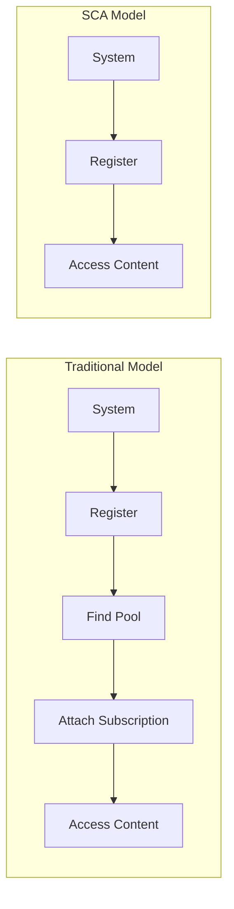

# How to Configure Simple Content Access for RHEL Systems

Author: [nawazdhandala](https://www.github.com/nawazdhandala)

Tags: RHEL, Simple Content Access, SCA, Red Hat, Linux

Description: A practical guide to enabling and configuring Simple Content Access (SCA) for RHEL, simplifying subscription management by removing the need for per-system entitlement attachment.

---

If you have spent time manually attaching subscriptions to individual RHEL systems, Simple Content Access (SCA) will feel like a breath of fresh air. SCA removes the requirement to attach specific subscriptions to each system. Once enabled, any registered system in your organization automatically gets access to content. This guide covers how to enable SCA and what changes when you switch to it.

## What Is Simple Content Access?

Traditional RHEL subscription management required attaching a specific subscription (entitlement) to each system. SCA changes this model. With SCA enabled on your Red Hat account, registered systems automatically have access to all content included in your subscriptions. You no longer need to run `subscription-manager attach` or worry about pool IDs.



## Is SCA Already Enabled?

For most Red Hat accounts created after 2022, SCA is enabled by default. Check your current status:

```bash
# Check if SCA is active on this system
sudo subscription-manager status
```

If SCA is active, you will see output mentioning "Content Access Mode" or "Simple Content Access" instead of a list of attached subscriptions. The status will show:

```
Overall Status: Disabled
Content Access Mode is set to Simple Content Access.
```

The "Disabled" status for compliance checking is normal with SCA, as individual entitlement tracking is not used.

## Enabling SCA on Your Red Hat Account

SCA is enabled at the organization level, not per system. To enable it:

1. Log in to the Red Hat Customer Portal at access.redhat.com
2. Navigate to Subscriptions
3. Click on "Manage" at the top
4. Find the "Simple Content Access" toggle
5. Enable it

Once enabled, all systems registered to your organization will switch to SCA mode. This change propagates to existing registered systems on their next check-in.

## Verifying SCA on an Existing System

After enabling SCA at the account level, verify it on your RHEL systems:

```bash
# Refresh the subscription data
sudo subscription-manager refresh

# Check the updated status
sudo subscription-manager status
```

You can also check the content access mode directly:

```bash
# Look for the content access certificate
ls -la /etc/pki/entitlement/
```

With SCA, you will see a content access certificate rather than individual entitlement certificates.

## What Changes with SCA

Several things change in how `subscription-manager` behaves:

**Auto-attach is unnecessary**: You do not need to run `subscription-manager attach --auto` or attach specific pools. Content access is granted upon registration.

**Status shows differently**: The `subscription-manager status` output will no longer show individual subscriptions as "Subscribed" or "Not Subscribed". Instead, it reports the content access mode.

**List commands behave differently**: Running `subscription-manager list --consumed` will not show individual subscriptions. Use `subscription-manager list --installed` to see installed products.

```bash
# See installed products
sudo subscription-manager list --installed

# Check repository access
sudo subscription-manager repos --list-enabled
```

## SCA with Satellite Server

If you use Red Hat Satellite for content management, SCA works there too. Enable it in the Satellite web UI:

1. Navigate to Content, then Subscriptions
2. Click "Manage Manifest"
3. Enable Simple Content Access

Systems registered to Satellite will automatically switch to SCA mode. Content views and lifecycle environments continue to control what content is available, but individual subscription attachment is no longer required.

## Registration Workflow with SCA

The registration process is simpler with SCA:

```bash
# Register the system - that is all you need
sudo subscription-manager register --username=your_username --password=your_password
```

Or with an activation key:

```bash
# Register with activation key - no attach step needed
sudo subscription-manager register --activationkey=my-key --org=my-org
```

After registration, repositories are immediately available:

```bash
# Verify repos are accessible
sudo dnf repolist

# Install a package to confirm
sudo dnf install -y tree
```

## Subscription Tracking with SCA

Even though individual attachment is not required, Red Hat still tracks subscription usage. You can view your subscription consumption in the Customer Portal:

1. Go to access.redhat.com
2. Navigate to Subscriptions
3. View the subscription inventory and system counts

This helps you stay within your subscription entitlements and plan renewals.

## Reverting from SCA to Traditional Mode

If you need to go back to traditional subscription management (rare, but it happens in some compliance scenarios):

1. Log in to the Red Hat Customer Portal
2. Navigate to Subscriptions, then Manage
3. Disable Simple Content Access

After disabling, systems will need to have subscriptions attached again:

```bash
# After disabling SCA, refresh and re-attach
sudo subscription-manager refresh
sudo subscription-manager attach --auto
```

## Impact on Existing Scripts

If you have automation scripts that include `subscription-manager attach` commands, they will still work with SCA enabled. The attach commands become no-ops rather than failures, so existing automation will not break. However, you can simplify your scripts by removing the attach steps.

Before SCA:

```bash
# Old workflow
subscription-manager register --username=$USER --password=$PASS
subscription-manager attach --auto
subscription-manager repos --enable=codeready-builder-for-rhel-9-x86_64-rpms
```

With SCA:

```bash
# Simplified workflow
subscription-manager register --username=$USER --password=$PASS
subscription-manager repos --enable=codeready-builder-for-rhel-9-x86_64-rpms
```

## Common Questions

**Does SCA affect what repos I can enable?** No. You still need to explicitly enable non-default repositories with `subscription-manager repos --enable`. SCA only removes the subscription attachment step.

**Does SCA work with older RHEL versions?** Yes. SCA works with RHEL 7, 8, and 9. The account-level setting applies to all registered systems.

**Can I use SCA with activation keys?** Absolutely. Activation keys work the same way with SCA. The only difference is that the key does not need to have subscriptions associated with it.

## Summary

Simple Content Access is the modern way to handle RHEL subscriptions. It eliminates the overhead of tracking and attaching individual subscriptions to each system, making registration a one-step process. For most organizations, SCA should be enabled at the account level, and registration scripts should be simplified to remove the now-unnecessary attach step. If you have not switched to SCA yet, it is worth the few clicks it takes to enable it.
