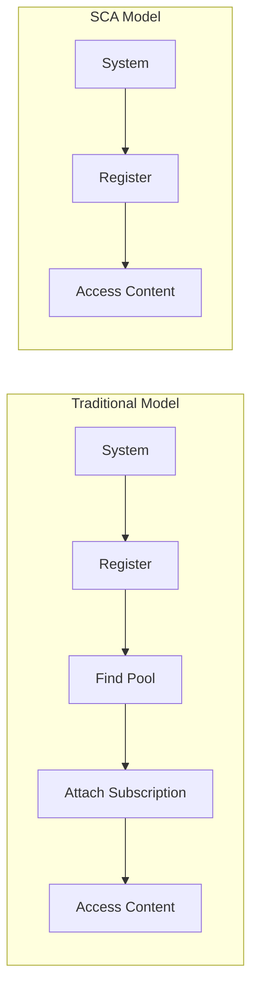

# How to Configure Simple Content Access for RHEL Systems

Author: [nawazdhandala](https://www.github.com/nawazdhandala)

Tags: RHEL, Simple Content Access, SCA, Red Hat, Linux

Description: A practical guide to enabling and configuring Simple Content Access (SCA) for RHEL, simplifying subscription management by removing the need for per-system entitlement attachment.

---

If you have spent time manually attaching subscriptions to individual RHEL systems, Simple Content Access (SCA) will feel like a breath of fresh air. SCA removes the requirement to attach specific subscriptions to each system. Once enabled, any registered system in your organization automatically gets access to subscribed content. This guide covers how to check SCA and what changes when you switch to it.

## What Is Simple Content Access?

Traditional RHEL subscription management required attaching a specific subscription (entitlement) to each system. SCA changes this model. With SCA enabled on your Red Hat account, registered systems automatically have access to content included in your subscriptions. You no longer need to run `subscription-manager attach` or worry about pool IDs.


```mermaid
flowchart LR
    subgraph Traditional Model
        A[System] --> B[Register]
        B --> C[Find Pool]
        C --> D[Attach Subscription]
        D --> E[Access Content]
    end
    subgraph SCA Model
        F[System] --> G[Register]
        G --> H[Access Content]
    end
```

## Is SCA Already Enabled?

New Red Hat accounts have defaulted to SCA since July 15, 2022, and Red Hat migrated most remaining Red Hat Subscription Management accounts to SCA by November 2024. Check your current status:

```bash
# Check if SCA is active on this system

sudo subscription-manager status
```

If SCA is active, you will see output mentioning "Content Access Mode" or "Simple Content Access" instead of a list of attached subscriptions. On older RHEL 9 releases, the status can show:

```bash
Overall Status: Disabled
Content Access Mode is set to Simple Content Access.
```

The "Disabled" status for compliance checking is normal with SCA on those releases, as individual entitlement tracking is not used. Current RHEL 9 releases simplify this output and report `Overall Status: Registered` or `Overall Status: Not registered` instead.

## Enabling SCA on Your Red Hat Account

SCA is enabled at the organization level, not per system. For directly connected systems managed by Red Hat Subscription Management, manual activation is generally no longer required because Red Hat has migrated most accounts to SCA. If your account still has the legacy workflow available, Red Hat documents the enablement path as:

1. Log in to the Red Hat Customer Portal at access.redhat.com
2. On the Overview page, set the "Simple content access for Red Hat" switch to Enabled

Once enabled, all systems registered to your organization will switch to SCA mode. This change propagates to existing registered systems on their next check-in.

## Verifying SCA on an Existing System

After enabling SCA at the account level, verify it on your RHEL systems:

```bash
# Refresh the subscription data
sudo subscription-manager refresh

# Check the updated status
sudo subscription-manager status
```

You can also check the content access mode directly:

```bash
# Look for entitlement-related certificates
ls -la /etc/pki/entitlement/
```

With SCA, the system is not expected to rely on per-subscription entitlement certificates for content access.

## What Changes with SCA

Several things change in how `subscription-manager` behaves:

**Auto-attach is unnecessary**: You do not need to run `subscription-manager attach --auto` or attach specific pools. Content access is granted upon registration.

**Status shows differently**: The `subscription-manager status` output will no longer show individual subscriptions as "Subscribed" or "Not Subscribed". Instead, it reports the content access mode.

**List commands behave differently**: Running `subscription-manager list --consumed` will not show individual subscriptions. Use `subscription-manager list --installed` to see installed products.

```bash
# See installed products
sudo subscription-manager list --installed

# Check repository access
sudo subscription-manager repos --list-enabled
```

## SCA with Satellite Server

If you use Red Hat Satellite for content management, SCA works there too. For supported Satellite releases, enable it for the Satellite organization in the Satellite web UI:

1. Navigate to Administer, then Organizations
2. Click your organization
3. On the Primary tab, enable Simple Content Access and submit the change

Systems registered to Satellite will use the organization's SCA mode. Content views and lifecycle environments continue to control what content is available, but individual subscription attachment is no longer required.

## Registration Workflow with SCA

The registration process is simpler with SCA:

```bash
# Register the system - that is all you need
sudo subscription-manager register --username=your_username --password=your_password
```

Or with an activation key:

```bash
# Register with activation key - no attach step needed
sudo subscription-manager register --activation-key=my-key --organization=123456
```

After registration, subscribed repositories are available, and you can enable additional repositories if needed:

```bash
# Verify repos are accessible
sudo dnf repolist

# Install a package to confirm
sudo dnf install -y tree
```

## Subscription Tracking with SCA

Even though individual attachment is not required, Red Hat still tracks subscription usage. You can view your subscription consumption in the Customer Portal:

1. Go to access.redhat.com
2. Navigate to Subscriptions
3. View the subscription inventory and system counts

This helps you stay within your subscription entitlements and plan renewals.

## Reverting from SCA to Traditional Mode

For directly connected systems managed by Red Hat Subscription Management, enabling SCA became a one-way conversion in April 2024 and cannot be disabled in the Red Hat Customer Portal. If you still manage an older Satellite environment where a traditional entitlement workflow is supported, check the Satellite version-specific documentation before changing modes.

After disabling SCA in an environment that still supports it, systems will need to have subscriptions attached again:

```bash
# After disabling SCA, refresh and re-attach
sudo subscription-manager refresh
sudo subscription-manager attach --auto
```

## Impact on Existing Scripts

If you have automation scripts that include `subscription-manager attach` commands, update them for SCA. Red Hat documents attach and auto-attach workflows as obsolete with SCA enabled; those commands can be a no-op or return an error depending on the environment. Simplify your scripts by removing the attach steps.

Before SCA:

```bash
# Old workflow
subscription-manager register --username=$USER --password=$PASS
subscription-manager attach --auto
subscription-manager repos --enable=codeready-builder-for-rhel-9-x86_64-rpms
```

With SCA:

```bash
# Simplified workflow
subscription-manager register --username=$USER --password=$PASS
subscription-manager repos --enable=codeready-builder-for-rhel-9-x86_64-rpms
```

## Common Questions

**Does SCA affect what repos I can enable?** No. You still need to explicitly enable non-default repositories with `subscription-manager repos --enable`. SCA only removes the subscription attachment step.

**Does SCA work with older RHEL versions?** Yes. SCA works with RHEL 7, 8, and 9. The account-level setting applies to all registered systems.

**Can I use SCA with activation keys?** Absolutely. Activation keys still work with SCA. The key should focus on registration and content-related settings, rather than subscription attachment.

## Summary

Simple Content Access is the modern way to handle RHEL subscriptions. It eliminates the overhead of tracking and attaching individual subscriptions to each system, making registration a one-step process. For most organizations, SCA is already enabled at the account level, and registration scripts should be simplified to remove the now-unnecessary attach step.
