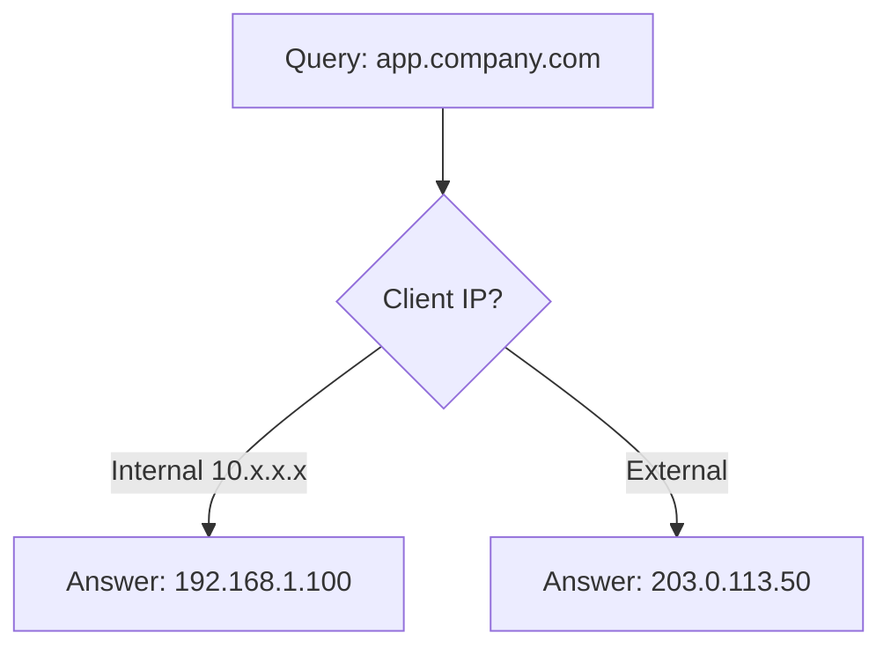

# How to Configure Split-Horizon DNS with BIND on RHEL 9

Author: [nawazdhandala](https://www.github.com/nawazdhandala)

Tags: RHEL, BIND, Split-Horizon DNS, Linux

Description: Learn how to configure BIND on RHEL 9 to serve different DNS answers to internal and external clients using split-horizon DNS views.

---

Split-horizon DNS (also called split-brain DNS) means your DNS server gives different answers depending on who's asking. Internal users get private IP addresses for your services, while external users get public IPs. This is extremely common in enterprise environments and BIND handles it natively with views.

## The Problem Split-Horizon Solves

Imagine you have a web application at `app.company.com`. External users need to reach it via your public IP (203.0.113.50), but internal users should connect to the private IP (192.168.1.100) to avoid hairpin NAT and reduce latency.



Without split-horizon, you'd need separate DNS servers or force internal traffic through your firewall unnecessarily.

## Setting Up Views in BIND

Views are defined in `named.conf`. Each view has its own set of zones and configuration. BIND evaluates views in order and uses the first one that matches the client.

Create the configuration:

```bash
cp /etc/named.conf /etc/named.conf.bak

cat > /etc/named.conf << 'EOF'
// ACLs define which clients belong to which view
acl "internal_nets" {
    10.0.0.0/8;
    192.168.0.0/16;
    172.16.0.0/12;
    localhost;
};

options {
    listen-on port 53 { any; };
    listen-on-v6 port 53 { any; };
    directory "/var/named";
    pid-file "/run/named/named.pid";
    session-keyfile "/run/named/session.key";

    // Common options
    dnssec-validation auto;
    managed-keys-directory "/var/named/dynamic";
};

logging {
    channel default_log {
        file "/var/log/named/default.log" versions 3 size 5m;
        severity info;
        print-time yes;
    };
    category default { default_log; };
};

// Internal view - matched first for internal clients
view "internal" {
    match-clients { internal_nets; };

    // Internal clients can use recursion
    recursion yes;
    allow-recursion { internal_nets; };

    // Internal version of the zone
    zone "company.com" IN {
        type primary;
        file "internal/company.com.zone";
    };

    // Reverse zone for internal
    zone "1.168.192.in-addr.arpa" IN {
        type primary;
        file "internal/192.168.1.rev";
    };

    // Root hints for recursion
    zone "." IN {
        type hint;
        file "named.ca";
    };
};

// External view - for everyone else
view "external" {
    match-clients { any; };

    // No recursion for external clients
    recursion no;

    // External version of the zone
    zone "company.com" IN {
        type primary;
        file "external/company.com.zone";
    };
};
EOF
```

## Creating Internal Zone Files

Create the directory structure:

```bash
mkdir -p /var/named/internal
mkdir -p /var/named/external
```

Create the internal zone file with private IPs:

```bash
cat > /var/named/internal/company.com.zone << 'EOF'
$TTL 86400
@   IN  SOA ns1.company.com. admin.company.com. (
            2026030401  ; Serial
            3600        ; Refresh
            1800        ; Retry
            604800      ; Expire
            86400       ; Minimum TTL
)

@       IN  NS      ns1.company.com.
@       IN  NS      ns2.company.com.

; Internal IPs
ns1         IN  A   192.168.1.10
ns2         IN  A   192.168.1.11
app         IN  A   192.168.1.100
www         IN  A   192.168.1.100
mail        IN  A   192.168.1.20
db          IN  A   192.168.1.40
monitoring  IN  A   192.168.1.50
gitlab      IN  A   192.168.1.60
jenkins     IN  A   192.168.1.61

; Internal-only services
wiki        IN  A   192.168.1.70
erp         IN  A   192.168.1.80
@           IN  MX  10  mail.company.com.
EOF
```

## Creating External Zone Files

Create the external zone file with public IPs:

```bash
cat > /var/named/external/company.com.zone << 'EOF'
$TTL 86400
@   IN  SOA ns1.company.com. admin.company.com. (
            2026030401  ; Serial
            3600        ; Refresh
            1800        ; Retry
            604800      ; Expire
            86400       ; Minimum TTL
)

@       IN  NS      ns1.company.com.
@       IN  NS      ns2.company.com.

; Public IPs only
ns1     IN  A   203.0.113.10
ns2     IN  A   203.0.113.11
app     IN  A   203.0.113.50
www     IN  A   203.0.113.50
mail    IN  A   203.0.113.20

; No internal-only services exposed here
@       IN  MX  10  mail.company.com.
EOF
```

Create the internal reverse zone:

```bash
cat > /var/named/internal/192.168.1.rev << 'EOF'
$TTL 86400
@   IN  SOA ns1.company.com. admin.company.com. (
            2026030401 3600 1800 604800 86400 )

@       IN  NS  ns1.company.com.
10      IN  PTR ns1.company.com.
11      IN  PTR ns2.company.com.
20      IN  PTR mail.company.com.
40      IN  PTR db.company.com.
50      IN  PTR monitoring.company.com.
100     IN  PTR app.company.com.
EOF
```

## Setting Permissions

```bash
chown -R named:named /var/named/internal
chown -R named:named /var/named/external
mkdir -p /var/log/named
chown named:named /var/log/named
```

## Validating and Starting

Check the configuration:

```bash
named-checkconf /etc/named.conf
named-checkzone company.com /var/named/internal/company.com.zone
named-checkzone company.com /var/named/external/company.com.zone
```

Restart BIND:

```bash
systemctl restart named
```

## Testing

Test the internal view from a local IP:

```bash
dig @localhost app.company.com A
```

This should return `192.168.1.100`.

Test the external view from an external client (or simulate it):

```bash
dig @203.0.113.10 app.company.com A
```

This should return `203.0.113.50`.

You can verify which view a client is hitting by checking the logs:

```bash
tail -f /var/log/named/default.log
```

## Important Considerations

**Every zone must be defined in every view.** If you reference a zone in one view, BIND won't fall through to another view to find it. If you need the root hints in both views, include them in both.

**Serial numbers should be kept in sync** across internal and external zone files for the same zone. This avoids confusion when troubleshooting.

**ACL order matters.** BIND uses the first matching view. Put the more specific view (internal) before the catch-all view (external).

**If you use TSIG keys for zone transfers,** they need to be defined within the appropriate view or before all views.

Split-horizon DNS is a straightforward pattern once you understand BIND views. Keep your internal and external zone files in separate directories, maintain consistent serial numbers, and test from both perspectives whenever you make changes.
